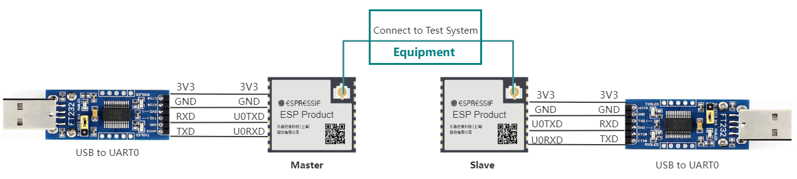
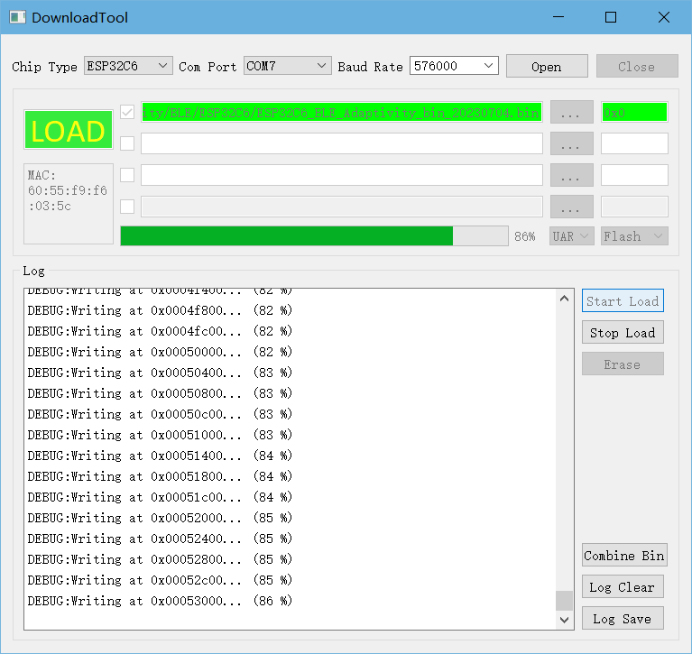

Bluetooth LE Adaptivity Test
=================================

:link_to_translation:`zh_CN:[中文]`

The Bluetooth LE Adaptivity Test is used to ensure that the device operates in a frequency hopping manner and when the Power Spectral Density (PSD) of the Bluetooth LE signal is greater than 10 dBm/MHz, it meets certain parameter requirements to avoid interference with other wireless devices. This test is mainly used in CE and SRRC certification tests.

.. note::

  - When the PSD of the Bluetooth LE signal is less than 10 dBm/MHz, you can choose to be based on the equivalent occupancy rate, and there is no need to perform the Bluetooth LE Adaptivity Test.
  - When the PSD of the Bluetooth LE signal is greater than 10 dBm/MHz, you can choose to perform the Bluetooth LE Adaptivity Test based on the frequency hopping Listen Before Talk (LBT) transmission pre-search mechanism.

Setting up the test environment
-------------------------------

    Schematic diagram of the test environment connection

- In the test, the {IDF_TARGET_NAME} module is used as the test device (Slave) to establish a connection with the device under test (Master). The Slave and Master burn the same firmware and distinguish them with serial port commands.

- The Test System refers to the adaptivity test system. After the Master and Slave are successfully connected through the serial port command, the test can be started.

.. note::

    - The CHIP_EN pin of the device under test is pulled up by default. If it is not pulled up in the product design, you need to manually connect the CHIP_EN to the 3V3 pin.
    - Some serial communication boards have already swapped RXD and TXD internally, no need to reverse connect, and the wiring needs to be adjusted according to the actual situation.
    - {IDF_TARGET_NAME} has a power-on self-calibration function, so the RF connection line must be connected to the test instrument before the device under test is powered on for testing.

Burning firmware
------------------

{IDF_TARGET_BLE_ADAPTIVITY_FIRMWARE:default="Not updated", esp32c2="`ESP32-C2 Bluetooth LE Adaptivity Test Firmware <https://dl.espressif.com/rf/esp32c2/ESP32C2_BLE_Adaptivity_bin_20230704.bin>`_", esp32c3="`ESP32-C3 Bluetooth LE Adaptivity Test Firmware <https://dl.espressif.com/rf/esp32c3/ESP32C3_BLE_Adaptivity_bin_20230704.bin>`_", esp32c6="`ESP32-C6 Bluetooth LE Adaptivity Test Firmware <https://dl.espressif.com/rf/esp32c6/ESP32C6_BLE_Adaptivity_bin_20230704.bin>`_", esp32s3="`ESP32-S3 Bluetooth LE Adaptivity Test Firmware <https://dl.espressif.com/rf/esp32s3/ESP32S3_BLE_Adaptivity_bin_20230704.bin>`_", esp32h2="`ESP32-H2 Bluetooth LE Adaptivity Test Firmware <https://dl.espressif.com/rf/esp32h2/ESP32H2_BLE_Adaptivity_bin_20230704.bin>`_"}

1. Open :ref:`download-tool`.

2. Set ``ChipType``, ``Com Port``, ``Baud Rate``, click ``Open``, choose to download to ``Flash``.

3. Burn {IDF_TARGET_BLE_ADAPTIVITY_FIRMWARE} to ``0x0`` via ``UART``.

    Schematic diagram of burning firmware

After the burning process is complete, continue with the following steps for testing.

Start Testing
---------------------------

Bluetooth LE Adaptivity Test requires inputting corresponding serial port commands in both Mater and Slave devices to establish a connection for testing.

Enter the corresponding commands in the Slave and Master devices in order:

1. **Slave Device**

::

  \\Start the pairing device broadcast
  bleadve -C -z start -t 19 -u 13

2. **Master Device**

::

  \\Establish connection, configure rate as 1 Mbps (if need to configure as 2 Mbps, parameters change to -x 2 -y 2), set power level (-v 13)
  bleconn -T -z start -x 1 -y 1 -n 1 -i 0x6-0x6 -v 13

  \\Configure power, default setting is 13 levels (-e parameter should be consistent with the -v parameter in the previous command)
  ble -S -z etxp -t 4 -h 1 -e 13

  \\Set MTU
  gattc -C -m 512 -p 0x10 -r c0:11:11:11:11:11 -b 1

  \\Send data
  gattc -W -z char -p 0x10 -s 0xA002 -c 0xC317 -l 490 -n 0xFFFFFFFF -w 1 -r c0:11:11:11:11:11 -g 1 -b 1

3. **Other Operation Commands**

::

  \\Disconnect
  bleconn -D -z all

  \\Restart module
  reboot

After entering the above commands, you can continue with the Bluetooth LE Adaptivity Test.

.. note::

   If you need to test broadcast and data hopping, please contact `Espressif <https://www.espressif.com/en/contact-us/sales-questions>`_.
