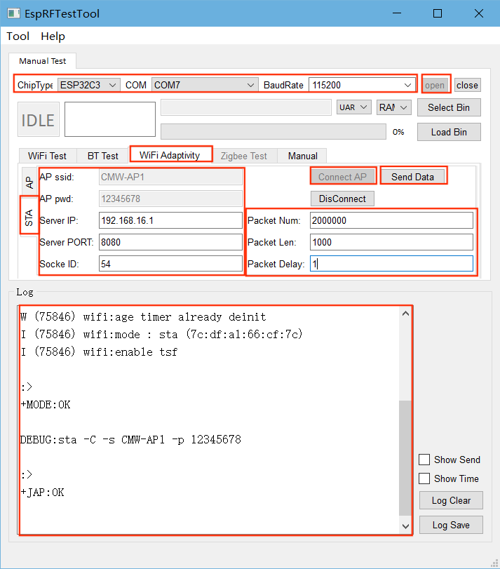
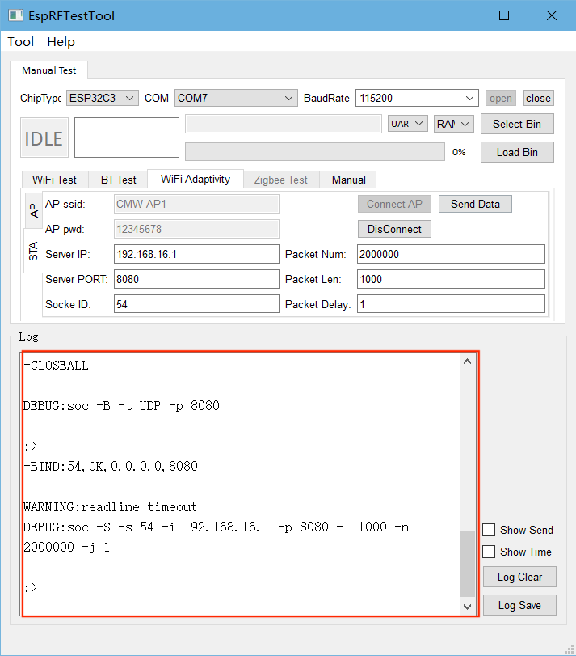

Wi-Fi Adaptivity Test
==============================

:link_to_translation:`zh_CN:[中文]`

The Wi-Fi Adaptivity Test is used to evaluate the active adaptability of Wi-Fi devices in an interference environment, mainly for SRRC, CE, and other certifications.

.. note::

  If the power spectral density (PSD) of the Wi-Fi signal is higher than 10 dBm/MHz, the adaptivity test should choose the Listen Before Talk (LBT) mechanism based on non-hopping load.

Setting Up the Test Environment
-------------------------------

.. figure:: ../../../_static/rf_test_tool/usb_to_uart_connection.png
    :align: center
    :scale: 80%

    UART Connection Description

The **Device Under Test (DUT)** is a product designed based on Espressif chips or modules. The DUT is connected to the USB-to-UART converter board via UART.

.. note::

    - The CHIP_EN pin of the DUT is pulled up by default. If it is not pulled up in the product design, you need to manually connect CHIP_EN to the 3V3 pin.
    - Some serial communication boards have already swapped RXD and TXD internally, so there is no need to reverse them. The wiring should be adjusted according to the actual situation.
    - Espressif chips have a power-on self-calibration function, so the RF connection line should be connected to the test instrument before the DUT is powered on for testing.

Firmware Burning
------------------

{IDF_TARGET_WIFI_ADAPTIVITY_FIRMWARE:default="Not updated", esp32="`ESP32 Wi-Fi Adaptivity Test Firmware <https://dl.espressif.com/rf/esp32/ESP32_wifi_Adaptivity&Blocking_20210420.bin>`__", esp32c2="`ESP32-C2 Wi-Fi Adaptivity Test Firmware <https://dl.espressif.com/rf/esp32c2/ESP32C2_WiFi_Adaptivity&Blocking_26M_20240416.bin>`__", esp32c3="`ESP32-C3 Wi-Fi Adaptivity Test Firmware <https://dl.espressif.com/rf/esp32c3/ESP32C3_wifi_Adaptivity&Blocking_20220627.bin>`__", esp32c6="`ESP32-C6 Wi-Fi Adaptivity Test Firmware <https://dl.espressif.com/rf/esp32c6/ESP32C6_wifi_Adaptivity&Blocking_20230704.bin>`__", esp32s2="`ESP32-S2 Wi-Fi Adaptivity Test Firmware <https://dl.espressif.com/rf/esp32s2/ESP32S2_wifi_Adaptivity&Blocking_20220826.bin>`__", esp32s3="`ESP32-S3 Wi-Fi Adaptivity Test Firmware <https://dl.espressif.com/rf/esp32s3/ESP32S3_wifi_Adaptivity&Blocking_20230328.bin>`__", esp8266="`ES8266 Wi-Fi Adaptivity Test Firmware <https://dl.espressif.com/RF/ESP8266&8285_adaptivity&blocking_bin_20220824_115200.bin>`__"}

{IDF_TARGET_FLASH_ADDRESS:default="0x0", esp32="0x1000", esp32s2="0x1000"}

1. Open the DownloadTool.

2. Set the ChipType, Com Port, Baud Rate, click Open, and select Download to Flash.

3. Burn {IDF_TARGET_WIFI_ADAPTIVITY_FIRMWARE} to {IDF_TARGET_FLASH_ADDRESS} via UART.

After the burning is completed, continue with the following steps for the adaptivity test.

Start Testing
---------------------------

View Power-on Print
^^^^^^^^^^^^^^^^^^^^^

Use a serial communication tool, such as `Friendly Serial Assistant <http://alithon.com/downloads>`_, configure the port number, set the baud rate to 115200, if the serial port prints similar information as below after the device is powered on again, you can confirm that the test status is OK:

.. figure:: ../../../_static/rf_test_tool/esp32c2_wifi_signaling.png
    :align: center
    :scale: 80%

    Device Power-on Serial Print Log

.. _wifi-adaptivity-test:

Next, you can choose to `test with serial commands`_ or `test with EspRFTestTool`_.

Test with Serial Commands
^^^^^^^^^^^^^^^^^^^^^^^^^^^^^^^^^

Enter the following commands in the serial port in order to perform network configuration and traffic testing:

::

  \\Device network configuration
  \\Configure the prototype to enter station mode
  op -S -o 1

  \\Connect to AP, SSID is CMW-AP, password is 12345678
  sta -C -s CMW-AP -p 12345678

  \\Traffic testing
  \\Clear socket
  soc -T

  \\Create UDP, port is 8080, default socket ID is 54
  soc -B -t UDP -p 8080

  \\Perform traffic testing on the AP device with socket ID 54
  soc -S -s 54 -i 192.168.1.1 -p 8080 -l 2000 -n 200000000 -j 1

.. note::

    The ``-p`` parameter is used to set the AP password. If the AP has no password, this parameter is not needed.

If the serial port prints similar information as below, it means that the traffic test has been successfully completed, and you can start the Wi-Fi adaptivity test.

.. figure:: ../../../_static/rf_test_tool/wifi_adptive_log.png
    :align: center
    :scale: 80%

    Device Network Configuration Serial Print Log

Test with EspRFTestTool
^^^^^^^^^^^^^^^^^^^^^^^^^^^^^^^^^^^^^^^^^

- Open `EspRFTestTool Toolkit <https://dl.espressif.com/RF/EspRFTestTool_v3.6_Manual.zip>`_, configure ChipType and COM, select 115200 for the baud rate, after opening the port, select the WiFi Adaptivity test interface.

- In STA mode, enter AP ssid and AP pwd, click Connect AP to connect.

- After successful connection, the following log should be printed:

    Device Network Configuration

- After successful connection, set Pakcet Num to a sufficiently large value, such as 20000000, to meet the long traffic test time.

- Set Server PORT to 8080, Socket ID to 54, change Packet Delay to 1, to meet certification requirements.

- After the above settings are completed, click Send Data. If the log is similar to the figure below, it means that the traffic test is successful, and you can start the Wi-Fi adaptivity test.

    Wi-Fi Adaptivity Traffic Test
