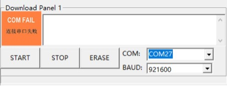
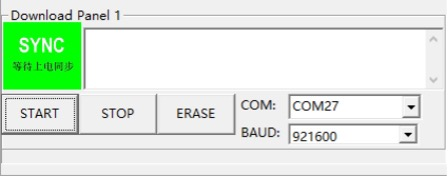
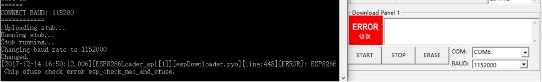

Flash Download Tool
===================

:link_to_translation:`zh_CN:[中文]`

**1. I cannot find the serial port in the COM drop-down menu of the Flash Download Tool.**

First, check the Device Manager to ensure the serial port is properly installed. If not, check the driver for any issues.

**2. I got a "COM FAIL" error, as shown below:**

    Connection Failure of Serial Port

- Make sure the correct COM port is selected
- Verify that the COM port isn't being used by another thread.

**3. The Flash Download Tool is stuck, as shown in the figure below. How can I fix this?**

    Download Panel

This issue may occur due to:

- Hardware: The module is not in download mode.
- Software: The module selected in the tool isn't the one you are using.

**4. I clicked the START button and got the error shown below.**

    eFuse Error

The ``ESP8266 Chip efuse check error esp_check_mac_and_efuse`` message indicates an issue with the eFuse. Possible causes include:

- The eFuse is fine, but the wrong module is selected in the tool. In this case, select the correct module based on your setup.
- There is a problem with the module's eFuse. In this case, contact Espressif for esptool.exe and instructions, and send the eFuse data to Espressif for further debugging.

**5. Errors occur during downloading.**

Check the following:

- Ensure the module's TX/RX pins are not used by other software.
- Make sure the module's flash size is no less than the firmware size.
- If you encounter an MD5 verification error, erase the entire flash and try downloading again.

**6. The module crashes when powered on again after downloading the firmware.**

If the firmware works correctly, check the following:

- The module selected in the tool matches the one you are using.
- The correct flash boot mode is selected.
- The correct flash download mode is selected.
