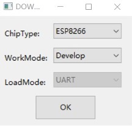
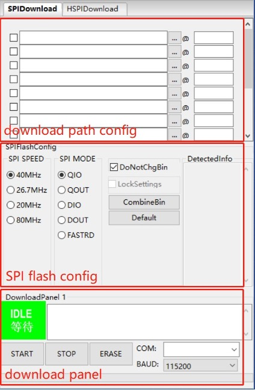
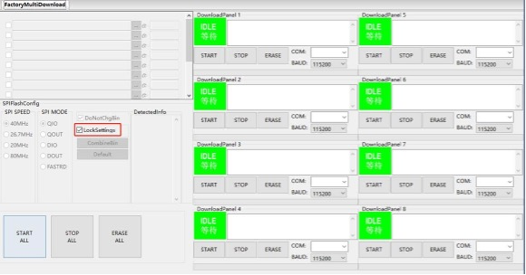
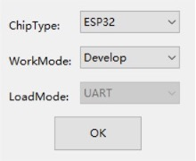
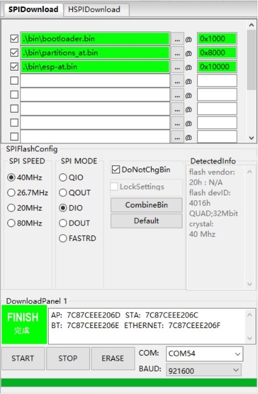
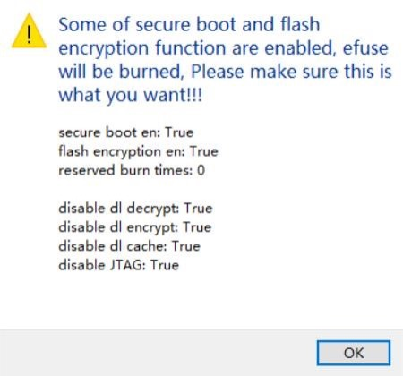
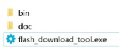

Flash Download Tool User Guide
******************************************

Preparation
=================

The software and hardware resources required for downloading firmware to flash are listed below.

- Hardware:

  * 1 x module to which firmware is downloaded
  * 1 x PC (Windows 7 [64 bits], Windows 10)

- Software:

  * Download Tool: Flash Download Tool (For the detailed structure of this tool, please refer to Appendix A.)

Tool Overview
================

User Interface
----------------

Open the Flash Download Tool package, double-click the .exe file to enter the main interface of the tool, as shown in the figure below:

    Flash Download Tool Main Interface

- **ChipType**：select the chip type according to what product you use.

- **WorkMode**：work mode of the tool. Below are the differences between the two modes supported currently, Develop and Factory modes.

  * Developer mode uses the absolute path of the firmware and only allows flashing firmware to one chip at a time.
  * Factory mode uses a relative path. It is recommended to place the firmware to flash in the bin directory of this tool package. It will be automatically saved locally when closed after configuration.
  * Selecting Factory mode leads you to a locked interface in order to prevent misoperation by your mouse. Please click the ``LockSettings`` button to enable editing.

- **LoadMode**：Download interface. Currently, ESP8266, ESP8285, and ESP32 only support UART, and other chip types support both UART and USB.

SPIDownload Tab
---------------------------

Here is the configuration descriptions.

- **Download Path Config**
  You can configure the firmware loading path and downloading address (in hexadecimal format), such as 0x1000.

- **SPI Flash Config**

  * **SPI SPEED**：SPI boot rate
  * **SPI MODE**：SPI boot mode
  * **DETECTED INFO**：flash & crystal oscillator information that are detected automatically.
  * **DoNotChgBin**：If it is enabled, the tool flashes the original content of the bin file. If not enabled, the tool updates the firmware according to the SPI SPEED, SPI MODE configuration on the interface before flashing.
  * **CombineBin** button：combines all the selected firmware in Download Path Config into one firmware. If DoNotChgBin is enabled, combine the original firmwares. If DoNotChgBin is not enabled, combine them according to the SPI SPEED and SPI MODE  configuration. Any unused areas between firmware files will be filled with 0xff. The combined firmware will be saved as ./combine/target.bin. Each click of this button will overwrite the previous firmware.
  * **Default button**：restores the SPI configuration to the default values.

- **Download Panel**

  * **START**：start downloading
  * **STOP**：stop downloading
  * **ERASE**：erase the entire flash
  * **COM**：serial port used for downloading
  * **BAUD**：baud rate

    SPIDownload Tab

HSPIDownload Tab
---------------------------

The SPIDownload tab is needed only for the ESP8266 series of chips that connect to external flash via HSPI. It has the same interface as the HSPIDownload tab, so please refer to Section 2.2 SPIDownload Tab for interface description.

FactoryMultiDownload Tab
------------------------------------

- Factory mode uses the relative path. By default, the tool loads the firmware from the bin folder of the tool directory. Whereas, Develop mode uses the absolute path. The advantage of the Factory mode is that as long as the firmware to flash remains in the bin folder of the tool directory, path problems will not occur when the tool package is copied to other factory computers.
- In Factory mode, the tool enables LockSettings by default. When LockSettings is enabled, firmware download path config and SPI flash config cannot be configured. This is to prevent production line workers from accidentally clicking and causing errors. (When factory managers need to configure these settings, they can click LockSettings to unlock.)

    FactoryMultiDownload Tab

The download path config and SPI flash config section on the FactoryMultiDownload are basically the same as those on the SPIDownload tab. Please refer to Section 2.2
SPIDownload Tab for descriptions. Do not forget to configure the serial port number and baud rate of each download panel.

Download Example
=================

This chapter takes the ESP32 series as an example to demonstrate how to perform both regular and encrypted download operations. At present, all chips series support regular download, and only ESP32 supports encrypted download. Other chip series will support encrypted download later.

Regular Download Example
------------------------

1. Set the device to download mode:

   - ESP32, ESP32-S2, ESP32-S3, ESP8266: pull GPIO0 low to enter the download mode.
   - ESP32-C3: pull GPIO9 low and GPIO8 high to enter the downloading mode.

2. Open the download tool, set ChipType to ESP32, WorkMode to Develop, and LoadMode to UART as shown in the figure below. Then, click OK

    Selecting Device — ESP32 Download Tool

3. In the appeared download page, enter the path to the bin file and the address where it should be downloaded, check the box before the path, and select SPI SPEED, SPI MODE, COM, and BAUD according to your actual needs.
4. Click START to start downloading. During the download process, the tool will read the flash information and the chip's MAC address.
5. After the download is complete, the tool interface is shown in Figure 3-2.

    Download Completed

Enable Encryption for Firmware Downloading
---------------------------------------------

The encrypted firmware downloading process is as follows:

- The Flash Download Tool downloads the plaintext firmware to the chip.
- The chip uses the key in its eFuse to encrypt the firmware and write it to the flash.
- If there is no such key in the eFuse, the tool will automatically generate a random one and flash it to eFuse. If there is, the tool skips the key generation and flashing process.

To configure the encryption function, follow the steps below:

- Open the configuration file ./configure/esp32/security.conf. If there is no such file, for example, when you open the tool for the first time, restart the tool.
- Update the configuration options as needed.

Below are the configuration options. The equal sign is followed by the default value of the option. “True” means enabling the option; “False” means disabling it.

- **[SECURE BOOT]** Secure boot related configurations:

  * secure_boot_en = False (Configures whether to enable secure boot)

- **[FLASH ENCRYPTION]** Flash encryption related configurations:

  * flash_encryption_en = False (Configures whether to enable flash encryption)
  * flash_encryption_use_customer_key_enable = False (Configures whether to use a customized flash encryption key)
  * flash_encryption_use_customer_key_path = .\secure\flash_encrypt_key.bin (Configures the file path to the customized flash encryption key)
  * reserved_burn_times = 3 (Configures how many times [3 in this case] are reserved for the flashing operation)
  * [ESP32-C* and ESP 32-S* Only] flash_encrypt_key_block_index = 0 (Configures the index of the encryption key in the block_key. Default: 0. Range: 0~4.)

  .. note::

    This option can only be set to 0 for ESP32-C2. For more information, refer to the respective chip technical reference manual > Chapter eFuse Controller.

- **[ENCRYPTION KEYS SAVE]** Encryption key related configurations:

  * keys_save_enable = False (Configures whether to save the key)
  * encrypt_keys_enable = False (Configures whether to encrypt the saved key)
  * encrypt_keys_aeskey_path = (If you encrypt the key, please fill in the key file here, such as ./my_aeskey.bin)
- **[ESP* DISABLE FUNC]** Flash encryption related configurations:

.. flat-table::
    :header-rows: 1

    * - --
      - Config Option
      - Description

    * - :rspan:`2` [ESP32 DISABLE FUNC]
      - dl_encrypt_disable = False
      - Configures whether to disable encryption

    * - dl_decrypt_disable = False
      - Configures whether to disable decryption

    * - dl_cache_disable = False
      - Configures whether to disable cache

    * - :rspan:`4` [ESP32-C* DISABLE FUNC]
      - dis_usb_jtag = False
      - Configures whether to disable USB JTAG

    * - dis_pad_jtag = False
      - Configures whether to disable JTAG PAD

    * - soft_dis_jtag = 7
      - Configures whether to soft-disable JTAG

    * - dis_direct_boot = False
      - Configures whether to disable direct boot

    * - dis_download_icache = False
      - Configures whether to disable instruction cache in the Download mode

    * - :rspan:`6` [ESP32-S* DISABLE FUNC]
      - dis_usb_jtag = False
      - Configures whether to disable USB JTAG

    * - hard_dis_jtag = False
      - Configures whether to hard-disable JTAG

    * - soft_dis_jtag = 7
      - Configures whether to soft-disable JTAG

    * - dis_usb_otg_download_mode = False
      - Configures whether to disable USB OTG download

    * - dis_direct_boot = False
      - Configures whether to disable direct boot

    * - dis_download_icache = False
      - Configures whether to disable instruction cache in the Download mode

    * - dis_download_dcache = False
      - Configures whether to disable data cache in the Download mode

There will be a prompt message (shown below) when the tool is running. Check if the message is correct. The figure below shows the prompt message of enabling both flash encryption and secure boot:

    ESP32 Prompt Message of Enabling Flash Encryption and Secure Boot

During the firmware flashing process, the key and other information will be flashed into the chip's eFuse. After the flashing process is completed, "FINISH/完成" will be displayed.

.. note::

    Prior to downloading, the tool verifies flash encryption and secure boot information in the eFuse , so as to prevent re-downloading to and damaging the encrypted module.

FAQ
===============

COM Related Errors
----------------------

I cannot find the serial port that I am using in the COM drop-down menu when I open the Flash Download Tool.
""""""""""""""""""""""""""""""""""""""""""""""""""""""""""""""""""""""""""""""""""""""""""""""""""""""""""""""""

First go to the device manager and check if the serial port has been successfully installed. If not, check the driver for any possible issues.

I get the "COM FAIL" error message, as shown in the Figure below:
""""""""""""""""""""""""""""""""""""""""""""""""""""""""""""""""""""""""

.. figure:: ../../_static/flash_download_tool/serial_port_connection_failure.jpg
    :align: center
    :scale: 90%

    Connection Failure of Serial Port

- Firstly, make sure the selected COM is correct
- Then, check if the COM is already occupied by another thread.

Synchronization Related Errors
-----------------------------------

The Flash Download Tool is stuck at the step shown in the figure below. How can I fix this?
""""""""""""""""""""""""""""""""""""""""""""""""""""""""""""""""""""""""""""""""""""""""""""""""

.. figure:: ../../_static/flash_download_tool/download_panel.jpg
    :align: center
    :scale: 90%

This may happen for the reasons given below

- Hardware: The module is not in download mode.
- Software: The module selected in the tool is not the one you are actually using.

eFuse Related Errors
-----------------------

I click the START button, and get the error shown in the figure below.
""""""""""""""""""""""""""""""""""""""""""""""""""""""""""""""""""""""""""

.. figure:: ../../_static/flash_download_tool/efuse_error.jpg
    :align: center
    :scale: 90%

You will get the ``ESP8266 Chip efuse check error esp_check_mac_and_efuse`` message when there are errors related to the eFuse. The possible causes are as follows:

- The eFuse is OK, but the module selected in the tool is not the one that is actually being used. In this situation, please select the module type based on your actual case.
- There are problems with the eFuse of the module. In this case, please contact Espressif to obtain the required esptool.exe and operating instructions. Also, send the data that is read from eFuse to Espressif for further debugging.

Download Related Errors
-------------------------

Errors occur during downloading.
""""""""""""""""""""""""""""""""""""""""""""

Please check the following:

- The TX/RX of the module is not used by other software programs.
- The module flash size is no less than the size of firmware to be downloaded.
- If there is an MD5 verification error, erase the entire flash and try downloading again.

Operation Related Errors
-------------------------

The module crashes when powered on again after the firmware has been downloaded.
""""""""""""""""""""""""""""""""""""""""""""""""""""""""""""""""""""""""""""""""""

If the downloaded firmware works fine, then please check the following:
- The module selected in the tool is not the one you are actually using.
- The selected flash boot mode is wrong.
- The selected flash download mode is wrong.

Appendix A. Contents of the Flash Download Tool Folder
=============================================================

The figure below shows what the Flash Download Tool folder contains.

- doc folder: stores instruction documentation
- bin folder: stores firmware to be flashed
- flash_download_tool.exe: executable file of the Flash Download Tool.
