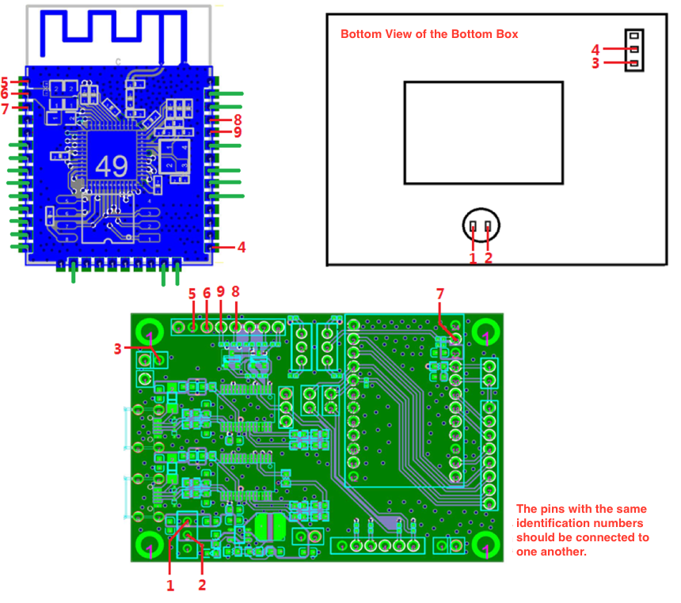
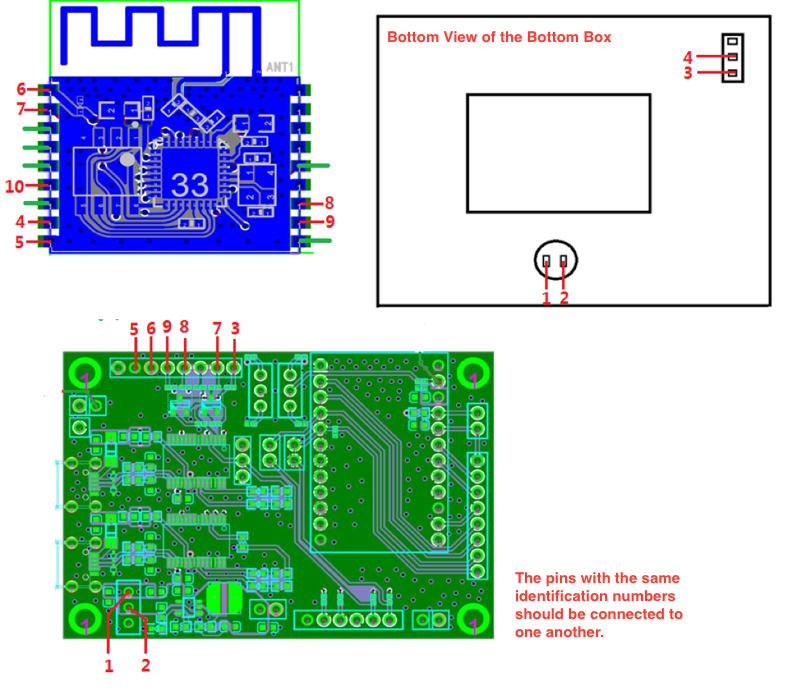
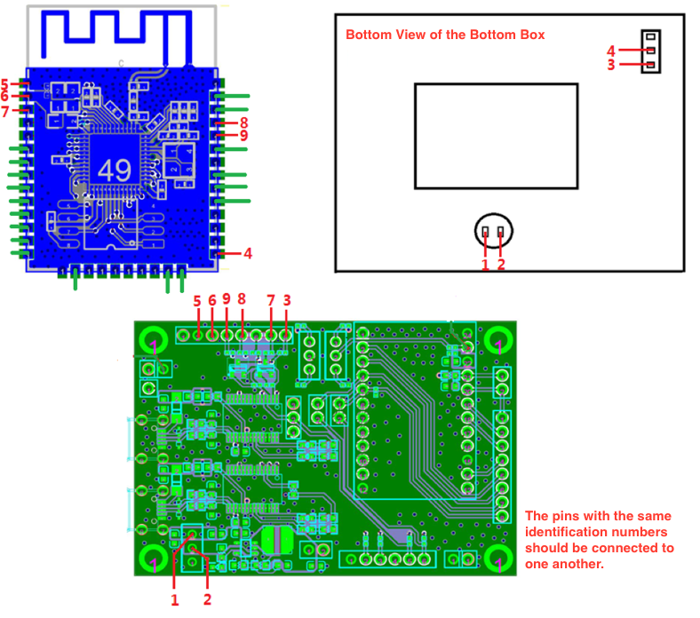
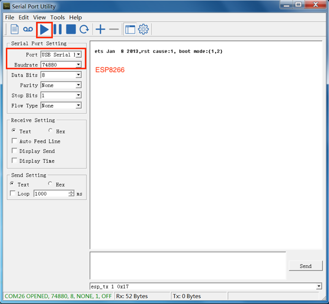

======================================
Test Fixture Manufacturing Instruction
======================================

:link_to_translation:`zh_CN:[中文]`

About This Instruction
======================

This document provides instructions on the manufacturing of the test fixtures for Espressif's Wi-Fi modules, in an effort to avoid problems caused by the lack of standardized fixtures during the module production and testing.

Overview
========

Module fixtures have different structures based on their types and usage. The structure of an ESP-WROVER fixture is shown in the following figure:

.. figure:: ../../../_static/test_fixture_manufacturing_inst/test_fixture_structure.png
    :align: center
    :scale: 40%

    The Structure of a Typical Test Fixture (ESP-WROVER)

The structure of other module fixtures are similar to that of ESP-WROVER. The primary structure of a typical module fixture consists of the following parts, which may differ only on the details:

.. list-table:: The Primary Structure of a Typical Test Fixture
    :header-rows: 1
    :widths: 1 4
    :align: center

    * - Part
      - Description
    * - Handle
      - It is used to power on or power off the module:

        * When users lift the handle, the module is separated from the metal probes at the bottom and gets disconnected from the power supply.
        * When users press the handle, the module comes into contact with the metal probes and starts the testing procedure.
    * - Mounting Panel
      - It is used for placing and holding the module.
    * - Bottom box
      - It is used to place serial port board(s), enabling the module to communicate with the PC
    * - Switch
      - It is installed on the bottom box to control the power supply to the serial port board and the working modes.

The Main Structure of a Typical Module Fixture
==============================================

Mounting Panel
--------------

The items needing attention during the manufacturing of mounting panels are listed below.

Antenna
~~~~~~~

The antenna area should be completely exposed, keeping the antenna connection point over the line at the left end of the mounting panel or aligned with the left end of the mounting panel, which can be seen in the figure below. The mounting panel should not be made of metal, and the use of metal components should be minimized around the antenna:

.. figure:: ../../../_static/test_fixture_manufacturing_inst/mounting_panel_for_esp_wrover.png
    :align: center
    :scale: 15%

    The Mounting Panel for the ESP-WROVER Test Fixture

Handle
~~~~~~

- When users press the handle, they must ensure that the metal probes under the mounting panel are attached to all the pins of the module.

.. figure:: ../../../_static/test_fixture_manufacturing_inst/metal_probles_handle_pressed.png
    :align: center
    :scale: 15%

    The Metal Probes (the handle is pressed)

- When users lift the handle, they must ensure that the metal probes under the mounting panel are completely detached from all the pins of the module, which can be seen in the figure below:

.. figure:: ../../../_static/test_fixture_manufacturing_inst/metal_probes_handle_lifted.png
    :align: center
    :scale: 15%

    The Metal Probes (the handle is lifted)

When users press the handle, they should leave a suitable distance between the movable plate and the mounting panel. The aim is to ensure that the probes are in touch with all the pins of the module, yet without crushing the module and its shield cover. Please see the figure below:

.. _distance:

.. figure:: ../../../_static/test_fixture_manufacturing_inst/movable_plate_and_mounting_panel.png
    :align: center
    :scale: 15%

    The Movable Plate and the Mounting Panel

Bottom Box
----------

Serial Port Board
~~~~~~~~~~~~~~~~~

Two serial port boards (ESP_Factory Test Boards V1.3) are placed inside the bottom box, which can be seen in the figure below:

.. figure:: ../../../_static/test_fixture_manufacturing_inst/serial_port_board.png
    :align: center
    :scale: 40%

    A Typical Serial Port Board (ESP_Factory Test Board V1.3)

This serial port board, which has two serial-port chips, is placed inside the bottom box, which can be seen in the figure below. Users should place as many serial port boards as necessary for the specific type of module fixture in operation. For example, the one-to-four module fixture requires four serial port boards.

.. figure:: ../../../_static/test_fixture_manufacturing_inst/serial_boards_placement.png
    :align: center
    :scale: 15%

    The Placement of the Serial Port Boards in the Bottom Box

It is required that the serial port boards be screwed onto the bottom box so as to keep them stable and prevent any short-circuit in the boards. The serial port boards are fixed by using screws in the four pass-through holes of the boards. In addition, when multiple serial ports are used to connect the HUB, the HUB should be provided with an external power supply to avoid a series of problems caused by insufficient power supply to the serial ports.

The Mark on the Bottom Box
~~~~~~~~~~~~~~~~~~~~~~~~~~

To facilitate the identification of the fixtures, it is required that the logo be printed on the surface of the bottom box. The classification of such marks is shown in the table below, where V\ :sup:`*` indicates the version of the fixture.

.. list-table:: The classification of the marks
    :header-rows: 1
    :widths: 2 3
    :align: center

    * - Module Type
      - Mark
    * -
        * ESP-WROOM-02
        * ESP-WROOM-02D
        * ESP-WROOM-02DC
      - ESP-WROOM-02/02D-V1
    * -
        * ESP-WROOM-02U
        * ESP-WROOM-02UC
      - ESP-WROOM-02U-V3\ :sup:`*`
    * -
        * ESP32-WROOM-32
        * ESP32-WROOM-32D
        * ESP32-WROOM-32DC
        * ESP32-SOLO-1
        * ESP32-SOLO-1C
      - ESP32-WROOM-32/32D-V1
    * -
        * ESP32-WROOM-32U
        * ESP32-WROOM-32UC
      - PESP32-WROOM-32U-V3\ :sup:`*`
    * -
        * ESP32-WROVER (PCB)
        * ESP32-WROVER-B (PCB)
        * ESP32-WROVER-BC (PCB)
      - ESP32-WROVER-V1
    * -
        * ESP32-WROVER (IPEX)
        * ESP32-WROVER-B (IPEX)
        * ESP32-WROVER-BC (IPEX)
      - ESP32-WROVER-I-V2\ :sup:`*`

.. Note::

    1. Jumper caps in :ref:`distance` should be plugged in the yellow shorting plugs.
    2. This guide is not applicable to ESP-WROOM-02U-V3, ESP32-WROOM-32U-V3 and ESP32-WROVER-I-V2.

The Wiring of the Mounting Panel
~~~~~~~~~~~~~~~~~~~~~~~~~~~~~~~~

Please see the rules in the table below, and connect the red and green wires as requested, while leaving the rest of the wires unconnected.

.. flat-table:: Wiring Requirements
    :header-rows: 1
    :widths: 1 2 3 4

    * - Components
      - Functions
      - Requirements
      - Remarks
    * - :rspan:`1` Red wire
      - The red wires coming out of the probe
      - Connect the DuPont cables coming out of the probe to the serial boards. The pins with the same identification numbers should be connected to one another (see the following figures).
      - **Notices**：

        1. Users should use standard DuPont cables, and the length of the cables should be kept as short as possible.
        2. For the pins on the serial board that are not led-out, please solder the cables directly to the tin spots at the back of the serial boards.
    * - The red wires coming out of the switch
      - Connect the DuPont cables coming out of the switch to the serial boards. The pins with the same identification numbers should be connected to one another (see the following figures).
      -
        1. Press the handle, so that the switch located in positions 1 and 2 is turned on and the serial port boards are powered on;
        2. The DIP switch located in position 3 and 4 is used to control the conductivity of the wiring, and therefore the working modes.
    * - Green wire
      - --
      - No need to connect the green wires to the serial port board.
      - --
    * - :rspan:`1` Switch
      - One to one
      - One-channel side switch
      - --
    * - One to four
      - A four-channel side switch that controls four circuits.
      - --

.. figure:: ../../../_static/test_fixture_manufacturing_inst/connect_red_wires.png
    :align: center
    :scale: 100%

    A Diagram Showing How to Connect the Red Wires

The Wiring of the Fixture
~~~~~~~~~~~~~~~~~~~~~~~~~

The fixture can enable or disable the **Automatic Mode Switching** on the Tool Side, by using the different wirings which can be seen in the following figures.

.. Note::

    By default, the Automatic Mode Switching on the Tool Side is not enabled.

When the Automatic Mode Switching on the Tool Side is not supported
^^^^^^^^^^^^^^^^^^^^^^^^^^^^^^^^^^^^^^^^^^^^^^^^^^^^^^^^^^^^^^^^^^^

1. ESP-WROOM-02

.. figure:: ../../../_static/test_fixture_manufacturing_inst/esp_wroom_02_wiring.png
    :align: center
    :scale: 80%

    The Wiring of the ESP-WROOM-02 Fixture

2. ESP-WROOM-32

    The Wiring of the ESP32-WROOM-32 Fixture

3. ESP-WROVER

.. figure:: ../../../_static/test_fixture_manufacturing_inst/esp_wrover_wiring.png
    :align: center
    :scale: 80%

    The Wiring of the ESP-WROVER Fixture

When the Automatic Mode Switching on the Tool Side is supported
^^^^^^^^^^^^^^^^^^^^^^^^^^^^^^^^^^^^^^^^^^^^^^^^^^^^^^^^^^^^^^^

1. ESP-WROOM-02

    The Wiring of the ESP-WROOM-02 Fixture

2. ESP32-WROOM-32

    The Wiring of the ESP-WROOM-32 Fixture

3. ESP-WROVER

.. figure:: ../../../_static/test_fixture_manufacturing_inst/esp_wrover_wiring_auto.png
    :align: center
    :scale: 80%

    The Wiring of the ESP-WROVER Fixture

Fixture Testing
===============

Wiring Conductivity Test
------------------------

To ensure that all the materials used for the wiring are functional, a conductivity test should be performed after the wiring is completed. Users can choose test tools, such as a multimeter, a simple LED circuit and so on.

Working Mode Verification Test
------------------------------

Please follow the steps below to verify the working modes of the module.

Operation Mode (currently only for ESP-WROOM-02 series modules)
~~~~~~~~~~~~~~~~~~~~~~~~~~~~~~~~~~~~~~~~~~~~~~~~~~~~~~~~~~~~~~~

1. After the wiring conductivity test, open a communication software for serial ports on the PC. (The **Serial Port Utility** is recommended here).
2. Select the corresponding port and baud rate (ESP8266/ESP32: 115200), and start the communication.
3. Use the switch located in positions 3 and 4 and toggle it towards position 3, so that you configure the module to the operation mode.
4. Press the handle.
5. Enter the command **AT+GMR**, and click Send.

.. figure:: ../../../_static/test_fixture_manufacturing_inst/AT_comment_test.png
    :align: center

    AT Command Test

.. Note::

    Before clicking the Send button, users should press the **Enter** button after typing in the **AT+GMR** command.

6. Check the serial debugging tool window.

.. figure:: ../../../_static/test_fixture_manufacturing_inst/AT_test_expected_result.png
    :align: center

    Expected Result of AT Test - ESP8266 Series

- If the test result is as expected, which means the test was successful, users should save a screenshot of the test result.
- If the test result is not as expected, which means the test was not successful, users should perform the conductivity test again and ensure that the wiring is correct.

Download Mode
~~~~~~~~~~~~~

1. After the verification test of the operation mode, users should perform a verification test of the download mode, using the same serial port debugging tool.
2.  Select the corresponding port and baud rate (ESP8266: 74880; ESP32: 115200), and start the debugging.
3.  Use the switch located in positions 3 and 4 and toggle it towards position 4, so that you configure the module to the operation mode.
4.  Press the handle.
5. Check the serial debugging tool window.

    Expected Result - ESP8266 Series

.. figure:: ../../../_static/test_fixture_manufacturing_inst/expected_result_esp32.png
    :align: center

    Expected Result - ESP32 Series

- If the test result is as expected, which means the test was successful, users should save a screenshot of the test result.
- If the test result is not as expected, which means the test was not successful, users should perform the conductivity test again and ensure that the wiring is correct.

Test Report
-----------

Fixture manufacturers must perform the above-mentioned tests, and provide test reports or screenshots reflecting the results of these tests.

Appendix
========

Materials to Apply Fixtures
---------------------------

To accelerate the fixture manufacturing process, please provide the fixture manufacturers with the materials listed in the table below:

.. list-table:: Materials to apply fixtures
    :header-rows: 1
    :widths: 3 7
    :align: center

    * - Material
      - Description
    * - Module Gerber
      - Gerber files provide detailed information about the dimensions and positioning holes of the module.
    * - Sample modules (for AT firmware downloading)
      - Sample modules can be useful for fixture manufacturers' testing. Please provide them on demand.
    * - Serial Port Board
      - Please provide as many serial port boards as you actually need. For example, you should provide four serial port boards if you want to use a one-to-four fixture. (The serial board is ESP_Factory_Test_board V1.3.)
    * - Wiring mode
      - Please inform the fixture manufactures whether you want to enable the Automatic Mode Switching or not. (By default, the Automatic Mode Switching on the Tool Side is not supported.)

Deliverable Items
-----------------

The fixture manufacturers should deliver both of the items listed below:

.. list-table:: Deliverables
    :header-rows: 1
    :widths: 1 3
    :align: center

    * - Deliverables
      - Description
    * - Fixture Set
      - Fixture + serial ports + complete wiring.

        **Notices:**

        1. If a one-to-four fixture is used, then there should be four serial boards in the bottom box, with complete wiring.
        2. The serial board is ESP_Factory_Test_board V1.3.

    * - Test Report
      - Test reports or screenshots reflecting the results of these tests.

Certification
-------------

Download certificates for Espressif products from `Certificates <https://www.espressif.com/en/certificates>`_.
