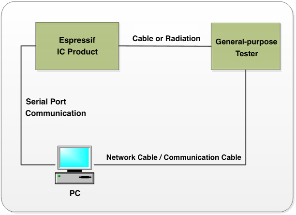

Espressif Production Testing Guide
==================================

:link_to_translation:`zh_CN:[中文]`

About This Guide
------------------

This guide mainly describes the production testing schemes available for Espressif Wi-Fi products (Wi-Fi module/Chip Onboard), thus providing reference for the production testing of customer products.

Introduction
-------------

Generally, there are two production testing schemes available to test the RF performance of the Wi-Fi products based on Espressif IC:

- RF General-purpose Tester Scheme (general standard in the industry);
- Signal Board Scheme (ESP enterprise standard).

To obtain the Espressif production testing tool, please `contact us <https://www.espressif.com/en/contact-us/sales-questions>`_.

RF General-purpose Tester Scheme
^^^^^^^^^^^^^^^^^^^^^^^^^^^^^^^^^^^

The tester scheme is widely used for the production testing of Wi-Fi products. Espressif provides the necessary serial port commands and firmware, so the customers can easily use this scheme for testing.

The testing steps can be found below, which are also demonstrated in the figure below:

    Diagram of the Tester Scheme

#. Download *RF_Test_FW.Bin* to ESP IC Ram;
#. Run the Test Tool that corresponds with the RF tester on the PC, and send the serial port commands to the modules for sending/receiving packets in different modes;
#. The RF tester analyzes the RF related parameters in each specific mode.

.. note::

    - For this scheme, the mass production testing tool provided by the tester supplier should be adaptable with the Espressif IC products;
    - If the supplier is unable to provide this kind of test tool, customers can alternatively make the tool adaptable by using the tester's available interfaces. Meanwhile, a *esp_ram_download_tool* is available for customers to download *RF_Test_FW.bin*:
        - To obtain the *esp_ram_download_tool*, please `contact us <https://www.espressif.com/en/company/contact/pre-sale-questions-crm>`__;
        - For the manual testing of ESP products' RF performance, please refer to: `ESP32&ESP8266 RF Performance Test Demonstration <https://www.espressif.com/sites/default/files/tools/esp32esp8266_rf_performance_test_en.zip>`__.
    - The test above must be performed in a shielded enclosure.

Signal Board Scheme
^^^^^^^^^^^^^^^^^^^^^^

The signal board scheme is specially designed by Espressif, which can effectively test the RF performance of the mass-produced Wi-Fi products, and therefore guarantee the RF quality. This scheme features low cost of hardwares and easy environment setup for factories.

As demonstrated in the figure below, the signal board can be used as a standard device to interact with and test the DUT (Device Under Test) by analyzing the communication data.

.. figure:: ../../../../_static/production_testing_guide/diagram_of_signal_board_scheme_EN.png
    :align: center
    :scale: 80%

    Diagram of Signal Board Scheme

.. figure:: ../../../../_static/production_testing_guide/hardware_connection_for_signal_board_scheme.png
    :align: center
    :scale: 60%

    Hardware Connection for Signal Board Scheme

.. note::

    The test above must be performed in a shielded enclosure.

Production Testing Process
^^^^^^^^^^^^^^^^^^^^^^^^^^^^^^^

1. Please find the followings that need to be tested, and connect the DUT accordingly to conduct the test:

.. only:: esp8266

    .. list-table::
        :header-rows: 1
        :widths: 1 2 2 2
        :align: center

        * - Module
          - Test Points
          - Download Mode
          - Flash Operation Mode
        * - ESP8266 Series
          - V33, GND, RXD, TXD, EN, GPIO0, GPIO15
          -
            - GPIO0 connected to low level
            - GPIO15 connected to low level
          -
            - GPIO0 connected to high level

.. only:: esp32 or esp32s2 or esp32s3

    .. list-table::
        :header-rows: 1
        :widths: 1 2 2 2
        :align: center

        * - Module
          - Test Points
          - Download Mode
          - Flash Operation Mode
        * - ESP32/ESP32-S Series
          - V33, GND, RXD, TXD, EN, GPIO0
          -
            - GPIO0 connected to low level
          -
            - GPIO0 connected to high level

.. only:: esp32c2 or esp32c3 or esp32c6

    .. list-table::
        :header-rows: 1
        :widths: 1 2 2 2
        :align: center

        * - Module
          - Test Points
          - Download Mode
          - Flash Operation Mode
        * - ESP32-C Series
          - V33, GND, RXD, TXD, EN, GPIO8, GPIO9
          -
            - GPIO8 connected to high level
            - GPIO9 connected to low level
          -
            - GPIO9 connected to high level

.. note::

    .. list::

        - Download mode: for downloading bin files and is the main mode used for production testing.
        - Flash operation mode: for checking the log info.
        :esp32c2 or esp32c3 or esp32c6: - ESP32-C3 series in the above table include ESP32-C3/ESP8684/ESP8585/ESP32-C6, etc.

2. Connect the DUT to the serial port board by using the test fixture, and enter the DUT into the download mode via the production testing tool. If your serial port board does not support flow control, connect the corresponding GPIO(s) to low level directly, so DUT enters the download mode after powering up automatically.

3. Start the production testing tool on your PC, and follow the instruction provided in :ref:`production-testing-tool`.

.. note::

    - To speed up the production efficiency, a test fixture is generally designed to be one-to-multiple, which means multiple serial port boards are used:

        - One typical design is one-to-four. With four serial port boards, four DUTs can be placed in one fixture and tested simultaneously.

    -  For more details about the test fixture manufacturing instruction, please refer to: `Test Fixture Manufacturing Instruction <https://www.espressif.com/sites/default/files/documentation/test_fixture_manufacturing_instruction__en.pdf>`__.

    -  Connect the serial port board (which is placed inside the bottom box of the fixture) to the PC with a USB cable, and install the corresponding driver to ensure the serial port can be successfully identified.

Related Equipments for Production Testing
^^^^^^^^^^^^^^^^^^^^^^^^^^^^^^^^^^^^^^^^^^^

Serial Port Board
~~~~~~~~~~~~~~~~~

The serial port board is mainly used as a USB converter. You may use other similar boards. However, considering some of them might have unstable performance, it is recommended to purchase what is shown below. If you want to purchase from Espressif, please `contact us <https://www.espressif.com/en/company/contact/pre-sale-questions-crm>`__.

.. figure:: ../../../../_static/production_testing_guide/serial_port_board.png
    :align: center
    :scale: 70%

    Serial Port Board

Please check the board you purchased against the following requirements to make sure the switches and shorting jumpers are in the correct positions:

  - Marking com1 and Marking com2: the serial ports used for the communication with the PC. Marking 1 and Making 2 are the two independent serial ports, corresponding to TX/RX/FRTS/FCTS.
  - Marking 3: selects powering the device through the USB port or an external power supply.
  - Marking 4: selects 3.3 V or 5 V serial voltage level.
  - Marking 5: for connecting external power supply, not used, so no need to configure.

Test Fixture
~~~~~~~~~~~~

The test fixture is an important equipment to execute the DUT in test mode. Specifically, you can put the module on the fixture and bring the module pins into contact with the fixture probes by pressing the fixture handle. When the test is finished, lift the handle to separate the module pins from the probes (for other similar equipments, customers may think of it as a reference or directly lead out the corresponding pins that are assigned to what you want to test).

For the production testing of Wi-Fi modules, the module pins must be led out and connected to the base board, so as to communicate with the serial ports of the PC. To achieve this, a fixture can be used. The figures below show the overall appearance of a typical fixture.

.. figure:: ../../../../_static/production_testing_guide/a_typical_module_fixture.png
    :align: center
    :scale: 70%

    A Typical Module Fixture

The primary structure of a typical module fixture can be seen in the table below (take Espressif test fixture as an example).

.. list-table:: The Primary Structure of a Typical Test Fixture
    :header-rows: 1
    :widths: 1 4
    :align: center

    * - Part
      - Description
    * - Handle
      -
        - When users lift the handle, the module is separated from the metal probes at the bottom and gets disconnected from the power supply.
        - When users press the handle, the module comes into contact with the metal probes and starts the testing procedure.
    * - Mounting Panel
      - It is used for placing and holding the module.
    * - Bottom box
      - It is used to place serial port board(s), enabling the module to communicate with the PC via USB.

Signal Board
~~~~~~~~~~~~

The signal board can be used a standard device to interact with the DUT during the production testing.

.. only:: esp32 or esp32s2 or esp32s3 or esp32c2 or esp32c3 or esp32c6

    .. list-table:: Signal Boards
        :header-rows: 1
        :widths: 1 4
        :align: center

        * - Board Name
          - Description
        * - ESP-BAT32
          - For ESP32/ESP32-S/ESP32-C series

    .. figure:: ../../../../_static/production_testing_guide/a_typical_espbat32_signal_board_EN.png
        :align: center
        :scale: 80%

        A Typical ESP-BAT32 Signal Board

.. only:: esp8266

    .. list-table:: Signal Boards
        :header-rows: 1
        :widths: 1 4
        :align: center

        * - Board Name
          - Description
        * - ESP-BAT8
          - For ESP8266 series

    .. figure:: ../../../../_static/production_testing_guide/a_typical_espbat8_signal_board_EN.png
        :align: center
        :scale: 70%

        A Typical ESP-BAT8 Signal Board

For the purchase of Espressif signal board, please `contact us <https://www.espressif.com/en/company/contact/pre-sale-questions-crm>`__.

.. note::

    .. list::

        - Only one signal board should be used within the same network coverage. Otherwise, signal interference will occur.
        - If more than one signal board are used for mass testing, please conduct in a shielded room or with a shielded box.
        :esp32 or esp32s2 or esp32s3 or esp32c2 or esp32c3 or esp32c6: - ESP32-C3 series in the above table include ESP32-C3/ESP8684/ESP8585/ESP32-C6, etc.

Scheme Comparison
^^^^^^^^^^^^^^^^^^^

The comparison between the signal board scheme and the tester scheme is shown in the table below. You can choose from these two schemes according to your actual requirements.

.. flat-table:: Scheme Comparison
    :header-rows: 1
    :widths: 1 2 3

    * - Scheme
      - Test Item
      - Description
    * - :rspan:`4` Signal Board Scheme
      - RF Test
      - Tests the supply voltage of the chip and its fluctuation, and the frequency offset against the signal board, etc.
    * - Packet Sending/Receiving Test
      - Tests the packet sending/receiving between the DUT and the signal board.
    * - GPIO Conductivity Test
      - Identifies IC soldering defects, if there are any.
    * - Firmware Version Verification Test
      - Verifies the version information of the firmware that has been downloaded to flash.
    * - Flash RW Test
      - Verifies the RW operation of flash.
    * - :rspan:`5` Tester Scheme
      - EVM Test
      - Tests the TX Power, and EVM performance of the DUT during the packet sending.
    * - Frequency Offset Test
      - Tests the frequency of the DUT during the packet sending.
    * - TX Power Test
      - Tests the TX power of the DUT during the packet sending.
    * - RX Sensitivity Test
      - Tests RX sensitivity of the DUT (This test must be performed in an RF shielded environment).
    * - GPIO Conductivity Test
      - See above in this table.
    * - Flash RW Test
      - See above in this table.

.. note::

    #. The signal board scheme has applied Espressif's internal standards and can effectively ensure the quality of RF products, provided that the RF matching of the module is qualified and the production materials are consistent with those specified in the production processes.
    #. To ensure the overall quality of the mass production of modules, the customers may use the signal board scheme for full inspection and the tester scheme for sampling inspection.
    #. You cannot directly test the RF performance parameters of a DUT, such as TX, RX, EVM, and FREQ, with the signal board scheme. Therefore, a general-purpose Wi-Fi tester can be used as a supplement to the signal board scheme.

The signal board scheme features low cost and easy environment setup, making it a popular solution that has long been widely used by the customers. Therefore, this guide will mainly focus on this scheme, and demonstrate it with the use of Espressif modules. Customers may follow this guide to set up the testing environment for their own Wi-Fi products.

Environment Setup
------------------------

In order to show the customers the effectiveness of our signal board scheme, Espressif provides a complete testing package. Our testing package introduces the customers to the overall process of the production testing. Note that an Espressif module is used in the package as an example, so that the customers can simply replace this module with their Wi-Fi products (of ESP32-C/ESP32/ESP32-S/ESP8266 series) in their own production testing.

Testing Package
^^^^^^^^^^^^^^^^

The production testing package has the following key components:

.. only:: esp32c2 or esp32c3 or esp32c6

    .. flat-table:: Production Testing Package
        :header-rows: 1
        :widths: 1 2 1 2

        * - Production Testing Package
          - Component
          - Quantity
          - Remark
        * - :rspan:`2` ESP32-C
          - ESP-BAT32
          - 1
          - ESP32 signal board
        * - ESP-FactoryTB2
          - 2
          - UART base board
        * - ESP32-C3-WROOM-02
          - 2
          - Espressif module ESP32-C3-WROOM-02

.. only:: esp32 or esp32s2 or esp32s3

    .. flat-table:: Production Testing Package
        :header-rows: 1
        :widths: 1 2 1 2

        * - Production Testing Package
          - Component
          - Quantity
          - Remark
        * - :rspan:`2` ESP32 / ESP32-S
          - ESP-BAT32
          - 1
          - ESP32 signal board
        * - ESP-FactoryTB2
          - 2
          - UART base board
        * -
            - ESP32-WROOM-32D
            - ESP32-S2-WROOM
          - 2
          -
            - Espressif modules ESP32-WROOM-32D
            - Espressif modules ESP32-S2-WROOM

.. only:: esp8266

    .. flat-table:: Production Testing Package
        :header-rows: 1
        :widths: 1 2 1 2

        * - Production Testing Package
          - Component
          - Quantity
          - Remark
        * - :rspan:`2` ESP8266
          - ESP-BAT8
          - 1
          - ESP8266 signal board
        * - ESP-FactoryTB2
          - 2
          - UART base board
        * - ESP32-WROOM-02D
          - 2
          - Espressif module ESP-WROOM-02D

Test Step
^^^^^^^^^^^

Please connect your DUT to the production testing base board as shown in the following figures, depending on the product series (ESP32-C/ESP32/ESP32-S/ESP8266) your DUT belongs to; then, connect the serial port board, signal board and your PC together; then, open the production testing software tool on your PC.

.. only:: esp32c2 or esp32c3 or esp32c6

    .. figure:: ../../../../_static/production_testing_guide/wiring_for_ESP32C3_WROOM_02.png
        :align: center
        :scale: 70%

        Wiring for ESP32-C3-WROOM-02

.. only:: esp32 or esp32s2 or esp32s3

    .. figure:: ../../../../_static/production_testing_guide/wiring_for_ESP32_WROOM_32D.png
        :align: center
        :scale: 70%

        Wiring for ESP32-WROOM-32D

.. only:: esp8266

    .. figure:: ../../../../_static/production_testing_guide/wiring_for_ESP32_WROOM_02D.png
        :align: center
        :scale: 70%

        Wiring for ESP32-WROOM-02D

1. The DUT communicates with the signal board at a rate of around 1 to 2 M. Configure the DUT to download mode and power up the serial port board.

.. figure:: ../../../../_static/production_testing_guide/quick_start_on_testing_diagram.png
    :align: center
    :scale: 70%

    Quick Start on Testing Diagram

2. Open the production testing software tool and complete the corresponding configuration based on which product series your DUT belongs to. For details, please refer to Section “Tool Configuration” below.

3. Click *START* button to start the test. During the testing, Parameter *fb_rssi* in the Log must be kept at around 50 (for ESP-BAT8) or -50 (for ESP-BAT32).

4. Troubleshoot based on the test results. For details, see :ref:`appendix-a` below.

.. _production-testing-tool:

Production Testing Tool
--------------------------

Tool Introduction
^^^^^^^^^^^^^^^^^^^^

`Download Link <download.espressif.com/fac_tool_release/Qrelease/the_latest_release/ESP_PRODUCTION_TEST_TOOL_NORMAL.zip>`__

Directory
~~~~~~~~~

- factory_test_tool: the main directory

   - factory_test_ui_tool.exe: the executable file
   - config: the configuration files run by the tool

      - .sys_config/.bin: stores the test bin files for different chips
      - .sys_config/.spec_file: stores the threshold files for different chips
      - .sys_settings.conf: configures the current test bin file and threshold file

   - logs: stores test logs for each DUT

Interface
~~~~~~~~~

.. figure:: ../../../../_static/production_testing_guide/main_interface.png
    :align: center
    :scale: 70%

    Main Interface

The MainWindows of the tool, as shown in the figure above, can be divided into six main parts:

#. *Menu Bar:* the *Config* button can be used to switch between Local Mode and Cloud Mode (Cloud Mode is currently not supported); the *Log* button can be used to select and open log files; the *Help* button can be used to find help files.
#. *Test Configuration Info:* the left section shows test configuration information such as Chip Type; the right section shows the summary of all historical tests till now (the numbers of passed and failed tests).
#. *Interface Tab Bar:* switches between different interfaces for testing or configuration.
#. *ALL START/ALL STOP:* Start/Stop all operations.
#. *Testing Interface:* the default testing interface after configuration. Here, you can see four DUT blocks, because a one-to-four fixture is used. Testing for different DUTs is independent from each other while the configuration of those is not.
#. *Position:* displays if Local Mode or Cloud Mode is enabled.

Test Mode
~~~~~~~~~

The current testing tool only supports 1 type of testing:

- **RAM Test** (ESP32-C/ESP32/ESP32-S/ESP8266)

   - Before testing, make sure the DUT is in download mode. During testing, the host computer downloads the firmware for testing to the RAM of the DUT, and runs it.

Tool Configuration
^^^^^^^^^^^^^^^^^^^^

Interface
~~~~~~~~~

.. figure:: ../../../../_static/production_testing_guide/dut_config.png
    :align: center
    :scale: 70%

    Dut Config

As shown in the figure above, the *Dut Config* tab can be divided into three major blocks:

#. *TEST CONFIG:* Test-related configuration
#. *DUT:* DUT-related configuration
#. *APPLY:* apply the configuration

TEST CONFIG
~~~~~~~~~~~

.. list-table:: TEST CONFIG
    :header-rows: 1
    :widths: 1 2 4
    :align: center

    * - Parameter
      - Description
      - Notes
    * - Chip Type
      - Product series to which the DUT belongs
      -
         - ESP8266EX
         - ESP32
         - ESP32-S
         - ESP32-C
    * - Test From
      - Location from which the program starts to run
      - RAM: The test bin to be downloaded must be selected.
    * - Fac-Plan
      - Test record code
      - The MAC list stored in the form of “code + test result”.
    * - AUTOST
      - Automatic test switch
      - If this option is checked, a new test will start automatically when the current test finishes.
    * - EFUSE MODE
      - Detection method of eFuse
      - If a customized MAC address is used, the *custom* option should be selected here. Otherwise, use *normal*.

DUT CONFIG
~~~~~~~~~~

.. list-table:: DUT CONFIG
    :header-rows: 1
    :widths: 1 2 4
    :align: center

    * - Parameter
      - Description
      - Notes
    * - Port
      - Serial port number
      - Serial port configuration of the DUT, including the serial port for normal test and the serial port for firmware test. The configuration of these two serial ports can be the same or not, depending on the customers' actual requirements.
    * - Rate
      - Baud rate
      - Baud rate of the serial port.
    * - APPLY
      - Confirms all the modification that has been made
      - Any modification to the configuration on the interface takes effect only after clicking the APPLY button and passing the verification by entering the correct verification code. The verification code depends on the date and time of performing the test (the sum of the values of year, month, day and hour). For example, assuming the test is performed at 12 o'clock on March 1st, 2018, the verification code is the sum of 2018 (year), 03 (month), 01 (date) and 15 (hour), i.e. 2037.

Test Flow
^^^^^^^^^^

In addition to some basic RF performance tests, the production testing scheme can also be used to evaluate the overall quality of the DUT through a variety of other tests, including but not limited to the RF Test (customizing commands is allowed), GPIO Conductivity Test, Firmware Version Verification Test, and Flash RW Test.

RF Test
~~~~~~~

- **Test Objective:** RF performance tests must be conducted during the production testing to ensure that the DUT can send/receive packets as expected.
- **Test Method:** Send/Receive packets back and forth between the signal board and the DUT through radiation. The DUT sends the test results to the host computer via the serial port. Then, the host computer provides conclusions by analyzing the test results.
- **Test Steps:** DUT runs with the testing firmware. The test starts after the host computer sends the serial port commands. Initially, the DUT obtains the RF performance information by reading registers, including the voltage fluctuations; then the DUT sends/receives a certain number of packets to/from the signal board; upon completion, the host computer determines if the DUT has passed the tests by checking the log information against the set thresholds.
- **Configuration Interface:** To enable this test, go to the *Test Flow* tab and check *RF_TEST*.

.. figure:: ../../../../_static/production_testing_guide/rf_test.png
    :align: center
    :scale: 70%

    RF Test

GPIO Conductivity Test
~~~~~~~~~~~~~~~~~~~~~~

- **Test Objective:** This test can be performed to check the conductivity of GPIOs. It can help identify if there are any soldering problems, such as insufficient wetting or solder bridges.
- **Test Method:** After the corresponding pins of the fixture and DUT are shortened, the pin levels are set and obtained with the serial port commands, thus identifying any existing soldering problems.
- **Test Steps:** After the RF test is completed, a series of serial port commands are sent to perform the GPIO conductivity test. The serial port commands have been integrated in the host computer, so the customers can easily perform the GPIO Conductivity Test by enabling this function.
- **Configuration Interface:** As shown in the figure below, you can enable this test in the *GENERAL_TEST* sub-list on the *Test Flow* tab. For details, please refer to :ref:`appendix-b`.

.. figure:: ../../../../_static/production_testing_guide/GPIO_conductivity_test.png
    :align: center
    :scale: 70%

    GPIO Conductivity Test

Firmware Version Verification Test
~~~~~~~~~~~~~~~~~~~~~~~~~~~~~~~~~~

- **Test Objective:** This test can be performed to verify the correctness of the firmware version downloaded to flash.
- **Test Method:** Check against the target firmware by comparing a “certain verification string” or “version number” in the serial port log. Therefore, this verification string must distinguish itself from those of other firmware.
- **Test Steps:** After the RF test, the host computer configures the serial port board to flow control mode, so the DUT boots from flash, and check the string in the log against the target string. You can easily verify the firmware version by enabling this function.
- **Configuration Interface:** You can enable this test in the *GENERAL_TEST* sub-list on the *Test Flow* tab.

.. figure:: ../../../../_static/production_testing_guide/firmware_version_verification_test.png
    :align: center
    :scale: 70%

    Firmware Version Verification Test

Flash-related Test
~~~~~~~~~~~~~~~~~~

- **Test Objective:** Flash ID Verification Test and Flash RW Test can be performed to verify the correctness of the flash model and the ability of the flash to read/write respectively.
- **Test Method:** These tests are performed with serial port commands, and the test results are returned to the host computer via the serial port.
- **Test Steps:** After the RF test is completed, the host computer provides a conclusion by checking the test results.
- **Configuration Interface:** You can enable these tests in the *GENERAL_TEST* sub-list on the *Test Flow* tab. *FLASH_SCAN_ADDR* is the starting address of this test item (only requiring a 0x1000 sector size), while *FLASH_SCAN_TARGET* is the target test value. The target value varies for different chips.

.. figure:: ../../../../_static/production_testing_guide/flash_related_test.png
    :align: center
    :scale: 70%

    Flash-related Test

Tool Operation
^^^^^^^^^^^^^^^^^^

Two different test modes are supported in the signal board scheme: the Single-DUT mode and the Four-DUT mode. The configuration below is applicable to both of these two test modes. The operation process is as follows:

1. After setting up the environment, click *Start* button (or *ALL START*) to begin synchronization and downloading.

.. figure:: ../../../../_static/production_testing_guide/synchronization.png
    :align: center
    :scale: 70%

    Synchronization

2. After downloading is finished, the tool displays testing progress (*RUN*). Wait for test results.

.. figure:: ../../../../_static/production_testing_guide/running.png
    :align: center
    :scale: 70%

    Running

3. The tool displays test results.

.. figure:: ../../../../_static/production_testing_guide/finish.png
    :align: center
    :scale: 70%

    Finish

The tool displays *FAIL* if any test item fails. The status block lists the detailed results of each test, to help you identify the reasons.

4. Check the detailed test records.

.. figure:: ../../../../_static/production_testing_guide/check_test_record.png
    :align: center
    :scale: 70%

    Check Test Record

The test results of each production test will be saved in a separated log. The name of each log follows the pattern of “DUT MAC + date”. Click the *Log* button to bring up the log file of the last test for the corresponding DUT. If there is no test history for this workstation, open the *Logs* folder to access available logs.

.. _appendix-a:

Appendix A: FAQ
------------------

Why it is necessary to set up an evaluating environment?
^^^^^^^^^^^^^^^^^^^^^^^^^^^^^^^^^^^^^^^^^^^^^^^^^^^^^^^^^^^^

An evaluating environment should be set up before the actual production testing, so as to check:

- if the power supplies of the DUT and signal board are stable.
- if the signal board currently being used meets the requirements.
- if the base board currently being used meets the requirements.
- if the ambient environment is free from interferences.

Why the signal received by my DUT is excessively strong?
^^^^^^^^^^^^^^^^^^^^^^^^^^^^^^^^^^^^^^^^^^^^^^^^^^^^^^^^^^^^

**Question:**

After the testing was completed, I saw an error message of *RX FAIL*. Checking the testing log, I found that the parameters *fb_rssi* and *dut_rssi* were around 60 and -30 respectively.

**Solution:**

- Please move the signal board AWAY from the DUT;
- Or add a 30 dB attenuator at the signal board.

Working life and range of signal Board
^^^^^^^^^^^^^^^^^^^^^^^^^^^^^^^^^^^^^^^^^^

The MAC address and production date of the board are given at the back of the signal board. Note that the signal board must be recalibrated every year, because the long operating time of components, such as crystal oscillators, may lead to measurement deviations. Only ONE signal board must be used in an independent environment or RF-shielded environment to avoid interference.

.. _appendix-b:

Appendix B: GPIO Conductivity Test Configuration
----------------------------------------------------

During the GPIO Conductivity Test, the pins (GPIOx, GPIOy) to be tested should be connected with each other as instructed below. One pin works as an output for a signal (n = 0 or 1), while the other one works as an input and reads the current signal.

Note on <GPIOx, GPIOy, n>:

#. GPIOx is the input pin, and GPIOy is the output pin.
#. n can be 0 or 1. 0: low level; 1: high level.

To make sure both high and low levels of all the pins can be tested. Once configured, this GPIO conductivity test is always performed twice:

#. First time with the configured n, and
#. Second time with the inverted n.

For example, if n is configured to 1, then the test will run with n = 1 for the first time, and then run again with n = 0 for the second time.

Test Configuration
^^^^^^^^^^^^^^^^^^^^^^

.. only:: esp32c2 or esp32c3 or esp32c6

    Please see the followings to configure the GPIO conductivity test for ESP32-C3-WROOM-02 module.

    **Pin wiring:**

    - IO3 --> IO1
    - IO7 --> IO5
    - IO19 --> IO10
    - IO2 --> IO0
    - IO4 --> IO0
    - IO18 --> IO6

    **Configuration on the host computer:**

    <GPIO1,GPIO3,0>;<GPIO5,GPIO7,0>;<GPIO10,GPIO19,0>;<GPIO0,GPIO2,1>;<GPIO0,GPIO4,1>;<GPIO6,GPIO18,1>

    .. figure:: ../../../../_static/production_testing_guide/test_option_esp32c_series.png
        :align: center
        :scale: 70%

        ESP32-C Series Test Option

.. only:: esp32

    Please see the followings to configure the GPIO conductivity test for ESP32-WROOM-32D module.

    **Pin wiring:**

    - IO23-->IO34
    - IO22-->IO35
    - IO15-->IO32
    - IO02-->IO33
    - IO19-->IO25
    - IO18-->IO26
    - IO05-->IO12
    - IO13-->IO27
    - IO21-->IO14

    **Configuration on the host computer:**

    <GPIO34,GPIO23,0>;<GPIO35,GPIO22,1>;<GPIO32,GPIO15,0>;<GPIO33,GPIO2,1>;<GPIO25,GPIO19,0>;<GPIO26,GPIO18,1>;<GPIO12,GPIO5,0>;<GPIO27,GPIO13,0>;<GPIO14,GPIO21,1>

    .. figure:: ../../../../_static/production_testing_guide/test_option_esp32_series.png
        :align: center
        :scale: 70%

        ESP32 Series Test Option

.. only:: esp8266

    Please see the followings to configure the GPIO conductivity test for ESP32-WROOM-32D module.

    **Pin wiring:**

    - IO2 --> IO14
    - IO4 --> IO13
    - IO5 --> IO12

    **Configuration on the host computer:**

    <GPIO14,GPIO2,0>;<GPIO13,GPIO4,0>;<GPIO12,GPIO5,1>

    .. figure:: ../../../../_static/production_testing_guide/test_option_esp8266_series.png
        :align: center
        :scale: 70%

        ESP8266 Series Test Option

.. only:: esp32 or esp32c2 or esp32c3 or esp32c6

    Serial Command
    ^^^^^^^^^^^^^^^^^^^^^^

    - **Serial port command: ESP_TEST_GPIO** <Parameter1> <Parameter2> <Parameter3>

    .. flat-table::
        :header-rows: 0
        :widths: 1 2

        * - Input
          - ESP_TEST_GPIO 0xD9000C20 0x0054ECE0 0x00000055
        * - Expected Input Result
          - 0x33000000 0x00AC0000 0x000000BB

    - **Command Description:** The states of a GPIO are represented with a 2-bit character. Each GPIO has four states:

      - 00: the default mode;
      - 01: INPUT;
      - 10: the OUTPUT level is low;
      - 11: the OUTPUT level is high.

    - **Parameter description:**

      - <Parameter1>: 32-bit character, which represents the states of the range from GPIO0 to GPIO15. To be more specific, bit [1:0] represents the states of GPIO0, bit [3:2] represents the states of GPIO1,... bit [30:31] represents the states of GPIO15.
      - <Parameter2>: 32-bit character, which represents the states of the range from GPIO16 to GPIO31. To be more specific, bit [1:0] represents the states of GPIO16, bit [3:2] represents the states of GPIO17,... bit [30:31] represents the states of GPIO31.
      - <Parameter3>: 32-bit character, which represents the states of the range from GPIO32 to GPIO47. To be more specific, bit [1:0] represents the states of GPIO32, bit [3:2] represents the states of GPIO33,... bit [30:31] represents the states of GPIO47.

    - **Result:**

      - **Input result:** <Parameter1>  <Parameter2>  <Parameter3>
      - **Description:** A 2-bit character is used to represent a GPIO as input result, in which the higher bit indicates whether the input is valid, while the lower bit represents the input level. Each GPIO as INPUT has four results in total:

        - 00: this GPIO does not work as INPUT;
        - 10: the OUTPUT level is low;
        - 11: the INPUT level is high;
        - 01: no significant meaning.

      - **Parameter description：**

        - <Parameter1>: 32-bit character, which represents the input results of the range from GPIO0 to GPIO15. To be more specific, bit [1:0] represents the input results of GPIO0, bit [3:2] represents the input results of GPIO17,... bit [30:31] represents the input results of GPIO15.
        - <Parameter2>: 32-bit character, which represents the input results of the range from GPIO16 to GPIO31. To be more specific, bit [1:0] represents the input results of GPIO16, bit [3:2] represents the input results of GPIO17,... bit [30:31] represents the input results of GPIO31.
        - <Parameter3>: 32-bit character, which represents the input results of the range from GPIO32 to GPIO47. To be more specific, bit [1:0] represents the input results of GPIO32, bit [3:2] represents the input results of GPIO33,... bit [30:31] represents the input results of GPIO47.

    .. only:: esp32

        .. note::

            ESP32 has 34 GPIOs, of which:

            - GPIO20, GPIO24, and GPIO28 to GPIO31 are not available for state configuration;
            - GPIO1/U0RXD and GPIO3/U0TXD are used to send/receive commands, thus cannot be used for IO tests (Therefore, the test results are considered invalid);
            - GPIO34 to GPIO39 only work as INPUT only.

.. only:: esp8266

    Serial Command
    ^^^^^^^^^^^^^^^^^^^^^^

    - **Serial port command:** gpio_test <Parameter1> <Parameter2> <Parameter3>

    .. flat-table::
        :header-rows: 0
        :widths: 1 2

        * - Input
          - gpio_test 0x3030 0x01010 0x1010

    - **Parameter description:**

      - <Parameter1>: enables the GPIO pin test, including input pins and output pins. A 16-bit character, which represents the enable bit of IO0 to IO15. To be more specific, the lowest bit represents IO0, the second lowest bit represents IO1,...and the highest bit represents IO15. “1” indicates ENABLE, which means this IO is available for GPIO test. “0” indicates DISABLE, which means this IO is not available for GPIO test.
      - <Parameter2>: The OUTPUT of a certain GPIO. “1” indicates the OUTPUT of this GPIO has high level, and “0” has low level. For example, 0x1000 represents that GPIO12 output has high level.
      - <Parameter3>: The enable switch of GPIO output. If <Parameter1> of one pin is enabled and the <Parameter3> is set to “1”, this pin works as an OUTPUT pin. If <Parameter1> of one pin is enabled and the <Parameter3> is set to “0”, this pin works as an INPUT pin.

    - **Serial port command:** *gpio_read*

    - **Command description:** read the values of all pins that enable the GPIO test.

Appendix C: Firmware Version Verification Test
--------------------------------------------------

The detailed configuration of the firmware version verification test is shown below:

.. figure:: ../../../../_static/production_testing_guide/detailed_configuration.png
    :align: center
    :scale: 70%

    Detailed Configuration

The firmware version verification test is enabled if the option *USER_FW_CHECK* is checked. Here, two test modes are available:

- *USER_FW_VER_TEST*: If the *USER_FW_VER_STR* is set to *Espcmd_en*, the *USER_TEST_CMD* is enabled. Otherwise, *USER_FW_VER_TEST* is enabled, in which a string is used to verify the firmware version number, such as the “0.17.59eh” in the figure above.
- *USER_TEST_CMD*: If the *USER_FW_VER_STR* is set to *Espcmd_en*, the *USER_TEST_CMD* is enabled. You can verify the firmware version number with your customized commands. For example, the value <*AT+GMR,“0.10.0”,5*> in the figure above indicates that after sending the command *AT+GMR*, the serial port should return a character string that contains “0.10.0”.

Certification
-----------------

Download certificates for Espressif products from `Certificates <https://www.espressif.com/en/certificates>`_.
