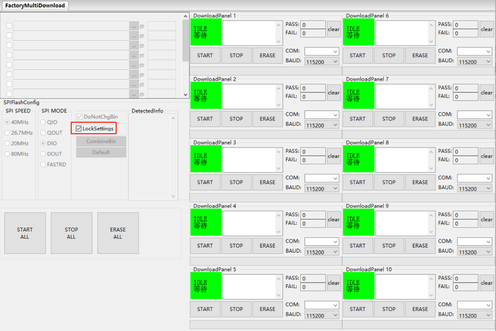

Flash Download Tool User Guide
==============================

:link_to_translation:`zh_CN:[中文]`

Preparation
-----------

The software and hardware resources required for downloading firmware to flash are listed below.

- Hardware:

  * 1 x module to which firmware is downloaded
  * 1 x PC (Windows 7 [64 bits], Windows 10)

- Software:

  * `Flash Download Tool <https://dl.espressif.com/public/flash_download_tool.zip>`__

Tool Overview
-------------

User Interface
^^^^^^^^^^^^^^

Open the `Flash Download Tool <https://dl.espressif.com/public/flash_download_tool.zip>`__, double-click the ``.exe`` file to enter the main interface of the tool, as shown in the figure below:

.. figure:: ../../../_static/flash_download_tool/main_interface.jpg
    :align: center
    :scale: 90%

    Flash Download Tool Main Interface

- ``ChipType``: select the chip type according to what product you use.

- ``WorkMode``: work mode of the tool. Below are the differences between the two modes supported currently, ``Develop`` and ``Factory`` modes.

  * ``Develop`` mode uses the absolute path of the firmware and only allows flashing firmware to one chip at a time.
  * ``Factory`` mode uses a relative path. It is recommended to place the firmware to be flashed in the bin folder at the same level as the ``.exe`` file. It will be automatically saved locally when closed after configuration.
  * Selecting ``Factory`` mode leads you to a locked interface in order to prevent misoperation by your mouse. Please click the ``LockSettings`` button to enable editing.

.. only:: esp8266 or esp32 or esp32c2

    - ``LoadMode``: only support ``UART``

.. only:: not esp8266 and not esp32 and not esp32c2

    - ``LoadMode``: support both ``UART`` and ``USB``

SPIDownload Tab
^^^^^^^^^^^^^^^

Here is the configuration descriptions.

- ``Download Path Config`` You can configure the firmware loading path and downloading address (in hexadecimal format), such as 0x1000.

- ``SPI Flash Config``

  * ``SPI SPEED``: SPI boot rate
  * ``SPI MODE``: SPI boot mode
  * ``DETECTED INFO``: flash & crystal oscillator information that are detected automatically.
  * ``DoNotChgBin``: If it is enabled, the tool flashes the original content of the bin file. If not enabled, the tool updates the firmware according to the ``SPI SPEED``, ``SPI MODE`` configuration on the interface before flashing.
  * ``CombineBin`` button: combines all the selected firmware in ``Download Path Config`` into one firmware. If ``DoNotChgBin`` is enabled, combine the original firmwares. If ``DoNotChgBin`` is not enabled, combine them according to the ``SPI SPEED`` and ``SPI MODE`` configuration. Any unused areas between firmware files will be filled with 0xff. The combined firmware will be saved as ./combine/target.bin. Each click of this button will overwrite the previous firmware.
  * ``Default`` button: restores the SPI configuration to the default values.

- ``Download Panel``

  * ``START``: start downloading
  * ``STOP``: stop downloading
  * ``ERASE``: erase the entire flash
  * ``COM``: serial port used for downloading
  * ``BAUD``: baud rate

.. figure:: ../../../_static/flash_download_tool/spidownload_interface.jpg
    :align: center
    :scale: 80%

    SPIDownload Tab

.. only:: esp8266

    HSPIDownload Tab
    ^^^^^^^^^^^^^^^^

    The SPIDownload tab is needed when ESP8266 connects to external flash via HSPI. It has the same interface as the HSPIDownload tab, please refer to `SPIDownload Tab`_ for interface description.

FactoryMultiDownload Tab
^^^^^^^^^^^^^^^^^^^^^^^^

- ``Factory`` mode uses the relative path. By default, the tool loads the firmware from the bin folder of the tool directory. Whereas, ``Develop`` mode uses the absolute path. The advantage of the ``Factory`` mode is that as long as the firmware to flash remains in the bin folder of the tool directory, path problems will not occur when the tool package is copied to other factory computers.

- In ``Factory`` mode, the tool enables ``LockSettings`` by default. When ``LockSettings`` is enabled, firmware download path config and ``SPI flash config`` cannot be configured. This is to prevent production line workers from accidentally clicking and causing errors. (When factory managers need to configure these settings, they can click ``LockSettings`` to unlock.)

    FactoryMultiDownload Tab

The ``download path config`` and ``SPI flash config`` section on the FactoryMultiDownload Tab are basically the same as those on the SPIDownload tab. Please refer to `SPIDownload Tab`_ for descriptions. Do not forget to configure the serial port number and baud rate of each download panel.

Download Example
----------------

.. only:: esp32

    This section takes ESP32 as an example to demonstrate how to perform both regular and encrypted download operations. {IDF_TARGET_NAME} supports regular and encrypted download.

.. only:: not esp32

    This section takes the ESP32 series as an example to demonstrate how to perform both regular and encrypted download operations. At present, {IDF_TARGET_NAME} only supports regular download, and will support encrypted download later.

Regular Download
^^^^^^^^^^^^^^^^

.. only:: esp8266 or esp32 or esp32s2 or esp32s3

    1. Pull GPIO0 low to enter the download mode.

.. only:: esp32c2 or esp32c3 or esp32c6 or esp32h2

    1. Pull GPIO9 low and GPIO8 high to enter the downloading mode.

2. Open the download tool, set ``ChipType`` to ``ESP32``, ``WorkMode`` to ``Develop``, and ``LoadMode`` to ``UART`` as shown in the figure below. Then, click ``OK``

.. figure:: ../../../_static/flash_download_tool/device_selection.jpg
    :align: center
    :scale: 90%

    Selecting Device — ESP32 Download Tool

3. In the appeared download page, enter the path to the bin file and the address where it should be downloaded, check the box before the path, and select ``SPI SPEED``, ``SPI MODE``, ``COM``, and ``BAUD`` according to your requirements.

4. Click ``START`` to start downloading. During the download process, the tool will read the flash information and the chip's MAC address.

5. After the download is complete, the tool interface is shown in the following figure.

.. figure:: ../../../_static/flash_download_tool/download_finish_interface.jpg
    :align: center
    :scale: 90%

    Download Completed

Encrypted Download
^^^^^^^^^^^^^^^^^^

The encrypted firmware downloading process is as follows:

- `Flash Download Tool <https://dl.espressif.com/public/flash_download_tool.zip>`__ downloads the plaintext firmware to the chip.

- The chip uses the key in its eFuse to encrypt the firmware and write it to the flash.

- If there is no such key in the eFuse, the tool will automatically generate a random one and flash it to eFuse. You can also prepare your own encryption key. If there is, the tool skips the key generation and flashing process.

To configure the encryption function, follow the steps below:

- Open the configuration file ./configure/esp32/security.conf. If there is no such file, for example, when you open the tool for the first time, restart the tool.

- Update the configuration options as needed.

Below are the configuration options. The equal sign is followed by the default value of the option. ``True`` means enabling the option; ``False`` means disabling it.

- **[SECURE BOOT]** Secure boot related configurations:

  * **secure_boot_en = False** (Configures whether to enable secure boot)

  .. only:: esp32

     * **secure_boot_version = 1** (Selects secure boot version)

  * **public_key_digest_path = .\secure\public_key_digest.bin** (Path to the public key digest file. This file is generated using the command ``espsecure digest_sbv2_public_key -k pem.pem -o public_key_digest.bin``. The ``.pem`` file is the private key file specified during compilation.)

  * **public_key_digest_block_index = 0** (Index of the eFuse block where the public key digest file is stored. Default: 0.)

- **[FLASH ENCRYPTION]** Flash encryption related configurations:

  * **flash_encryption_en = False** (Configures whether to enable flash encryption)

  * **reserved_burn_times = 3** (Configures how many times [3 in this case] are reserved for the flashing operation)

  .. only:: esp32s2 or esp32s3 or esp32c3 or esp32c6

    * **flash_encrypt_key_block_index = 0** (Configures the index of the encryption key in the block_key. Default: 0. Range: 0~4. For more information, refer to `Technical Reference Manual (PDF) <{IDF_TARGET_TRM_EN_URL}>`__ > Chapter eFuse Controller.)

.. only:: esp32c2

    * **flash_encrypt_key_block_index = 0** (Configures the index of the encryption key in the block_key. Default: 0. This index cannot be updated. For more information, refer to `Technical Reference Manual (PDF) <{IDF_TARGET_TRM_EN_URL}>`__ > Chapter eFuse Controller.)

- **[SECURE OTHER CONFIG]** Other security configurations:

  * **flash_encryption_use_customer_key_enable = False** (Configures whether to enable a customer-specified encryption key)

  * **flash_encryption_use_customer_key_path = .\secure\flash_encrypt_key.bin** (If using a customer-specified key, the key path needs to be specified here.)

  * **flash_force_write_enable = False** (Configures whether to skip encryption and secure boot checks during flashing. If it is set to False (default), an error message may pop up when attempting to flash products with enabled flash encryption or secure boot.)

- **[FLASH ENCRYPTION KEYS LOCAL SAVE]** Determines whether to store the encryption key file locally. Default: False.

* **keys_save_enable = False** (Configures whether to save the key.)

* **encrypt_keys_enable = False** (Configure whether to encrypt the locally stored key.)

* **encrypt_keys_aeskey_path =** (If you encrypt the locally stored key, please fill in the key file here, such as **./my_aeskey.bin**)

- **[ESP32* EFUSE BIT CONFIG]** Determines whether to set encryption items when flash encryption is enabled. Default: False.

.. only:: esp32

    .. list-table:: [ESP32 DISABLE FUNC] Config Option
        :header-rows: 1

        * - [ESP32 DISABLE FUNC] Config Option
          - Description

        * - dl_encrypt_disable = False
          - Configures whether to disable encryption

        * - dl_decrypt_disable = False
          - Configures whether to disable decryption

        * - dl_cache_disable = False
          - Configures whether to disable cache

        * - jtag_disable = False
          - Configures whether to disable JTAG

.. only:: esp32c2 or esp32c3 or esp32c6

    .. list-table:: [ESP32-C* DISABLE FUNC] Config Option
        :header-rows: 1

        * - [ESP32-C* DISABLE FUNC] Config Option
          - Description

        * - dis_usb_jtag = False
          - Configures whether to disable USB JTAG

        * - dis_pad_jtag = False
          - Configures whether to disable JTAG PAD

        * - soft_dis_jtag = 7
          - Configures whether to soft-disable JTAG

        * - dis_direct_boot = False
          - Configures whether to disable direct boot

        * - dis_download_icache = False
          - Configures whether to disable instruction cache in the Download mode

.. only:: esp32s2 or esp32s3

    .. list-table:: [ESP32-S* DISABLE FUNC] Config Option
        :header-rows: 1

        * - [ESP32-S* DISABLE FUNC] Config Option
          - Description

        * - dis_usb_jtag = False
          - Configures whether to disable USB JTAG

        * - hard_dis_jtag = False
          - Configures whether to hard-disable JTAG

        * - soft_dis_jtag = 7
          - Configures whether to soft-disable JTAG

        * - dis_usb_otg_download_mode = False
          - Configures whether to disable USB OTG download

        * - dis_direct_boot = False
          - Configures whether to disable direct boot

        * - dis_download_icache = False
          - Configures whether to disable instruction cache in the Download mode

        * - dis_download_dcache = False
          - Configures whether to disable data cache in the Download mode

.. only:: esp32h2

    .. list-table:: [ESP32-H* DISABLE FUNC] Config Option
        :header-rows: 1

        * - [ESP32-H* DISABLE FUNC] Config Option
          - Description

        * - dis_direct_boot = False
          - Configures whether to disable direct boot

        * - soft_dis_jtag = False
          - Configures whether to soft-disable JTAG

        * - dis_pad_jtag = False
          - Configures whether to hard-disable JTAG

        * - dis_usb_jtag = False
          - Configures whether to disable USB JTAG

There will be a prompt message (shown below) when the tool is running. Check if the message is correct. The figure below shows the prompt message of enabling both flash encryption and secure boot:

.. figure:: ../../../_static/flash_download_tool/flash_encryption_secure_boot.jpg
    :align: center
    :scale: 90%

    ESP32 Prompt Message of Enabling Flash Encryption and Secure Boot

During the firmware flashing process, the key and other information will be flashed into the chip's eFuse. After the flashing process is completed, ``FINISH/完成`` will be displayed.

.. note::

    Prior to downloading, the tool verifies flash encryption and secure boot information in the eFuse, so as to prevent re-downloading to and damaging the encrypted module.
