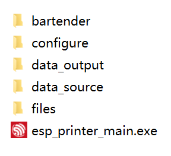
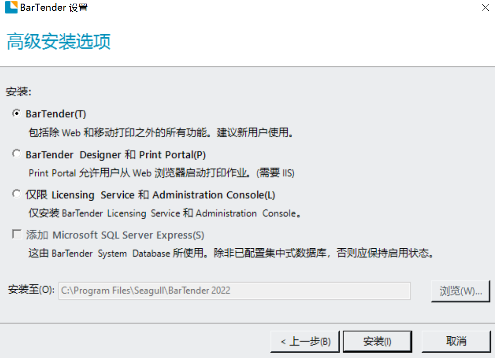
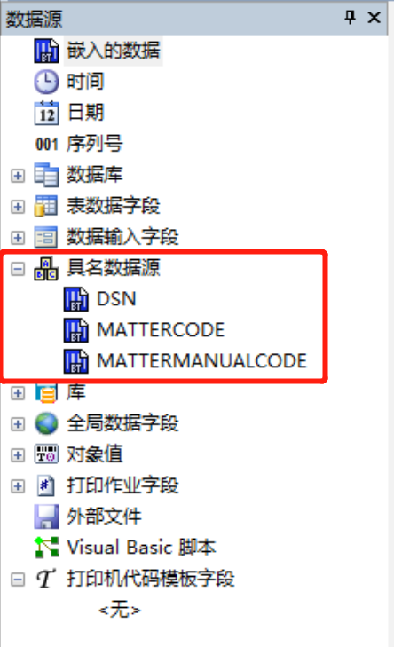
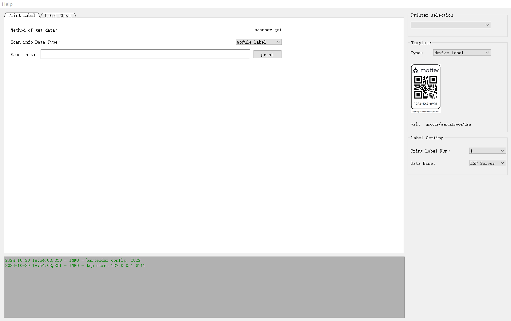
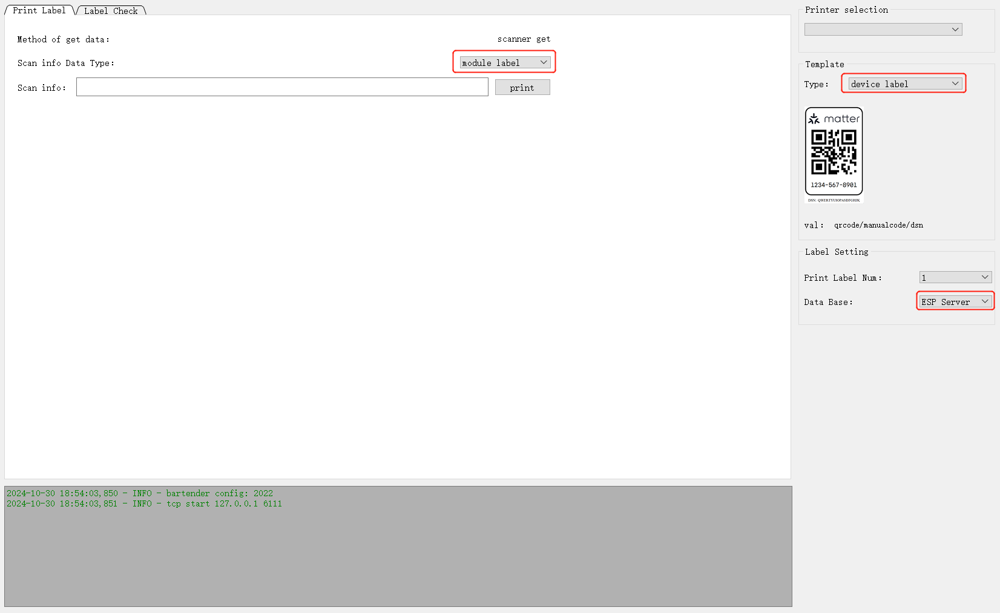
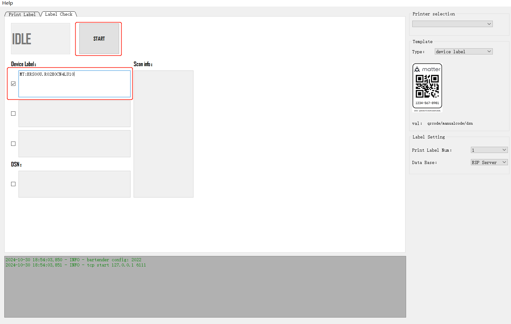

Matter QR Code Generator
========================

:link_to_translation:`zh_CN:[中文]`

`Matter QR Code Generator <https://dl.espressif.com/public/esp_matter_printer.zip>`_ is used to generate QR codes that are used for provisioning Espressif's Matter devices. Integrated with BarTender, the generator enables label design and printing. With Matter QR Code Generator, you can configure label templates, select printers, and define data sources flexibly, meeting various QR code generation and printing needs in different scenarios. The generator also supports laser engraving machines over LAN for easier integration.

Software Directory
------------------

The directory structure of the Matter QR code generator is as follows:

- ``bartender``: stores library dependency files
- ``configure``: stores configuration files
- ``data_output``: stores temporary output files
- ``data_source``: stores files for local printing
- ``files``: stores printing template files and scanning board firmware
- ``esp_printer_main.exe``: the main executable file

    QR code generator main interface (click to enlarge)

Get Started
-----------

Install BarTender
^^^^^^^^^^^^^^^^^

BarTender is the middleware of Espressif's Matter QR code Generator. Currently, Matter QR code Generator only supports `BarTender <https://www.seagullscientific.com/cn/software/>`__ 2022 and 2016 64-bit versions. During installation, make sure to choose the default path. You can select just the BarTender Designer module.

    Module selection (click to enlarge)

For more details about the installation process, refer to `Appendix II: BarTender (2022) Installation Process`_.

Edit Label Template
^^^^^^^^^^^^^^^^^^^

The label template defines the content and format of printed labels, and it can be edited using BarTender. The generator uses a default label template located in the the ``\\files\\matter`` directory. You may also customize this template to adjust the font, label size, or layout.

Note:

* Do not modify the label template filename.
* You can add or delete elements that are not bound to the data source, such as images, boxes, etc.
* Do not add or delete named data sources.

    Named data sources in the template (click to enlarge)

* The examples shown in the print interface are just static images. Your changes will not appear in the interface.

Tool Configuration
^^^^^^^^^^^^^^^^^^

The configuration files are located in the directory ``configure/config.conf``. You can open and edit them with Notepad.

.. Flat-table::
    :header-rows: 1
    :widths: 1 1 1 2

    * - Main Config
      - Subitem
      - Optional Value
      - Description
    * - :rspan:`2` facConfig
      - rssiLimit
      - Recommended range: -30 ~ -80
      - The signal strength threshold that must be reached for surrounding products to be scanned before printing
    * - getMacType
      - [devboard, scan]
      - Provides two ways to enter device information:
          - devboard: Obtain MAC by receiving Bluetooth broadcasts via the scanning board
          - scan: Directly obtain device information using a barcode scanner
    * - print_enable
      - [0, 1]
      - Controls the printer's enabled status:
          - 0: Only retrieve information; printing is disabled
          - 1: Enables printing
    * - :rspan:`1` SerialConfig
      - devPort
      - COM*
      - Scanning board serial port number
    * - devBaud
      - 115200
      - Scanning board baud rate
    * - :rspan:`1` v2_scanboard (only for V2 scanning boards)
      - scan_timeout
      - Default: 10
      - Scan timeout
    * - case_command
      - 2
      - Fixed value
    * - bartender
      - version
      - [2022, 2016]
      - BarTender Software Version [#]_

.. [#] Currently, only version 2016 and 2022 are supported.

Start Printing
--------------

Interface
^^^^^^^^^

    Advanced Options (click to enlarge)

Interface Configuration
^^^^^^^^^^^^^^^^^^^^^^^

- ``Printer selection``: The system printer is displayed by default. You can select a printer as needed
- ``Template``: Choose the template file used for printing
- ``Method of get data``: The method to get device information

  * ``Scanner get``: Use a barcode scanner

    * ``Scan info Data Type``: The format of the content scanned by the barcode scanner

      * ``Module label``: QR code on the Espressif module shield
      * ``Device label``: The already printed device label
      * ``MAC``: MAC address of Espressif products
  * ``BLE Broadcast``: Use a scanning board
- ``Print Label Num``: The number of labels to print. The maximum is currently 6
- ``Data Base``: Data source

  * ``ESP Server``: Retrieve QR code data from Espressif server
  * ``Local excel``: Query data from a local table and copy it to ``data_source/matter_qrcode_data.xlsx`` in the required format:

    .. figure:: ../../../_static/qr_tool/xlsx_data.png
        :align: center
        :scale: 90%

        Data storage format

  * ``Scanner data``: Retrieve information from scanned data (Currently only supported by Cyprus, as its device broadcast comes with MAC and QR code information).

Common Printing Methods
^^^^^^^^^^^^^^^^^^^^^^^

- Printing by scanning the shield QR code:

    Print by scanning the shield QR code (click to enlarge)

- Printing by scanning a printed label:

.. figure:: ../../../_static/qr_tool/devl_to_devl.png
    :align: center
    :scale: 50%

    Print by scanning a printed label (click to enlarge)

Check Printed Labels
--------------------

The purpose of checking printed labels is to ensure that the device information matches the printed QR code. To do this, a scanning board is required to scan the device's Bluetooth broadcast signal.

    QR code check (click to enlarge)

- To check the QR code, you need to use the configuration method of the scanning board, which corresponds to the ``Method of get data``: ``BLE boardcase`` in the ``Print Label`` interface.

  * In the configuration file ``facConfig``, set ``getMacType = devboard``.

- Check the checkbox based on the number of device codes to be checked, so as to enable the corresponding number of device labels.
- To perform a DSN check (only applicable for Cyprus), check the checkbox to enable this feature.

Integrate Laser Marking
-----------------------

Currently, the QR code can be obtained over LAN, enabling integration with the laser marking machine.

Configuration
^^^^^^^^^^^^^

.. list-table:: TCPserverConfig
    :header-rows: 1
    :align: center
    :widths: 1 1 2

    * - Configuration Item
      - Configuration Value
      - Description
    * - server_enable
      - 1
      - Enable LAN for QR code retrieval
    * - ip
      - 127.0.0.1
      - LAN address. If the laser marking host and this host are on the same PC, the loopback address can be used
    * - port
      - 6000
      - TCP communication port
    * - qr_req_string
      - get_qrcode
      - The command to request QR code. This can be adjusted based on the configuration of the laser marking machine
    * - manual_req_string
      - get_manualcode
      - The command to request manual code. This can be adjusted based on the configuration of the laser marking machine
    * - dsn_req_string
      - get_dsncode
      - The command to request dsn code. This can be adjusted based on the configuration of the laser marking machine

Appendix I: Flash Scan Board Firmware
-------------------------------------

- To flash the scanning board firmware, the ESP32-C3 series development boards are required. Select the development board based on your needs.
- bin file path: ``./files``
- Flash address: ``0x0``

Flash tool download: `Click here to download the flash tool <https://dl.espressif.com/public/flash_download_tool.zip>`_

Appendix II: BarTender (2022) Installation Process
--------------------------------------------------

The following figures show the whole process of BarTender installation (Take BarTender 2022 as an example):

#. Check the advanced installation option checkbox.

    .. figure:: ../../../_static/qr_tool/bar_2.png
      :align: center
      :scale: 90%

      Choose advanced installation options (click to enlarge)

#. Use the default installation path.

    .. figure:: ../../../_static/qr_tool/bar_3.png
      :align: center
      :scale: 90%

      Default installation path (click to enlarge)

#. The installation process is as follows.

    .. figure:: ../../../_static/qr_tool/bar_4.png
      :align: center
      :scale: 90%

      BarTender Installing (click to enlarge)

    .. figure:: ../../../_static/qr_tool/bar_5.png
      :align: center
      :scale: 90%

      Installation completed (click to enlarge)

#. Enter the serial number to activate BarTender.

    .. figure:: ../../../_static/qr_tool/bar_6.png
      :align: center
      :scale: 90%

      Enter serial number (click to enlarge)
