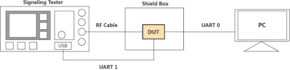
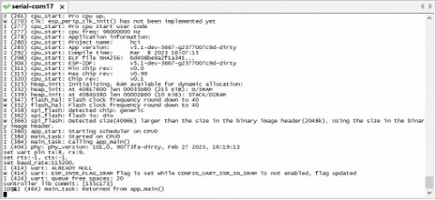
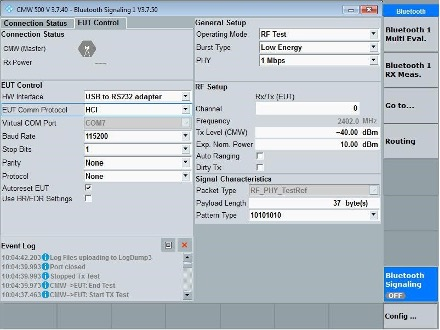
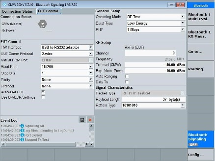
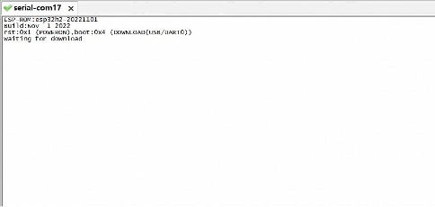

Bluetooth LE DTM Test Guide
===========================

:link_to_translation:`zh_CN:[中文]`

Introduction
------------

Test Introduction
^^^^^^^^^^^^^^^^^

This guide will introduce how to conduct Bluetooth LE DTM Test based on ESP32-H2 products, by using related software and equipment.

Product Introduction
^^^^^^^^^^^^^^^^^^^^

Details about product can be found in data sheet.To see more information please enter espressif official website.

Test Structure
--------------

    Test Structure

**DUT(Device Under Test)**: Products based on ESP32-H2 platform, which will be called as DUT in the rest of the article.

**PC**: When testing, run serial port tool on PC. PC and DUT communicate through UART, to set configurations for different test purposes.

**Signaling Tester**: To test performance of DUT, e.g., Rohde & Schwarz CMW500

Preparation before Test
-----------------------

Hardware Preparation
^^^^^^^^^^^^^^^^^^^^

.. list-table:: Hardware
  :widths: 20 40 10 30

  * - Name
    - Picture
    - Number
    - Introduction
  * - Serial port board
    - .. figure:: ../../_static/rf_test_tool/serial_board.jpg
    - 2
    - Used as USB -to-Serial adapter. DUT communicates with PC through UART to set test configurations.

  * - Micro USB Cable
    - .. figure:: ../../_static/rf_test_tool/usb_cable.jpg
    - 2
    - Used for connection between DUT and PC.
  * - PC
    - --
    - 1
    - To run serial tool and EspTestTool
  * - Test Instruments (e.g.CMW500)
    - --
    - 1
    - Used to test Bluetooth LE performance parameters.Can be other instruments which can realize same function.
  * - RF Cable
    - --
    - 1
    - Used to transmit and receive radio signal between tester and DUT

Software Preparation
^^^^^^^^^^^^^^^^^^^^

.. list-table::
  :widths: 50 50

  * - Name
    - Introduction
  * - ft232r-usb-uart.zip
    - Driver for USB to Serial Port (will be downloaded automatically when serial board is plugged)
  * - SecureCRT or other serial port tools
    - DUT receives commands from PC to set up test configurations.
  * - EspRFTestTool_vX.X_Manual (downloaded from espressif website)
    - To configure and conduct different test modes

DTM Test - HCI
--------------

Hardware Connection
^^^^^^^^^^^^^^^^^^^

UART 0
""""""

This UART is used to communication between PC and DUT. DUT receive commands from PC to set up test configurations and download bin file. Here is the connection details:

- DUT TXD0：Connected to Serial port board TX0.
- DUT RXD0：Connected to Serial port board RX0.
- DUT GND：Connected to Serial port board GND.
- DUT 3V3：Connected to Serial port board 3V3.

UART 1
""""""

HCI Serial port, used for connection between DUT and Tester. Here is the connection details:

- DUT pin IO8：Connected to Serial port board TX0.
- DUT pin IO9：Connected to Serial port board RX0.
- 	DUT GND：Connected to Serial port board GND.

.. note::

    If you are not using ESP serial port board, TX & RX connection may be opposite.

Test Execution
^^^^^^^^^^^^^^

1. Connect DUT with PC by UART0, and connect DUT with Tester by UART1.
2. Open serial port tool, open the serial port of UART0 and set baud rate as 115200. After DUT being powered on (connect RF cable between DUT and tester before electrifying DUT), the following content will be printed on serial port interface.

    Log of DUT entering Bluetooth LE DTM mode

3. Send following commands in sequence in command bar:

   - bqb -z set_ble_tx_power -i [power_level_index] (See Appendix B)

     After sending this command, the log will print: Set Bluetooth LE TX power to power_level_index level.

    .. figure:: ../../_static/rf_test_tool/log_ble_dtm_succ_setup.jpg
        :align: center
        :scale: 120%

        Log of Bluetooth LE DTM successfully set up

4. Now, the Bluetooth LE DTM HCI configuration is finished. You are able to conduct Bluetooth LE tests by operating the tester.

    EUT Control Configuration on Tester - HCI

DTM Test - 2-wire UART (not supported for now)
----------------------------------------------

Hardware Connection
^^^^^^^^^^^^^^^^^^^

When conducting 2-wire DTM, only UART1 is necessary.

UART1
""""""

This UART is used to communication between Tester and DUT. Here is the connection details:

- DUT pin IO8：Connected to Serial port board TX0.
- DUT pin IO9：Connected to Serial port board RX0.

.. note::

    Hardware Flow Control is disabled by default.

Test Execution
^^^^^^^^^^^^^^

The initialization of 2-wire UART DTM function will be initiated automatically after power on.There is no need to input serial commands. After DUT power on, operate the tester directly.

    EUT Control Configuration on Tester - 2-wire UART

Appendix A - Bin Download
-------------------------

Hardware Set up
^^^^^^^^^^^^^^^

Besides connect DUT with PC through UART0 as following, lower IO9 and pull up IO8. Then electrify DUT. In this way, the chip will enter bin download mode.

- DUT TXD0：Connected to Serial port board TX0.
- DUT RXD0：Connected to Serial port board RX0.
- DUT GND：Connected to Serial port board GND.
- DUT 3V3：Connected to Serial port board 3V3.

You may check serial port log to verify that chip has successfully entered bin download mode. If chip enters bin download mode, the log will be like this:

    Log of bin download mode

Then, keep IO8&IO9 floating and re-electrify the DUT, chip will enter work mode, in which the chip realizes its functions.

Download bin by EspRFTestTool
^^^^^^^^^^^^^^^^^^^^^^^^^^^^^

You can use EspRFTestTool to download related bin. Here are the operation steps.

- Select Tool - Download Tool.
- Choose correct Chip Type, Com Port and Baud Rate. Click Open.
- Choose Flash. Check the checkbox in first row. Click ``...`` to select bin file. Fill in correct address.

  * bootloader.bin : 0x1000
  * partion-table.bin : 0x8000
  * ssc.bin : 0x10000

- Click ``Start Loading``

.. figure:: ../../_static/rf_test_tool/download_bin_esprftesttool1.png
    :align: center

    Download bin using EspRFTestTool (1)

.. figure:: ../../_static/rf_test_tool/download_bin_esprftesttool2.png
    :align: center

    Download bin using EspRFTestTool (2)

When “SUCC” with yellow background appears, it means the bin has been successfully downloaded.

Appendix B - UART0 Commands Introduction
----------------------------------------

Set up Bluetooth LE TX Power
^^^^^^^^^^^^^^^^^^^^^^^^^^^^

Command: ``bqb -z set_ble_tx_power -i [Power_level_index]``

Introduction: Power level index corresponds to TX power, varies from 0 ~ 15.

.. list-table::
  :widths: 50 50

  * - Power Level Index
    - TX Power/dBm
  * - 0
    - -24
  * - 1
    - -21
  * - 2
    - -18
  * - 3
    - -15
  * - 4
    - -12
  * - 5
    - -9
  * - 6
    - -6
  * - 7
    - -3
  * - 8
    - 0
  * - 9
    - 3
  * - 10
    - 6
  * - 11
    - 9
  * - 12
    - 12
  * - 13
    - 15
  * - 14
    - 18
  * - 15
    - 20

For instance, command ``bqb -z set_ble_tx_power -i 9`` will set Bluetooth LE TX power from as 3 dBm .

Change pin for UART1
^^^^^^^^^^^^^^^^^^^^

Command: ``bqb -z reconfig_uart1_pin -t [TX_pin] -r [RX_pin]``

Introduction: If GPIO8 and GPIO9 can not be the pins for UART1, you can use this command to configure other GPIO as the pins for UART1.

For instance, command bqb -z reconfig_uart1_pin -t 4 -r 5 will set GPIO4 as UART1 TX pin,
GPIO5 as UART1 RX pin.
