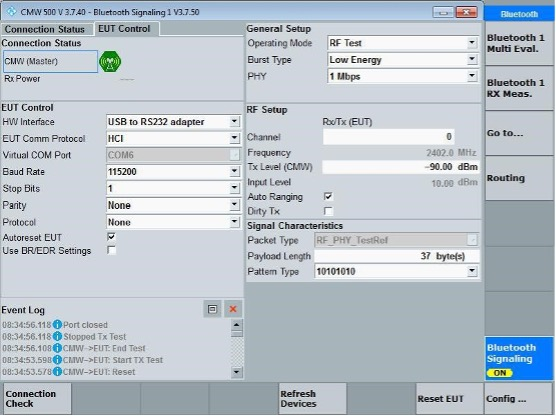
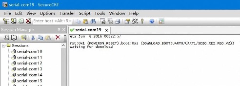
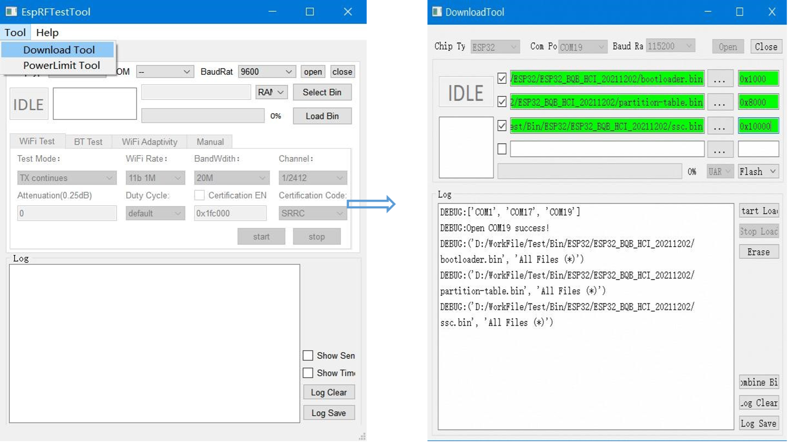
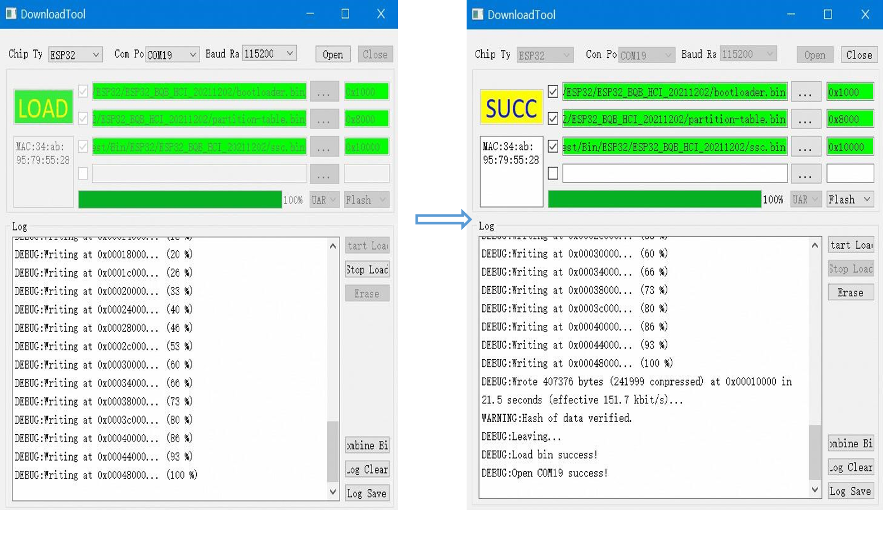

ESP32 Bluetooth Signaling Test Guide
*********************************************

:link_to_translation:`zh_CN:[中文]`

Introduction
================

Test Introduction
-------------------

This guide will introduce how to conduct Bluetooth Signaling Test based on ESP32 products, by using related software and equipment.

Product Introduction
--------------------

ESP32 supports both classic BT (BR & EDR) and Bluetooth Low Energy (LE 1M PHY). The signaling test methods of the two Bluetooth modes are different.

To get more information about ESP32 product, please enter espressif official website.

Test Structure
==============

.. figure:: ../../_static/rf_test_tool/bt_signal_test_frame.jpg
    :align: center
    :scale: 120%

    Bluetooth Signaling Test Frame

**DUT(Device Under Test)**: Products based on ESP32 platform, which will be called as DUT in the rest of the article.

**PC**: Run serial port tool on PC to send commands and get return log. PC and DUT communicate by UART-to-Serial to set configurations for different test purposes.

**Signaling Tester**: To test RF performance of DUT, e.g. Rohde & Schwarz CMW500.

Preparation before Test
=======================

Hardware Preparation
--------------------

.. list-table:: Hardware
  :widths: 20 40 10 30

  * - Name
    - Picture
    - Number
    - Introduction
  * - Serial port board
    - .. figure:: ../../_static/rf_test_tool/serial_board.jpg
    - 2
    - Used as UART -to-Serial adapter. DUT communicates with PC through UART, to set test configurations
  * - Micro USB Cable
    - .. figure:: ../../_static/rf_test_tool/usb_cable.jpg
    - 2
    - Used for connection between DUT and PC
  * - PC
    - --
    - 1
    - Run EspRFTestTool and serial port tools
  * - Test Instruments (e.g.CMW500)
    - --
    - 1
    - Used to test Bluetooth LE performance parameters. Can be other instruments which can realize same function.
  * - RF Cable
    - --
    - 1
    - Used to transmit and receive radio signal between tester and DUT

Software Preparation
--------------------

.. list-table::
  :widths: 50 50

  * - Name
    - Introduction
  * - ft232r-usb-uart.zip
    - Driver for USB to Serial Port (will be downloaded automatically when serial board is plugged)
  * - SecureCRT or other serial port tools
    - DUT receives commands from PC to set test configurations.
  * - EspRFTestTool_vX.X_Manual (downloaded from espressif website)
    - To download bin file

Signaling Test for BLE
======================

Hardware Connection
-------------------

UART 0
""""""

This UART is used for communication between PC and DUT. DUT receive commands from PC to set test configurations and download bin file. Here is the connection detail:

- DUT TXD0：Connected to serial board TX0.
- DUT RXD0：Connected to serial board RX0.
- DUT GND：Connected to serial board GND.
- DUT 3V3：Connected to serial board 3V3.

UART 1
""""""

HCI Serial port, used for connection between DUT and Tester. Here is the connection detail:

- DUT pin IO5：Connected to the other serial board TX0.
- DUT pin IO18：Connected to the other serial board RX0.

.. note::

    If you are not using ESP serial board, connection of TX0 and RX0 may be opposite.

Command Configuration
---------------------

1. Connect DUT with PC by UART0, and connect DUT with Tester by UART1.
2. Open serial port tool, open the serial port of UART0 and set baud rate as 115200. Then electrify DUT. (Connect RF cable between DUT and tester before electrifying DUT).
3. Send following commands in sequence in command bar:

   - bqb -z set_ble_tx_power -i 7
   - bqb -z set_uart_param -f 0 -b 115200
   - bqb -z init
   - bqb -z set_pll_track -e 0
   - bqb -z init

After sending every command , serial port interface will print “BT: OK”, which represents the command has been responded correctly. After sending the last command, the correct return log from serial port is shown in Appendix C.
4. Now, the Bluetooth LE HCI configuration is finished. You are able to conduct ESP32 Bluetooth Signaling test for Bluetooth Low Energy by operating the tester. If you use CMW500 as the signaling tester, the set up is shown in the picture below.

    Bluetooth Signaling EUT Control Configuration on Tester - ESP32 Bluetooth LE HCI

Signaling Test for Classic BT
=============================

Hardware Connection
-------------------

UART0
""""""

This UART is used for communication between PC and DUT. DUT receive commands from PC to download bin file and set test configurations. Here is the connection detail:

- DUT TXD0：Connected to serial board TX0.
- DUT RXD0：Connected to serial board RX0.
- DUT GND：Connected to serial board GND.
- DUT 3V3：Connected to serial board 3V3.

UART1
""""""

For classic BT signaling test of ESP32, this UART is used for HCI configuration.

- DUT pin IO5：Connected to the other serial board TX0.
- DUT pin IO18：Connected to the other serial board RX0.
- DUT pin IO19：Connected to the other serial board RTS.
- DUT pin IO23：Connected to the other serial board CTS.

Command Configuration
---------------------

1. Connect DUT with PC by UART0 and UART1.

2. Open serial port tool, open the serial port of UART0 and set baud rate as 115200. Then electrify DUT. (Connect RF cable between DUT and tester before electrifying DUT).

3. Send following commands by UART0 in sequence in command bar:

   - bqb -z set_power_class -i 0 -a 7
   - bqb -z set_pll_track -e 0
   - bqb -z init

  After sending every command, serial port interface will print “BT: OK”, which represents the command has been responded correctly.

4. Open dev0.txt file in ESP32_BQBRF7_release_en_v1.x.x\tools\HCI_host\config folder, fill in the COM number of UART1, as shown in the figure below.

  .. figure:: ../../_static/rf_test_tool/fill_in_com_number_uart1.jpg
      :align: center
      :scale: 120%

      Fill in COM number of UART1 in dev0 file

5. Open tinyBH application program, send following commands in sequence:

   - hci reset
   - hci set_evt_mask
   - hci set_name ESPTEST
   - hci dut
   - hci ipscan

  The correct return log is supposed to print as shown in Appendix D.

6. Now, the command configuration for classic BT signaling test is finished. You are able to conduct ESP32 signaling test for classic BT by operating the tester. If you use CMW500 as the signaling tester, the set up is shown in the picture below.

../../_static/rf_test_tool/bt_signal_eut_control_config_bt.jpg

    Bluetooth Signaling EUT Control Configuration on Tester - ESP32 classic BT

Appendix A - Bin Download for ESP32 Bluetooth signaling test
============================================================

Hardware Connection
-------------------

Besides connect DUT with PC through UART0 as following, lower pin IO0 and IO2. Then electrify DUT. In this way, the chip will enter bin download mode.

- DUT TXD0：Connected to serial board TX0.
- DUT RXD0：Connected to serial board RX0.
- DUT GND：Connected to serial board GND.
- DUT 3V3：Connected to serial board 3V3.

You may check serial port log to verify that chip has successfully entered bin download mode. If chip enters bin download mode, the log will be printed as shown below.

    Log of bin download mode

Next, keep IO0 floating and re-electrify the DUT, ESP32 SoC will enter work mode, in which the chip realizes its functions.

Download bin by EspRFTestTool
-----------------------------

You can use EspRFTestTool to download related bin files. Here are the operation steps.

- Select Tool - Download Tool.
- Choose correct Chip Type, Com Port and Baud Rate. Click Open.
- Choose Flash. Check the checkbox in first row. Click ``...`` to select bin file.Fill in bin download address. (bootloader.bin : 0x1000 / partion-table.bin : 0x8000 / ssc.bin : 0x10000)
- Click ``Start`` to load

    Download bin using EspRFTestTool (1)

    Download bin using EspRFTestTool (2)

When “SUCC” with yellow background appears, it means the bin has been successfully downloaded.

.. note::

    The download address may vary from different chip types and bin files.

Appendix B - UART0 Commands Introduction
========================================

Set up Bluetooth LE TX Power
-----------------------------

Command: ``bqb -z set_ble_tx_power -i [Power_level_index]``

Introduction: Power level index corresponds to TX power, varies from 0 ~ 15.

.. list-table::
  :widths: 50 50

  * - Power Level Index
    - TX Power/dBm
  * - 0
    - -12
  * - 1
    - -9
  * - 2
    - -6
  * - 3
    - -3
  * - 4
    - 0
  * - 5
    - 3
  * - 6
    - 6
  * - 7
    - 9

For instance, command bqb -z set_ble_tx_power -i 7 will set Bluetooth LE TX power as 9 dBm.

Set up classic BT TX Power
--------------------------

Command: ``bqb -z set_power_class -i [Min_power_level_index] -a [Max_power_level_index]``

Introduction:	Set	TX	power	range	by	setting	min	&	max	power_level_index.

Min_power_level_index is supposed to be smaller than or equal to Max_power_level_index. For instance, command bqb -z set_power_class -i 0 -a 7 will set ESP32 classic BT TX power between -12dBm and 9dBm.

Change pin for UART1
---------------------

Command: ``bqb -z set_uart_pin -t [TX_pin] -r [RX_pin] -q [RTS_pin] -c [CTS_pin]``

Introduction: If GPIO7\GPIO4\GPIO18\GPIO10 can not be the pins for UART1, you can use this command to configure other GPIO as the pins for UART1.

For instance, command bqb -z set_uart_pin -t 7 -r 8 -q 9 -c 10 will set GPIO7 as UART1 TX pin, GPIO8 as UART1 RX pin, GPIO9 as UART1 RTS pin, GPIO10 as UART1 CTS pin.

Appendix C - Correct power-on return log of UART0 for ESP32 Bluetooth LE signaling test
========================================================================================

.. code::

    ÿets Jul 29 2019 12:21:46
    rst:0x1 (POWERON_RESET),boot:0x13 (SPI_FAST_FLASH_BOOT) configsip: 153911750, SPIWP:0xee clk_drv:0x00,q_drv:0x00,d_drv:0x00,cs0_drv:0x00,hd_drv:0x00,wp_drv:0x00 mode:DIO, clock div:2 load:0x3fff0030,len:6720 load:0x40078000,len:14816 load:0x40080400,len:3584 entry 0x40080660
    [0;32mI (28) boot: ESP-IDF v4.4-dev-3068-g5758c11e6d 2nd stage bootloader[0m
    [0;32mI (28) boot: compile time 11:42:08[0m
    [0;32mI (28) boot: chip revision: 3[0m
    [0;32mI (32) boot_comm: chip revision: 3, min. bootloader chip revision: 0[0m
    [0;32mI (40) boot.esp32: SPI Speed	: 40MHz[0m
    [0;32mI (44) boot.esp32: SPI Mode	: DIO[0m
    [0;32mI (49) boot.esp32: SPI Flash Size : 2MB[0m
    [0;32mI (53) boot: Enabling RNG early entropy source...[0m
    [0;32mI (59) boot: Partition Table:[0m
    [0;32mI (62) boot: ## Label	Usage	Type ST Offset	Length[0m
    [0;32mI (70) boot:	0 nvs	WiFi data	01 02 00009000 00006000[0m
    [0;32mI (77) boot:	1 phy_init	RF data	01 01 0000f000 00001000[0m
    [0;32mI (84) boot:	2 factory	factory app	00 00 00010000 00100000[0m
    [0;32mI (92) boot: End of partition table[0m
    [0;32mI (96) boot_comm: chip revision: 3, min. application chip revision: 0[0m
    [0;32mI (103) esp_image: segment 0: paddr=00010020 vaddr=3f400020 size=0bf90h ( 49040) map[0m
    [0;32mI (130) esp_image: segment 1: paddr=0001bfb8 vaddr=3ffbdb60 size=04060h ( 16480) load[0m
    [0;32mI (136) esp_image: segment 2: paddr=00020020 vaddr=400d0020 size=3acfch (240892) map[0m
    [0;32mI (224) esp_image: segment 3: paddr=0005ad24 vaddr=3ffc1bc0 size=0104ch (	4172) load[0m
    [0;32mI (226) esp_image: segment 4: paddr=0005bd78 vaddr=40080000 size=17990h ( 96656) load[0m
    [0;32mI (269) esp_image: segment 5: paddr=00073710 vaddr=50000000 size=00010h (	16) load[0m
    [0;32mI (281) boot: Loaded app from partition at offset 0x10000[0m
    [0;32mI (281) boot: Disabling RNG early entropy source...[0m
    [0;32mI (293) cpu_start: Pro cpu up.[0m
    [0;32mI (293) cpu_start: Single core mode[0m
    [0;32mI (301) cpu_start: Pro cpu start user code[0m
    [0;32mI (301) cpu_start: cpu freq: 160000000[0m
    [0;32mI (301) cpu_start: Application information:[0m
    [0;32mI (306) cpu_start: Project name:	ssc[0m
    [0;32mI (310) cpu_start: App version:	v4.0-beta1-201-gc39494b0-dirty[0m
    [0;32mI (317) cpu_start: Compile time:	Dec	2 2021 11:44:53[0m
    [0;32mI (324) cpu_start: ELF file SHA256:	ec302a092ca311e1...[0m
    [0;32mI (329) cpu_start: ESP-IDF:	v4.4-dev-3068-g5758c11e6d[0m
    [0;32mI (336) heap_init: Initializing. RAM available for dynamic allocation:[0m
    [0;32mI (343) heap_init: At 3FF80000 len 00002000 (8 KiB): RTCRAM[0m
    [0;32mI (349) heap_init: At 3FFAFF10 len 000000F0 (0 KiB): DRAM[0m
    [0;32mI (356) heap_init: At 3FFB7CD8 len 00000328 (0 KiB): DRAM[0m
    [0;32mI (362) heap_init: At 3FFB9A20 len 00004108 (16 KiB): DRAM[0m
    [0;32mI (368) heap_init: At 3FFC4A48 len 0001B5B8 (109 KiB): DRAM[0m
    [0;32mI (374) heap_init: At 3FFE0440 len 0001FBC0 (126 KiB): D/IRAM[0m
    [0;32mI (381) heap_init: At 40078000 len 00008000 (32 KiB): IRAM[0m
    [0;32mI (387) heap_init: At 40097990 len 00008670 (33 KiB): IRAM[0m
    [0;32mI (394) spi_flash: detected chip: mxic[0m
    [0;32mI (397) spi_flash: flash io: dio[0m
    [0;33mW (401) spi_flash: Detected size(8192k) larger than the size in the binary image header(2048k). Using the size in the binary image header.[0m
    [0;32[0;32mI (426) uart: queue free spaces: 10[0m
    SSC: BQB default pin UART1 TX 5, RX, 18, RTS 19, CTS 23
    SSC version : cert/bqb_rf_mas_20210913(c39494b0)
    IDF version : cert/bqb_rf_mas_20210913(5758c11e)
    WIFI LIB version : cert/bqb_rf_mas_20210913(5758c11e)
    BT LIB version : cert/bqb_rf_mas_20210913(5758c11e)
    !!!ready!!!
    bqb -z set_ble_tx_power -i 4 SSC: bqb
    ssc_bt, got op i
    SSC: set ble tx power, idx 4
    +BT:OK
    :>bqb -z set_uart_param -f 0 -b 115200 SSC: bqb
    ssc_bt, got op f
    ssc_bt, got op b
    +BT:OK
    :>bqb -z init
    SSC: bqb
    SSC: bluetooth init
    UART1 baud rate 115200
    HCI UART1 Pin select: TX 5, RX 18, CTS 23, RTS 19
    [0;32mI (6946) BTDM_INIT: BT controller compile version [d1d699b][0m
    Heap MSG [0x3ffc822c], Hea
    :>p ENV [0x3ffc91cc], Heap NORET [0x3ffcb4cc]
    Uart	ENV	[0x3ffba31c],	VHCI	ENV	[0x00000000],	PLF	FUNCS
    [0x3ffba2b0]
    BTDM CONTROLLER VERSION: 010200
    BTDM CONTROLLER DATE: Sep 13 2021 17:11:58
    BTDM ROM VERSION 0101
    [0;32mI (6976) system_api: Base MAC address is not set[0m
    [0;32mI (6976) system_api: read default base MAC address from EFUSE[0m
    BD_ADDR: C4:DE:E2:1D:4D:7E
    NVDS MAGIC FAILED
    RF Init OK with coex
    ACL Link Number[7], Mask other ACL Links
    [0;32mI (7496) phy_init: phy_version 4700,0dcb552,Sep 22 2021,19:22:08[0m
    PLL track enable
    BT BB INTR enabled!
    ACL Link Number[7], Mask other ACL Links
    Enable Classic BT
    Enable Low Energy
    +BT:OK
    bqb -z set_pll_track -e 0 SSC: bqb
    ssc_bt, got op e
    SSC: set pll track 0
    +BT:OK
    :>bqb -z init
    SSC: bqb
    SSC: bluetooth init
    :>UART1 baud rate 115200
    HCI UART1 Pin select: TX 5, RX 18, CTS 23, RTS 19
    +BT:OK
    ACL Link Number[7], Mask other ACL Links
    LLD: ble testmode txpwr 4

Appendix D - Correct returned log for ESP32 classic BT HCI command configuration
===================================================================================

.. code::

    _________[NORMAL][I][	MAIN] : TinyBH starting...
    [NORMAL][I][	CFG] : ======== Global Config Dump [START] ========
    [NORMAL][I][	CFG] : Device Name : dev0
    [NORMAL][I][	CFG] : Mode : HciConsole
    [NORMAL][I][	CFG] : Layer: HciOnly
    [NORMAL][I][	CFG] : ======== Global Config Dump [END] ========
    [NORMAL][I][
    [MISC]	DEVICE] : Device initialising [dev0] ...
    [NORMAL][I][	EIF] : EIF init
    [1;34m[	dev0][I][	HUART] : Open uart[0m
    [NORMAL][I][ VTHREAD] : Vthread[dev0 [HCI]] running!!
    [NORMAL][I][ VTHREAD] : Vthread[dev0 [HCI]] running!!
    [1;34m[ dev0][I][ GAP_BLE] : module "gap" \init[0m [NORMAL][I][ VTHREAD] : Vthread[dev0[STACK]] running!!
    [NORMAL][I][ VTHREAD] : Vthread[dev0[SYS_EVT]] running!!
    ===============================================================
    [1;32m[	Cnsl][I][ CONSOLE] : Console mode starting ... [0m
    >>hci reset
    [1;32m[	Cnsl][I][ CONSOLE] : console echo: hci reset[0m
    [1;32m[	Cnsl][I][HCI_CNSL] : hci_console_handler: reset[0m
    [1;32m[	Cnsl][I][HCI_CNSL] : send reset[0m
    [1;34m[	dev0][D][	HCI] : 01 03 0c 00 [0m
    >>[1;34m[	dev0][D][	H4] : 01 03 0c 00 [0m
    [1;34m[	dev0][D][	H4] : [DEV : dev0] RECV:[0m
    [1;34m[	dev0][D][	HCI] : HCI_EVT[0m
    [1;34m[	dev0][D][	HCI] : EVT Opcode 0e[0m
    [1;34m[	dev0][D][	HCI] : TOTAL LENGTH 4[0m
    [1;34m[	dev0][D][	HCI] : HCI EVT COMMAND COMPLETE:[0m
    [1;34m[	dev0][D][	HCI] : Num HCI COMMAND PACKETS 5[0m
    [1;34m[	dev0][D][	HCI] : HCI EVT RESET, STATUS[00][0m
    [1;32m[	Cnsl][I][HCI_CNSL] : SYS HCI EVT 10001[0m
    >>hci set_evt_mask
    [1;32m[	Cnsl][I][ CONSOLE] : console echo: hci set_evt_mask[0m
    [1;32m[	Cnsl][I][HCI_CNSL] : hci_console_handler: set_evt_mask[0m
    [1;32m[	Cnsl][I][HCI_CNSL] : set event mask[0m
    [1;34m[	dev0][D][	HCI] : 01 01 0c 08 ff ff ff ff ff ff ff 3f [0m
    >>[1;34m[	dev0][D][	H4] : 01 01 0c 08 ff ff ff ff ff ff ff 3f [0m
    [1;34m[	dev0][D][	H4] : [DEV : dev0] RECV:[0m
    [1;34m[	dev0][D][	H4] : 04 0e 04 05 [0m
    [1;34m[	dev0][D][	H4] : [DEV : dev0] RECV:[0m
    [1;34m[	dev0][D][	HCI] : HCI_EVT[0m
    [1;34m[	dev0][D][	HCI] : EVT Opcode 0e[0m
    [1;34m[	dev0][D][	HCI] : TOTAL LENGTH 4[0m
    [1;34m[	dev0][D][	HCI] : HCI EVT COMMAND COMPLETE:[0m
    [1;34m[	dev0][D][	HCI] : Num HCI COMMAND PACKETS 5[0m
    [1;34m[	dev0][D][	HCI] : HCI EVT SET EVENT MASK, STATUS[00][0m
    [1;32m[	Cnsl][I][HCI_CNSL] : SYS HCI EVT 10004[0m
    >>hci set_name ESPTEST
    [1;32m[	Cnsl][I][ CONSOLE] : console echo: hci set_name ESPTEST[0m
    [1;32m[	Cnsl][I][HCI_CNSL] : hci_console_handler: set_name[0m
    [1;32m[	Cnsl][I][HCI_CNSL] : set device name[0m
    [1;34m[	dev0][D][	HCI] : 13 0c f8 45 53 50 54 45 53 54 00 00 00 00 00 00 0
    0 00 00 00 00 00 00 00 00 00 00 00 00 00 00 00 00 00 00 00 00 00 00 00 00 00 00
    00 00 00 00 00 00 00 00 00 00 00 00 00 00 00 00 00 00 00 00 00
    00 00 00 00 00 00 00 00 00 00 00 00 00 00 00 00 00 00 00
    00 00 00 00 00 00 00 00 00 00 00 00 00 00 00 00 00 00 00 00 00 00 00 00 00 00 0
    0 00 00 00 00 00 00 00 00 00 00 00 00 00 00 00 00 00 00
    00 00 00 00 00 00 00 00 00 00 00 00 00 00 00 00 00 00 00
    00 00 00 00 00 00 00 00 00 00 00 00 00 00 00 00 00 00 00 00 00 00 00 00 00 00 0
    0 00 00 00 00 00 00 00 00 00 00 00 00 00 00 00 00 00 00
    00 00 00 00 00 00 00 00 00 00 00 00 00 00 00 00 00 00 00
    00 00 00 00 00 00 00 00 00 00 00 00 00 00 00 00 00 00 00 00 00 00 00 00 00 00 0
    0 00 00 00 00 00 00 00 00 00 00 00 00 00 [0m
    >> [1;34m[	dev0][D][	H4] : [DEV : dev0] RECV:[0m
    [1;34m[	dev0][D][	HCI] : HCI_EVT[0m
    [1;34m[	dev0][D][	HCI] : EVT Opcode 0e[0m
    [1;34m[	dev0][D][	HCI] : TOTAL LENGTH 4[0m
    [1;34m[	dev0][D][	HCI] : HCI EVT COMMAND COMPLETE:[0m
    [1;34m[	dev0][D][	HCI] : Num HCI COMMAND PACKETS 5[0m
    [1;34m[	dev0][D][	HCI] : HCI EVT WRITE LOCAL NAME, STATUS[0][0m
    [1;32m[	Cnsl][I][HCI_CNSL] : SYS HCI EVT 10006[0m
    >>hci dut
    [1;32m[	Cnsl][I][ CONSOLE] : console echo: hci dut[0m
    [1;32m[	Cnsl][I][HCI_CNSL] : hci_console_handler: dut[0m
    [1;32m[	Cnsl][I][HCI_CNSL] : device under test mode[0m
    [1;34m[	dev0][D][	HCI] : 03 18 00 [0m
    >> [1;34m[	dev0][D][	H4] : [DEV : dev0] RECV:[0m
    [1;34m[	dev0][D][	HCI] : HCI_EVT[0m
    [1;34m[	dev0][D][	HCI] : EVT Opcode 0e[0m
    [1;34m[	dev0][D][	HCI] : TOTAL LENGTH 4[0m
    [1;34m[	dev0][D][	HCI] : HCI EVT COMMAND COMPLETE:[0m
    [1;34m[	dev0][D][	HCI] : Num HCI COMMAND PACKETS 5[0m
    [1;34m[	dev0][D][	HCI] : HCI EVT DEVICE UNDER TEST MODE, STATUS[00][0m
    [1;32m[	Cnsl][I][HCI_CNSL] : SYS HCI EVT 1010005[0m
    >>hci ipscan
    [1;32m[	Cnsl][I][ CONSOLE] : console echo: hci ipscan[0m
    [1;32m[	Cnsl][I][HCI_CNSL] : hci_console_handler: ipscan[0m
    [1;32m[	Cnsl][I][HCI_CNSL] : send inquriry and page scan[0m
    [1;34m[	dev0][D][	HCI] : 01 1a 0c 01 03 [0m
    >>[1;34m[	dev0][D][	H4] : 01 1a 0c 01 03 [0m
    [1;34m[	dev0][D][	H4] : [DEV : dev0] RECV:[0m
    [1;34m[	dev0][D][	HCI] : HCI_EVT[0m
    [1;34m[	dev0][D][	HCI] : EVT Opcode 0e[0m
    [1;34m[	dev0][D][	HCI] : TOTAL LENGTH 4[0m
    [1;34m[	dev0][D][	HCI] : HCI EVT COMMAND COMPLETE:[0m
    [1;34m[	dev0][D][	HCI] : Num HCI COMMAND PACKETS 5[0m
    [1;34m[	dev0][D][	HCI] : HCI EVT INQUIRY SCAN, STATUS[00][0m
    [1;32m[	Cnsl][I][HCI_CNSL] : SYS HCI EVT 1010002[0m
