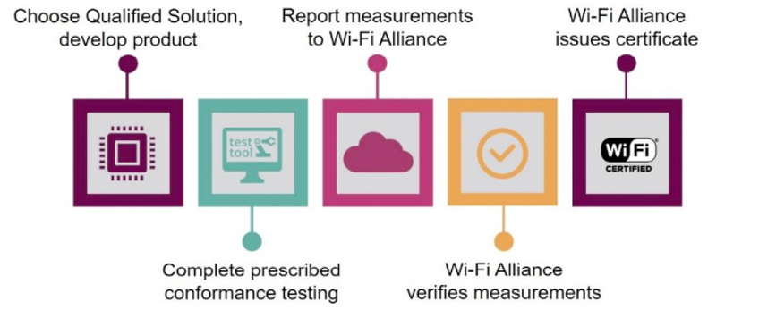
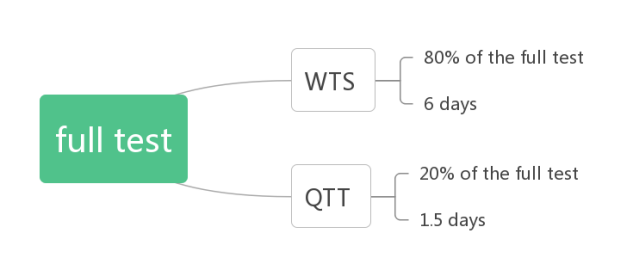
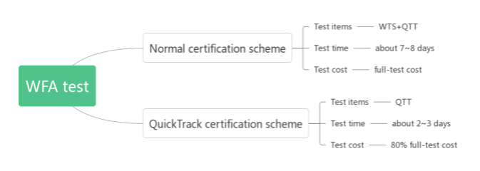

WFA Certification and Test Guide
********************************

:link_to_translation:`zh_CN:[中文]`

Overview
========

This guide provides instructions for obtaining WFA certificates for ESP series chips, along with QuickTrack for Espressif clients seeking certification for their products.

The firmware and test tool for ESP series chips can be downloaded from `Espressif website <https://www.espressif.com/zh-hans/support/download/other-tools>`__.

Introduction to WFA Certification
=================================

Certification Paths
-------------------

Standard process of WFA certification is shown as follows

.. figure:: ../../_static/wfa_certification_test_guide/wfa_certification_process.png
    :align: center
    :scale: 90%

    Standard Process of WFA Certification

1. Member submits a testing application to Wi-Fi Alliance and select an authorized test laboratory (ATL) to receive the certification identification number (CID)
2. Member coordinates with ATL to deliver device under test (DUT)
3. ATL performs tests
4. ATL issues test reports
5. Wi-Fi Alliance issues certificates

Certification Options of Wi-Fi Alliance
---------------------------------------

1. **New Certification**

   Choose this option if your products have not received Wi-Fi certification.

2. **Additional Certification**

   Select this option if your products have been certified and you want to test new or updated features.

3. **Re-Certification**

   Contributors, sponsors, affiliate members, implements are not eligible for this option. Only members are permitted to apply for re-certification of their existing Wi-Fi certified products.

   If there have been changes to the firmware or software of a previously Wi-Fi CERTIFIED product, re-certification is necessary.

   Firmware or software changes encompass the following three scenarios:

   - The hardware modifications (with minimal impact) and/or software modifications (operating system or drivers) that affect Wi-Fi operations
   - Changes in firmware or minor software adjustments that impact Wi-Fi functionality (inclusive of minor updates and bug fixes, but excluding operating system or drive updates)
   - Changes that do not affect Wi-Fi operations will be evaluated by ATL to determine the necessity of testing

4. **Derivative Certification**

   - Membership

     All members are eligible to apply for derivative certification.

   - Requirements

     * This option is based on source certification only, not other derivative product certification.
     * Derivative products shall be functionally identical to the source products.
     * Members shall provide necessary technical information for derivative products or source certified products to validate certification conformity of derivative products.

   - Module requirements

     * A tested and Wi-Fi certified module should accurately represent its modular application in both primary and subsequent derivative products.
     * Source certification of a Wi-Fi module is exclusively applicable to the module itself and does not extend to the primary derivative products.
     * A Wi-Fi module designed for testing may be considered as a derivative product and certified as a primary derivative. Subsequent derivative products may be certified as derivative products if they meet requirements for derivative product certification.

What Products Should be Wi-Fi Certified?
-----------------------------------------

Wi-Fi Alliance Certification is applicable to products that operate in the Wi-Fi 802.11a/b/g/n modes, which commonly span the 2.4 GHz UHF or 5 GHz SHF ISM frequency bands. The certification encompasses an array of products, ranging from wireless routers, smartphones, home appliance, computers, network infrastructure, and consumer electronics.

Certification for ESP Series Products
======================================

Certification Schemes
---------------------

- ESP series modules adopt the New Certification scheme for their certification process.
- For clients using ESP series chips, it is recommended to use the QuickTrack scheme.

The relationship between the two schemes is as follows:

    New Certification and QuickTrack

When a new ESP series module has passed New Certification testing, Espressif undertakes the payment to Wi-Fi Alliance for preserving the test data and generate qualified solutions. Consequently, Espressif clients gain the flexibility to select this solution and apply the QuickTrack scheme.

Introduction to New Certification for ESP Series Modules
-----------------------------------------------------------------

The test items for ESP series modules are shown in Figure 3-2.

.. figure:: ../../_static/wfa_certification_test_guide/full_test_items.png
    :align: center
    :scale: 90%

    Test items of full-test

WFA test includes two parts, WTS and QTT. WTS test includes test items related to sigma tool, and QTT test covers the test items related to QuickTrack tool. They contain some of the same test items, but the specific test cases are different.

Introduction to QuickTrack
--------------------------

QuickTrack is a new Wi-Fi certification scheme.

As one of three new certification schemes introduced by Wi-Fi Alliance, QuickTrack aims at the products built on Qualified Solutions. In other words, for products designed based on modules and chipsets that have already passed prerequisite tests or other solutions, Wi-Fi Alliance will make it easier to certify them, thereby reducing test cost as well as certification cost and time.

Specifically, a company should select a component or solution that meet its requirements and design among multiple alternative qualified solutions to build the product, and then complete a conformance test between the product and the selected solution to ensure that the component or solution used in the product is indeed a qualified solution. Then the company can conduct the test itself or through an authorized laboratory and submit the test result to the certification system. During the test, the company can set up the test environment using the hardware and software testing tools provided by Wi-Fi Alliance. After the test result has been confirmed by Wi-Fi Alliance, the product can be Wi-Fi CERTIFIED.

    QuickTrack certification process summary

Advantages of QuickTrack
-------------------------

The QuickTrack scheme is featured by reducing test cost, certification cost, and test time, so that product can pass WFA certification more quickly.

We will explain it in detail with ESP32-C2 as an example.

    Test time of full-test

The full test for ESP32-C2 module takes about 7.5 days.

If customers of the ESP32-C2 modules select the QuickTrack scheme, first they need to confirm the following product information:

.. figure:: ../../_static/wfa_certification_test_guide/product_information.png
    :align: center
    :scale: 90%

    Product information

- If the product information is same with that of ESP32-C2 without any changes, the product does not need to do any testing. The company can get the certification after paying fees.
- If the product information is different from ESP32-C2, the product only needs to pass the QTT test and does not need to perform the WTS test. It only takes 1.5 days for the product to complete certification.

The comparison between the QuickTrack scheme and the normal scheme is shown as follows.

    Comparison between normal scheme and QuickTrack

.. note::

   The test time here is not the completion time of WFA certification, but the time only for testing itself, which depends on the laboratory schedule. The time required by a whole WFA certification has been stated in subsection 2.1. For ESP32-C2, it takes 40 days to finish the WFA certification (the normal scheme), whereas it takes only 10 days for the QuickTrack scheme, saving about 70% time.

Status of QuickTrack Scheme for ESP series chips
---------------------------------------------------

Currently, ESP32-C2 and ESP32-C6 can adopt the QuickTrack scheme for WFA certification.

WFA Test
========

Filling in CID Information
---------------------------

You can fill in the test information according to your own requirements by referring to the guidance on CID provided by Wi-Fi Alliance or CID guidance related to ESP series modules.

Flashing Firmware
------------------

Windows System
^^^^^^^^^^^^^^^^^

ESP32 Series Chips
""""""""""""""""""""""

- Open ``flash_download_tool_3.9.2.exe``.
- Select ``ESP32`` for ``chipType``, and select ``develop`` for ``workMode``, and then click ``OK``.
- Select the firmware, fill in the flash position, select the port number, set ``baud rate`` to ``115200``, and then click ``START`` to start flashing.

  Locations of firmware:

  - bootloader.bin  0x1000
  - espsigma.bin    0x10000
  - partition.bin   0x8000

ESP32-C3, ESP32-C2, ESP32-C6
""""""""""""""""""""""""""""""

- Open ``flash_download_tool_3.9.2.exe``.
- Select the desired ``chip name (ESPXX)`` for ``chipType``, select ``develop`` for ``workMode``, and then click ``OK``.
- Select the firmware, fill in the flash position, select the port number, set ``baud rate`` to ``115200``, and then click ``START`` to start flashing.

  Locations of firmware:

  - bootloader.bin  0x0
  - espsigma.bin    0x10000
  - partition.bin   0x8000

After flashing the firmware, you can see ``finish`` on the webpage.

.. figure:: ../../_static/wfa_certification_test_guide/flash_configuration.png
    :align: center
    :scale: 90%

    Flash configuration

.. figure:: ../../_static/wfa_certification_test_guide/flash_firmware.png
    :align: center
    :scale: 90%

    Flashing firmware

Ubuntu
^^^^^^^

- Install python3.7

  .. code-block:: bash

     cd espsigma_qt/espsigma
     ./tools/setup/setup_pyenv_python.sh
     source ~/.pyenv/activate

- Install flash tool

  .. code-block:: bash

     pip install esptool

- Flash firmware

  .. code-block:: bash

     esptool.py -p /dev/ttyUSB0 --chip=auto write_flash 0x0 bootloader.bin 0x8000 partition-table.bin 0x10000 espsigma.bin

.. note::

   ``0x0 bootloader.bin``, ``0x8000 partition-table.bin``, ``0x10000 espsigma.bin`` You need to fill in the information based on your chip type and firmware location.

Configure Environment
-----------------------

1. The test computer should be installed with Ubuntu 16.04 or newer version

2. Install Python3.7

   .. code-block:: bash

      cd espsigma_qt/espsigma
      ./tools/setup/setup_pyenv_python.sh
      source ~/.pyenv/activate

After installing it, input ``python -v`` to check the Python version.

Test
-----

WTS Test
^^^^^^^^^

- Open Command Prompt

  .. code:: bash

     cd /espsigma_qt/espsigma/esp_sigma_ca

- Input the following command

  .. code:: bash

     python espsigma.py --dut /dev/ttyUSB*

.. note::

   ``*`` indicates the serial port number.

.. figure:: ../../_static/wfa_certification_test_guide/wts_test.png
    :align: center
    :scale: 90%

    WTS test

QuickTrack Test
^^^^^^^^^^^^^^^^^^

- Open Command Prompt

  .. code:: bash

     cd /espsigma_qt/espsigma/esp_sigma_ca

- Input the following command

  .. code:: bash

     python espsigma.py --quicktrack --dut/dev/ttyUSB *

  .. note::

     ``*`` indicates the series port number.

.. figure:: ../../_static/wfa_certification_test_guide/quicktrack_test_1.png
    :align: center
    :scale: 90%

    QuickTrack test-1

- Open another Command Prompt

  .. code:: bash

     cd /espsigma_qt/controlappc-2.0.0.9

- Input the following command

  .. code:: bash

     ./app -p *

  .. note::

     ``*`` indicates the QTT port, for example, 9005.

.. figure:: ../../_static/wfa_certification_test_guide/quicktrack_test_2.png
    :align: center
    :scale: 90%

    QuickTrack test-2

Refer to following figures when setting QuickTrack configurations.

.. figure:: ../../_static/wfa_certification_test_guide/quicktrack_configuration_1.png
    :align: center
    :scale: 80%

    QuickTrack configuration-1

.. figure:: ../../_static/wfa_certification_test_guide/quicktrack_configuration_2.png
    :align: center
    :scale: 80%

    QuickTrack configuration-2

.. figure:: ../../_static/wfa_certification_test_guide/quicktrack_configuration_3.png
    :align: center
    :scale: 90%

    QuickTrack configuration-3

.. figure:: ../../_static/wfa_certification_test_guide/quicktrack_configuration_4.png
    :align: center
    :scale: 90%

    QuickTrack configuration-4

.. figure:: ../../_static/wfa_certification_test_guide/quicktrack_configuration_5.png
    :align: center
    :scale: 90%

    QuickTrack configuration-5

.. note::

    The Python version should be 3.7 or newer. Install and activate Python 3.7 if your version does not satisfy the requirement.

Common Issues
===========================

How can I get the USB port number?
-------------------------------------

  You can get it by inputting ``ls /dev/ttyUSB*`` in the command line.

How can I get the MAC address of the DUT?
------------------------------------------------

  - Enter minicom and operate the command ``minicom -D /dev/ttyUSB*``
  - Input the command ``query``, and the printed ``dut_mac`` is the MAC address of the DUT.

How can I flash enterprise certificate?
----------------------------------------

  The certificate has been included in the firmware and you do not need to flash it.

Why is the tool not starting?
------------------------------

  Please check the Python version and ensure the toolchain is complete.

Why is the tool script unable to monitor UCC command after being started?
-----------------------------------------------------------------------------------

  Please ensure that the IP address is correctly configured on the computer.

What steps should be taken if the DUT displays garbled content and is unresponsive to read or write operations?
----------------------------------------------------------------------------------------------------------------------------

  Please verify whether the DUT has been flashed with the appropriate bin files and ensure that the power supply is functioning normally.

Test Data
================================

After completing the test, ATL will store the test data and submit it to Wi-Fi Alliance. Following a thorough review of the data, the product can obtain the WFA certification.

If your test fails and you need to debug, please provide the test log, which should include UCC, DUT, and sniffer details. The path to dut_log is ``espesigma_qt/espsigma/esp_sigma_ca/logs``.
