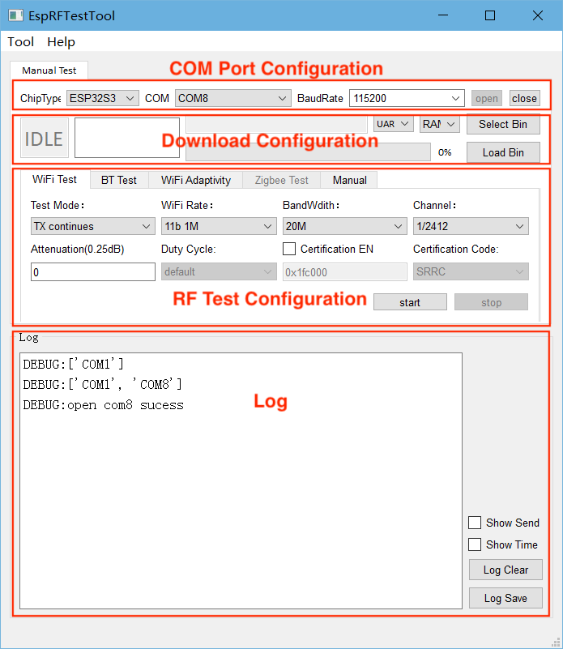
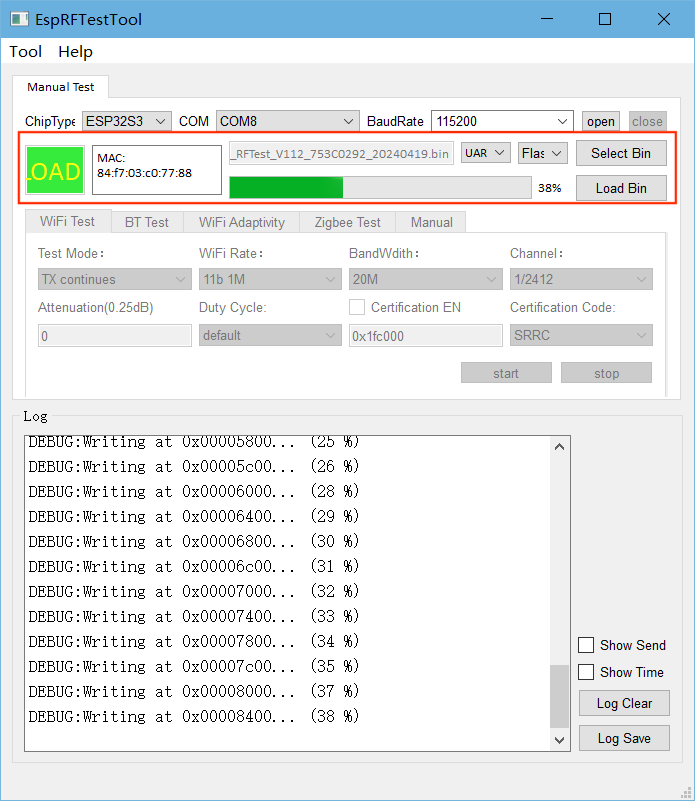
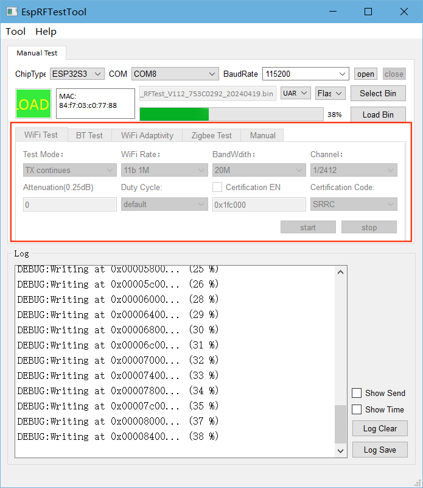
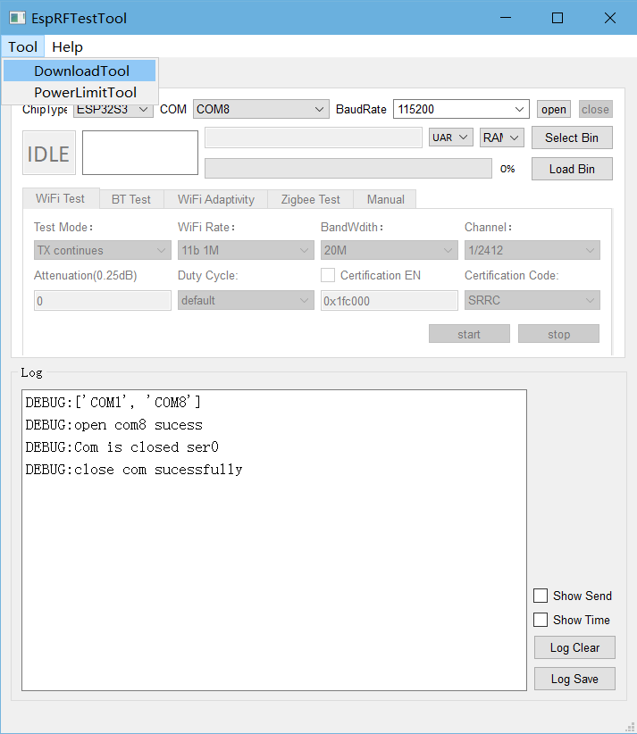
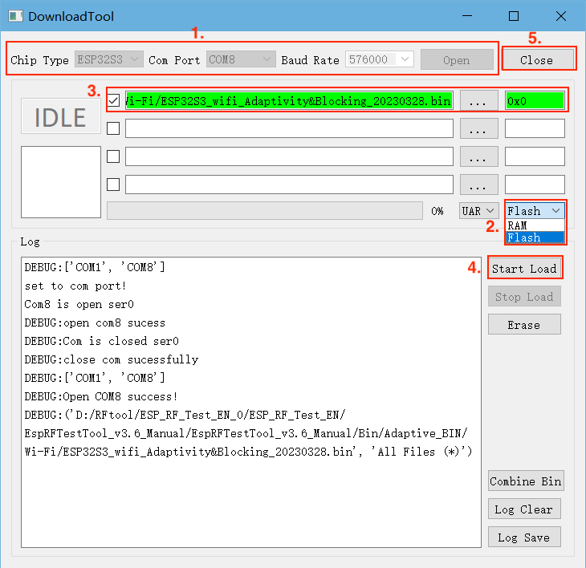
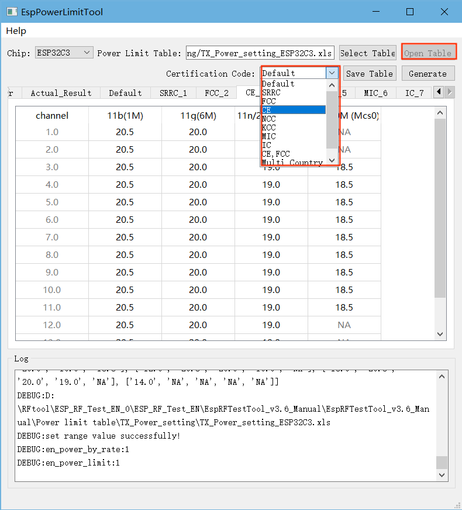

EspRFTestTool 工具包
=============================

:link_to_translation:`en:[English]`

`EspRFTestTool 工具包 <https://dl.espressif.com/RF/EspRFTestTool_v3.6_Manual.zip>`_ 是乐鑫提供的射频测试工具，包含 EspRFTestTool 工具、DownloadTool 工具和 PowerLimitTool 工具。

- `EspRFTestTool 工具 <esp-rf-test-tool>`_：用于相关射频测试；
- `DownloadTool 工具 <download-tool>`_：用于下载射频测试中所需的固件；
- `PowerLimitTool 工具 <power-limit-tool>`_：用于生成定制化 phy_init_data 固件。

.. note::

   在本文中， **EspRFTestTool 工具包** 指的是三个工具的集合，而 **EspRFTestTool 工具** 指的是该单一工具。

.. _esp-rf-test-tool:

EspRFTestTool 工具
---------------------------------

EspRFTestTool 工具包主界面就是 EspRFTestTool 工具，包含串口配置区、下载配置区、射频测试配置区，以及 log 窗口。

    EspRFTestTool 工具

串口配置区
^^^^^^^^^^^^^^^^^^^^^^^

.. figure:: ../../../_static/rf_test_tool/esprftesttool_com.png
    :align: center
    :scale: 80%

    EspRFTestTool 串口配置区

- **ChipType**：选择芯片型号；
- **COM**：选择串口号；
- **BaudRate**：选择波特率；
- **Open**：打开串口；
- **Close**：关闭串口。

串口配置完成后，可进行快速烧录和射频测试。

下载配置区
^^^^^^^^^^^^^^^^^^^^^^^

    EspRFTestTool 下载配置区

一般使用 `DownloadTool 工具 <download-tool>`_ 下载射频测试中所需的固件，但是对于一些简单的固件，如非信令测试固件与自适应测试固件，可直接使用 EspRFTestTool 工具进行快速烧录。

- 拉低 Boot 管脚后对芯片重新上电使芯片进入下载模式；
- 默认通过 ``UART`` 进行烧录；
- 选择烧录至 ``flash`` 中；
- 点击 ``Select Bin`` 选择要烧录的 bin 文件；
- 点击 ``Load Bin`` 即可开始烧录；
- 烧录完成后，拉高 Boot 管脚对芯片重新上电使芯片进入工作模式。

射频测试配置区
^^^^^^^^^^^^^^^^^^^^^^^

    EspRFTestTool 射频测试配置区

烧录固件后，可进行相应的射频测试：

- **Wi-Fi Test**：用于 Wi-Fi 非信令测试；
- **BT Test**：用于蓝牙及低功耗蓝牙非信令测试；
- **Wi-Fi Adaptivity**：用于 Wi-Fi 自适应测试；
- **Zigbee Test**：用于 802.15.4 非信令测试；
- **Manual**：可用于串口指令输入。

具体参数配置可参考对应的射频测试文档。

Log 窗口
^^^^^^^^^^^^^

Log 窗口中用于展示工具状态，如需查看芯片串口打印 log，请使用通用串口助手。

.. _download-tool:

DownloadTool 工具
---------------------------------

在工具栏中点击 ``Tool``，选择 ``DownloadTool``，进入 DownloadTool 工具界面。

    DownloadTool 工具入口

按照以下步骤进行固件烧录：

- 设置芯片类型 (``Chip Type``)、串口 (``COM Port``)、波特率 (``Baud Rate``)，然后点击 ``Open`` 打开串口；
- 选择烧录到 ``flash``；
- 选择要烧录的固件，并下载到指定地址；
- 确认芯片已进入下载模式，点击 ``Start Load`` 开始烧录。烧录完成后显示 SUCC 标志；
- 烧录完成后，点击 ``Close`` 关闭串口。

    DownloadTool 界面

.. note::

  如何确认芯片进入下载模式：

  1. 关闭 DownloadTool 串口，打开通用串口助手，如 `友善串口助手 <http://alithon.com/downloads>`__；
  2. 配置串口号和波特率，拉低 Boot 管脚，芯片重新上电，串口助手中会打印 ``waiting for download`` 等 log;
  3. 关闭串口助手，打开 DownloadTool，可开始烧录；
  4. 烧录完成后，拉高 Boot 管脚，芯片重新上电，可进入工作模式。如有异常，使用串口助手确认。

.. _power-limit-tool:

PowerLimitTool 工具
---------------------------------

PowerLimitTool 可用于配置 Wi-Fi 输出功率，生成单国和多国的 phy init bin 文件，满足客户产品在不同国家或地区的法规需求。

.. note::

  可使用以下几种方式来限制 Wi-Fi 功率，如多种方式共用，则取其功率的最小值：

  1. 使用 API (``esp_wifi_set_max_tx_power``)，可限制最大输出功率；
  2. 在 Menuconfig 中配置 ``Max Wi-Fi TX Power``，与上述 API 功能相同，可限制最大输出功率；
  3. 使用 ``Phy Init Bin`` 功能，在 ESP-IDF 中修改 phy_init_data.h 文件；
  4. 使用 ``Phy Init Bin`` 功能，生成 phy_init_data.bin 文件，参考本文介绍。

生成 phy_init_data.bin 文件
^^^^^^^^^^^^^^^^^^^^^^^^^^^^^^^^^^^

在 EspRFTestTool 主界面下，点击 ``Tool``，选择下拉框中的 ``PowerLimitTool``，打开 PowerLimitTool 工具。

.. figure:: ../../../_static/rf_test_tool/powerlimit_open.png
    :align: center
    :scale: 80%

    PowerLimitTool 工具入口

进入 PowerLimitTool 主界面，``Chip`` 下拉框中显示当前工具版本支持的芯片型号，选择对应的芯片（以 ESP32-C3 为例）。

.. figure:: ../../../_static/rf_test_tool/powerlimit_main.png
    :align: center
    :scale: 80%

    PowerLimitTool 工具主界面

点击 ``Select Table``，选择对应芯片的 TX Power Setting 表格。

.. figure:: ../../../_static/rf_test_tool/powerlimit_select.png
    :align: center
    :scale: 80%

    导入 TX Power Setting 表格

.. note::

  TX Power Setting 表格参数说明：

  1. **Config_Switch**：使能 ``Power_By_Rate`` 和 ``Power_Limit``，默认均选择 ``Yes``，表示均可调整；
  2. **PowerByRate_TargetPower**：各速率目标功率，建议保持默认值；
  3. **Country_Table**：当前默认支持的国家（地区），可扩展；
  4. **Actual_Result**：模组实测功率，默认使用目标功率；
  5. **Default**：国家码中 “Default” 功率配置，通常用于识别国家码前的功率配置；
  6. **SRRC_1**：国家码中 “SRRC” 的功率配置，适用于中国大陆；
  7. **FCC_2**：国家码中 “FCC” 的功率配置，适用于美国；
  8. **CE_3**：国家码中 “CE” 的功率配置，适用于欧洲；
  9. **NCC_4**：国家码中 “NCC” 的功率配置，适用于台湾地区；
  10. **KCC_5**：国家码中 “KCC” 的功率配置，适用于韩国；
  11. **MIC_6**：国家码中 “MIC” 的功率配置，适用于日本；
  12. **IC_7**：国家码中 “IC” 的功率配置，适用于加拿大；

点击 ``Open Table``，在对应国家码表中修改期望的功率值，在 ``Certification Code`` 下拉框中选择期望的国家码。

    修改 TX_Power_Setting

.. note::

  关于如何修改功率值：

  1. 根据认证结果（认证提供功率衰减值）填写功率值（功率值 = 目标功率 - 衰减值/4）；
  2. 如果修改了 ``Actual_Result``，上述公式中的目标功率需改为 ``Actual_Result``；
  3. 不能增删表格内容，例如 FCC 仅支持 1~11 信道，此表中 12~13 信道功率值建议与 11 信道保持相同，但不可删除；
  4. 除低高信道外，其它信道功率与中间信道保持一致；
  5. NA 的部分不可修改。如果 ``Certification Code`` 无法下拉选择，表明表格被改动，需还原。

点击 ``Save Table`` 保存设置，点击 ``Generate`` 生成对应国家码的 phy_init_bin 文件。

.. figure:: ../../../_static/rf_test_tool/powerlimit_generate.png
    :align: center
    :scale: 80%

    生成 phy_init_bin 文件
