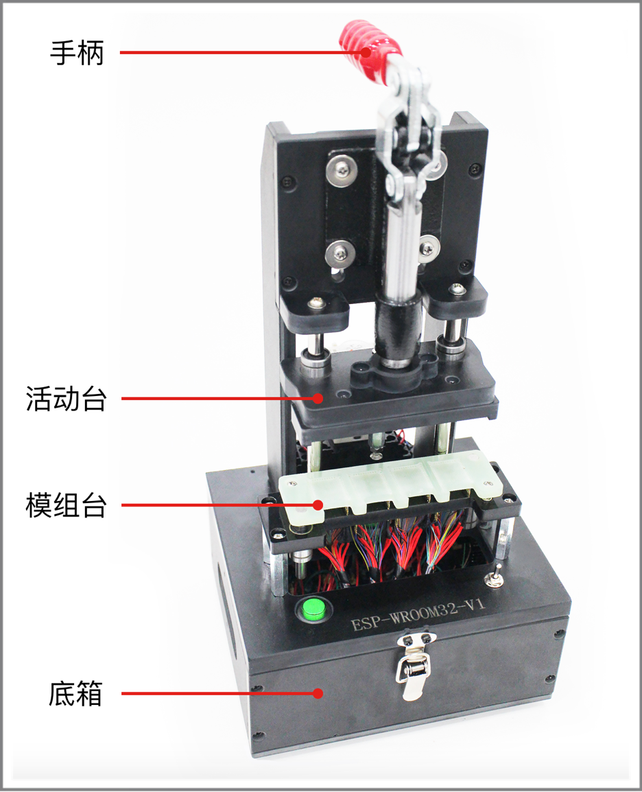
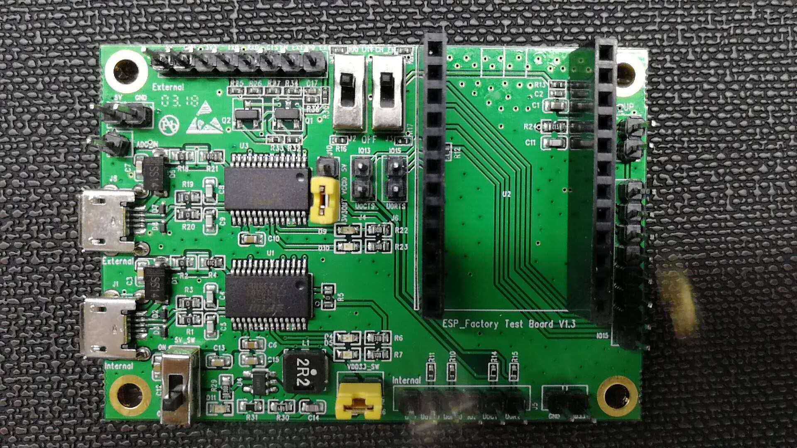
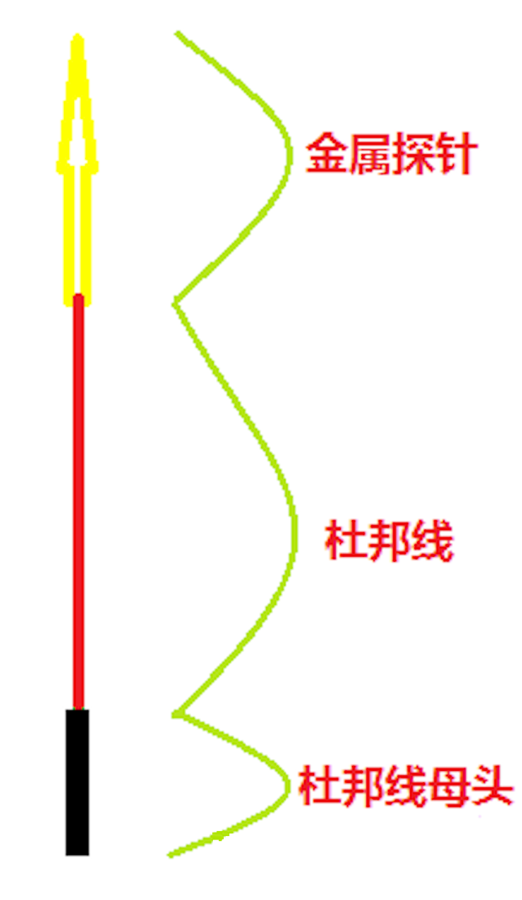
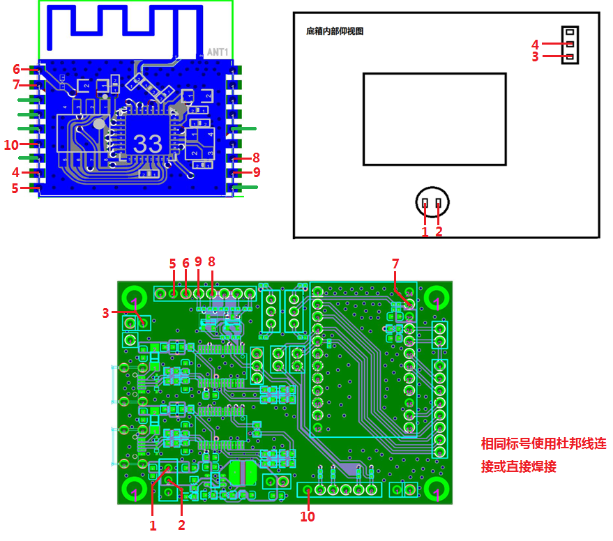
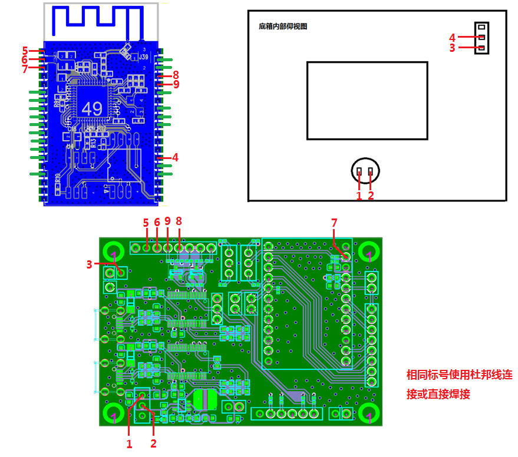
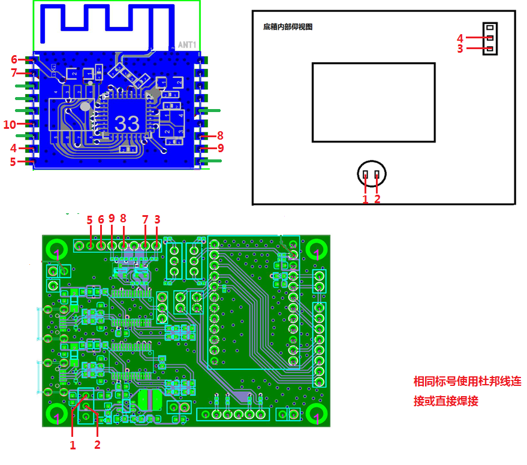
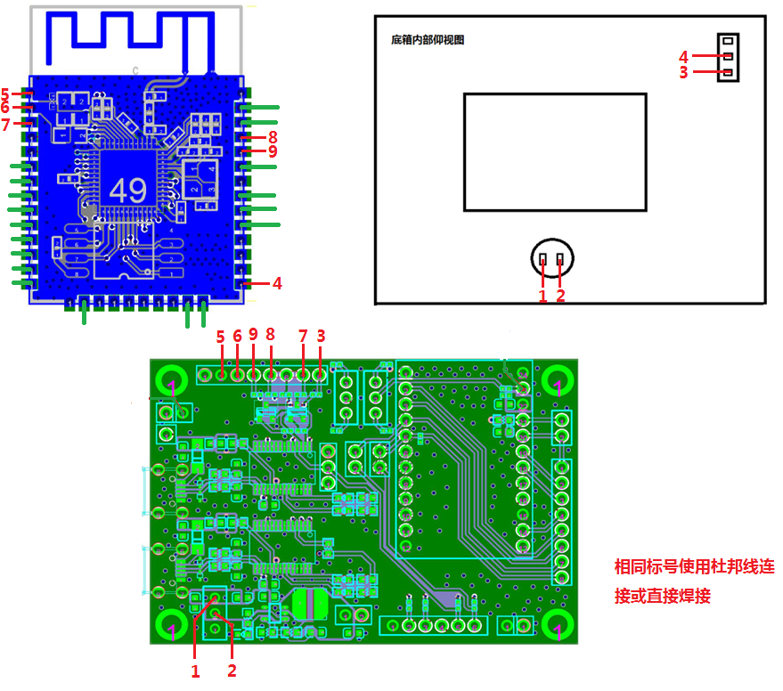
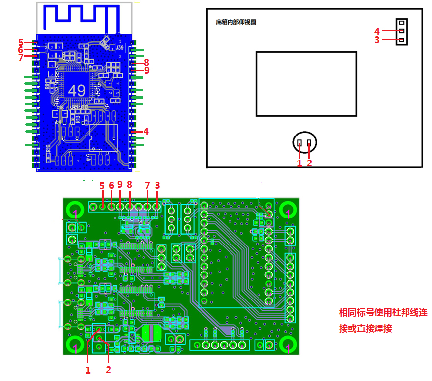
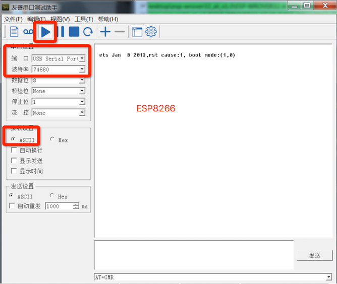
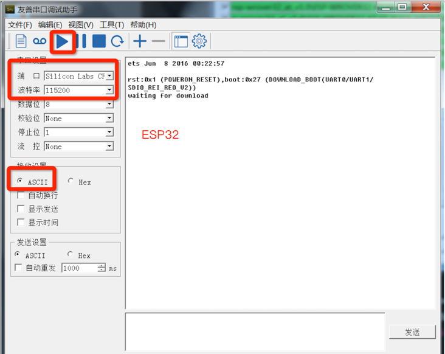

===================
模组治具制作规范
===================

:link_to_translation:`en:[English]`

关于本规范
======================

本文档完整地介绍了 Wi-Fi 模组治具的制作规范，避免由于夹具没有统一制作规范导致在产测过程中引起的各种问题。

概述
========

治具根据型号和用途不同，其结构也不同。其中 ESP-WROVER 治具的结构如图所示：

    模组治具机构示意图 (ESP-WROVER)

其他治具大体相似，在细节上稍有不同，模组治具的大概结构包括以下几个部分：

.. list-table:: 治具主要组成部分
    :header-rows: 1
    :widths: 1 4
    :align: center

    * - 部件
      - 说明
    * - 手柄
      - 控制模组是否上电：

        * 抬起手柄时，模组与底部探针分离，断开电源。
        * 按下手柄时，模组与探针接触，模组进入测试状态。
    * - 模组台
      - 摆放并固定模组。
    * - 底箱
      - 安装串口板，可以通过串口线与 PC 通信。
    * - 开关
      - 安装在底箱上，用以控制底板是否上电及模式切换。

模组治具的主要结构
====================

模组台制作规范
--------------

模组台在制造过程中应注意以下事项。

天线
~~~~

天线部分要完全裸露，保持天线连接点在模组台前沿之前或在一条直线上，如下图所示。模组台不得用金属制造，并且在天线的周围尽量减少金属部件的使用。

.. figure:: ../../../_static/test_fixture_manufacturing_inst/mounting_panel_for_esp_wrover.png
    :align: center
    :scale: 15%

    ESP-WROVER 治具模组台

手柄
~~~~

- 手柄按下时，保证模组台下的金属探针能与模组的所有 Pin 脚接触。

.. figure:: ../../../_static/test_fixture_manufacturing_inst/metal_probles_handle_pressed.png
    :align: center
    :scale: 15%

    探针状态示意图（手柄按下）

- 手柄抬起后，保证模组台下的金属探针能与模组完全分离。

.. figure:: ../../../_static/test_fixture_manufacturing_inst/metal_probes_handle_lifted.png
    :align: center
    :scale: 15%

    探针状态示意图（手柄抬起）

手柄按下时，活动台与模组台之间留合适的距离。保证探针既能与模组完全接触，又不会压坏模组（包括屏蔽盖），如图：

.. _distance:

.. figure:: ../../../_static/test_fixture_manufacturing_inst/movable_plate_and_mounting_panel.png
    :align: center
    :scale: 15%

    活动台与模组台之间的距离示意

底箱制作规范
------------

串口板
~~~~~~

底箱内放有串口板，使用的串口板的版本号为：ESP_Factory Test Board V1.3，如图所示：

    串口板示意 (ESP_Factory Test Board V1.3)

此串口板包括两颗串口芯片，其在底箱的放置方式如图所示。根据夹具的类型放置对应数目的串口板（如“一拖四”治具则需要放置 4 块串口板）。

.. figure:: ../../../_static/test_fixture_manufacturing_inst/serial_boards_placement.png
    :align: center
    :scale: 15%

    底板放置示意图

要求底板须固定在底箱里，防止串口板位置不固定导致管脚触碰短路现象。固定时采用螺丝固定的方式，分别固定串口板的四个过孔。并且在使用多个串口接 HUB 时，要给 HUB 供外部电源，防止串口供电不足引起的一系列问题。

底箱标识
~~~~~~~~

为方便辨识治具，规定将标识印于底箱表面。分类如下表所示，其中 V\ :sup:`*` 为治具的版本号。

.. list-table:: 机台型号分类
    :header-rows: 1
    :widths: 2 3
    :align: center

    * - 模组类型
      - 机台型号
    * -
        * ESP-WROOM-02
        * ESP-WROOM-02D
        * ESP-WROOM-02DC
      - ESP-WROOM-02/02D-V1
    * -
        * ESP-WROOM-02U
        * ESP-WROOM-02UC
      - ESP-WROOM-02U-V3\ :sup:`*`
    * -
        * ESP32-WROOM-32
        * ESP32-WROOM-32D
        * ESP32-WROOM-32DC
        * ESP32-SOLO-1
        * ESP32-SOLO-1C
      - ESP32-WROOM-32/32D-V1
    * -
        * ESP32-WROOM-32U
        * ESP32-WROOM-32UC
      - PESP32-WROOM-32U-V3\ :sup:`*`
    * -
        * ESP32-WROVER (PCB)
        * ESP32-WROVER-B (PCB)
        * ESP32-WROVER-BC (PCB)
      - ESP32-WROVER-V1
    * -
        * ESP32-WROVER (IPEX)
        * ESP32-WROVER-B (IPEX)
        * ESP32-WROVER-BC (IPEX)
      - ESP32-WROVER-I-V2\ :sup:`*`

.. Note::

    1. 图片 :ref:`distance` 中黄色短路插需插入跳线帽。
    2. 本规范不适用于 ESP-WROOM-02U-V3, ESP32-WROOM-32U-V3 和 ESP32-WROVER-I-V2。

模组台接线
~~~~~~~~~~

从探针接出来红绿两种颜色的线。接线规则如下表所示。除标识的红绿线，其余未引线管脚均不得接线。

.. flat-table:: 接线要求说明
    :header-rows: 1
    :widths: 1 2 3 4

    * - 组件
      - 功能
      - 要求
      - 备注
    * - :rspan:`1` 红线
      - 探针引出线
      - 杜邦线从探针上引出并接于底板上，相同标号连接在一起（见下方图片）。
      - **注意**：

        1. 使用标准粗细的杜邦线，长度在保证正常使用的情况下尽量短；
        2. 对于底板上没有插针的管脚，可直接焊接在底板背部的锡点上。
    * - 开关引出线
      - 杜邦线从开关上引出并接于底板上，相同标号连接在一起（见下方图片）。
      -
        1. 压合治具，开关打开将被按下（1，2 位置），代表开关接通，达到治具压合即给被测模组上电；
        2. 拨码开关（3，4 位置），用于 3-4 手动开关导通，实现模组不同模式切换。
    * - 绿线
      - --
      - 探针默认引出线即可，无需连接到底板。
      - --
    * - :rspan:`1` 开关
      - 一拖一
      - 一路扭头开关
      - --
    * - 一拖四
      - 四路扭头开关（一个开关可以控制四路导线的导通）
      - --

    红色接线示意图

治具接线
~~~~~~~~

治具可通过不同的接线，选择 **不支持工具端自动模式切换** 和 **支持工具端自动模式切换** 两种模式，具体参考下方图片。

.. Note::

    默认选择 **不支持工具端自动模式切换** 方式。

不支持工具端自动模式切换
^^^^^^^^^^^^^^^^^^^^^^^^^^^

1. ESP-WROOM-02 系列

    ESP-WROOM-02 模组台接线示意图

2. ESP-WROOM-32 系列

    ESP32-WROOM-32 模组台接线示意图

3. ESP-WROVER 系列

    ESP-WROVER 模组台接线示意图

支持工具端自动模式切换
^^^^^^^^^^^^^^^^^^^^^^^^^^^

1. ESP-WROOM-02 系列

    ESP-WROOM-02 模组台接线示意图

2. ESP-WROOM-32 系列

    ESP-WROOM-32 模组台接线示意图

3. ESP-WROVER 系列

    ESP-WROVER 模组台接线示意图

模组治具测试
===============

接线的导通测试
------------------------

为保证接线使用的材料都是可用的，接线完成后需进行导通测试。测试工具厂商可自行选择，比如万用表、自制简易 LED 显示电路等。

工作模式确认测试
------------------------

请按照以下步骤，依次确认模组的工作模式。

运行模式（目前只针对 ESP-WROOM-02 系列模组）
~~~~~~~~~~~~~~~~~~~~~~~~~~~~~~~~~~~~~~~~~~~~~~~~~~

1. 接线导通测试通过后，打开电脑端的串口调试工具（推荐使用 **友善串口调试助手**）。
2. 选择对应的端口和波特率 (ESP8266/ESP32：115200)，点击运行按钮。
3. 将开关(3, 4) 拨在位置 3，将模块置于运行模式。
4. 按下手柄。
5. 在图红色区域内输入命令 **AT+GMR**，点击发送。

.. figure:: ../../../_static/test_fixture_manufacturing_inst/AT_comment_test.png
    :align: center

    AT 命令测试示意

.. Note::

    输入 **AT+GMR** 命令后需要敲回车键。

6. 观察串口调试工具窗口。

.. figure:: ../../../_static/test_fixture_manufacturing_inst/AT_test_expected_result_cn.png
    :align: center

    AT 测试期望结果

- 如为期望测试结果，本项测试通过，保存截图。
- 如不为期望测试结果，本项测试不通过，重新进行接线导通测试，确保接线导通。

烧录模式
~~~~~~~~

1. 运行模式确认测试后通过后，继续使用电脑端的串口调试工具。
2. 选择对应的端口和波特率 (ESP8266: 74880; ESP32: 115200)，点击运行。
3. 将开关 (3, 4) 拨在位置 4，将模块置于下载模式。
4. 按下手柄。
5. 观察串口调试工具窗口。

    ESP8266 烧录模式上电打印

    ESP32 烧录模式上电打印

- 如为期望测试结果，本项测试通过，保存截图。
- 如不为期望测试结果，本项测试不通过，重新进行接线导通测试，确保接线导通。

测试报告
--------

夹具制造商完成夹具成品，必须进行了上述两种测试，并出具测试报告和对应测试结果截图。

附录
====

治具申请材料
------------

用户在向治具制造商申请治具时，应提供以下材料：

.. list-table:: 申请夹具的材料
    :header-rows: 1
    :widths: 1 3
    :align: center

    * - 材料
      - 说明
    * - 模块 Gerber 文件
      - Gerber 文件可提供模组的详细尺寸及定位孔信息。
    * - 模组样品（用于烧录 AT 固件）
      - 方便夹具制造商测试夹具成品，根据需求提供。
    * - 串口底板
      - 根据自己的需求提供相应数目的串口底板，如一拖四需提供四块底板。底板版本号为 ESP_Factory_Test_board V1.3。
    * - 接线模式
      - 请说明是否需要支持 **自动切换模式** （默认不支持）。

交付项
------

治具制造商完成生产后，应交付以下内容：

.. list-table:: 交付内容
    :header-rows: 1
    :widths: 1 3
    :align: center

    * - 交付项
      - 说明
    * - 治具套装
      - 治具+对应数量串口底板+完成接线。

        **注意：**

        1. 如一拖四治具，低箱内应有四块底板，并完成接线。
        2. 底板版本号为 ESP_Factory_Test_board V1.3。

    * - 测试报告
      - 测试报告和对应测试结果截图。

证书下载
--------

用户可通过乐鑫官网证书 `下载页面 <https://www.espressif.com/zh-hans/certificates>`_ 下载产品证书。
