乐鑫产测指南
==================================

:link_to_translation:`en:[English]`

关于本手册
------------

本文主要介绍乐鑫 IC 平台相关 Wi-Fi 产品（Wi-Fi 模组/Chip Onboard）的生产测试方案，为客户在进行 Wi-Fi 产品生产时，提供生产测试方案的相关参考。

简介
------

基于乐鑫 IC 平台的 Wi-Fi 产品生产测试方案，针对 RF 性能产测部分，通常有如下两类：

- RF 综测仪测试方案（行业通用标准）
- 信号板方案（ESP 企业标准）

获取乐鑫产测工具，请 `联系我们 <https://www.espressif.com/zh-hans/company/contact/pre-sale-questions-crm>`_。

RF 综测仪测试方案
^^^^^^^^^^^^^^^^^^^^^^

仪器测试方案为 Wi-Fi 射频产品通用方案，由乐鑫提供串口命令及测试固件来完成产品的性能测试。

测试过程简介（测试系统框架如下图）：

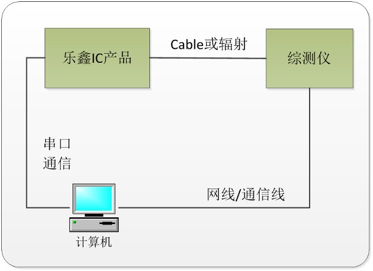

    仪器方案框架

#. 下载 *RF_Test_FW.Bin* 到 ESP IC Ram 中；
#. PC 端运行 RF 仪器对应的 Test Tool，通过串口发送命令使模组在不同的模式下进行收发包；
#. RF 测试仪器解析对应工作模式下的 RF 性能参数。

.. note::

    - 仪器测试方案需要仪器供应商提供适配乐鑫 IC 的批量产测工具；
    - 若 RF 仪器工具未适配乐鑫 IC 方案，客户也可以通过仪器可提供的接口完成适配。适配过程中，乐鑫 *RF_Test_FW.bin* 下载方式可使用 *esp_ram_download_tool* 进行下载：
        - 获得 *esp_ram_download_tool*，请联系我们；
        - 有关乐鑫产品 RF 性能的手动测试，请参考：`ESP32&ESP8266 射频性能测试指南 <https://www.espressif.com/sites/default/files/tools/esp32esp8266_rf_performance_test_cn.zip>`__。
    - 上述测试需要屏蔽环境。

信号板方案
^^^^^^^^^^^^^^^

乐鑫信号板产测方案是乐鑫自主研发的产测方案，可以对量产 Wi-Fi 产品的 RF 性能进行有效测试，确保量产产品的 RF 品质达标，该方案具有环境搭建成本低，工厂产测环境易部署的优势。

信号板测试方案系统框架如下所示，信号板在产测过程中，可作为标准设备，与待测设备进行数据通讯，通过对通讯过程的数据进行判断，达到对待测设备进行测试的作用。

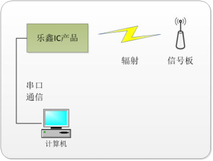

    信号板方案框架

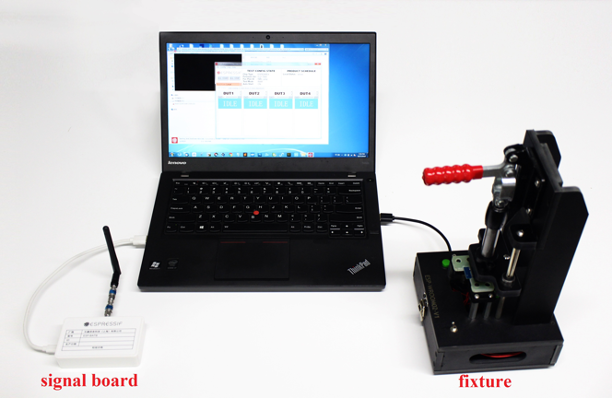

    信号板方案的实物连接

.. note::

    上述测试需要屏蔽环境。

生产测试流程
^^^^^^^^^^^^^^^^^^

1. 确认待测设备有以下测试点，用来连接待测设备后进行测试。测试点说明如下。

.. only:: esp8266

    .. list-table::
        :header-rows: 1
        :widths: 1 2 2 2
        :align: center

        * - 模组系列
          - 需要引出的测试点
          - 下载模式
          - Flash 运行模式
        * - ESP8266 系列
          - V33, GND, RXD, TXD, EN, GPIO0, GPIO15
          -
            - GPIO0 接低电平
            - GPIO15 接低电平
          -
            - GPIO0 接高电平

.. only:: esp32 or esp32s2 or esp32s3

    .. list-table::
        :header-rows: 1
        :widths: 1 2 2 2
        :align: center

        * - 模组系列
          - 需要引出的测试点
          - 下载模式
          - Flash 运行模式
        * - ESP32/ESP32-S 系列
          - V33, GND, RXD, TXD, EN, GPIO0
          -
            - GPIO0 接低电平
          -
            - GPIO0 接高电平

.. only:: esp32c2 or esp32c3 or esp32c6

    .. list-table::
        :header-rows: 1
        :widths: 1 2 2 2
        :align: center

        * - 模组系列
          - 需要引出的测试点
          - 下载模式
          - Flash 运行模式
        * - ESP32-C 系列
          - V33, GND, RXD, TXD, EN, GPIO8, GPIO9
          -
            - GPIO8 接高电平
            - GPIO9 接低电平
          -
            - GPIO9 接高电平

.. note::

    .. list::

        - 下载模式：主要用于下载 bin 文件，生产测试过程均在下载模式下。
        - Flash 运行模式：查看模组上电打印信息。
        :esp32c2 or esp32c3 or esp32c6: - 上表中的 ESP32-C 系列包括 ESP32-C3/ESP8684/ESP8685/ESP32-C6 等。

2. 待测设备通过测试治具连接到串口底板，使用产测工具控制待测设备进入下载模式。如无支持流控控制的串口底板，可直接将相应 GPIO 接低电平，使待测设备上电工作在下载模式。

3. 打开 PC 端产测工具，按照产测工具的使用方法（见 :ref:`production-testing-tool`）。

.. note::

    - 通常生产为了加快生产效率，测试治具可以设计为 1 拖多的方式；

        - 一般为 1 拖 4，即一个治具可以放置 4 个待测设备，同时进行测试，内部就是 4 个串口测试底板。

    - 测试治具的制作连接方法可参考乐鑫 `模组治具规范 <https://www.espressif.com/sites/default/files/documentation/test_fixture_manufacturing_instruction__cn.pdf>`__。

    - 使用 USB 线将串口底板（放在治具中）与 PC 连接，并安装对应的串口底板驱动，确保串口能够成功识别。

生产测试相关配件
^^^^^^^^^^^^^^^^^^^^

串口底板
~~~~~~~~

串口底板主要用于 USB 转串口，用同类的 USB 转串口底板也可以，但是考虑到部分 USB 转串口底板的稳定性较差，推荐直接申购如下串口测试底板。如需申购，请 `联系我们 <https://www.espressif.com/zh-hans/company/contact/pre-sale-questions-crm>`__）。

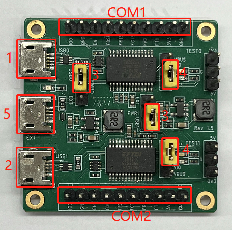

    串口底板示意图

拿到底板后，需要检查对应的开关及短路插是否正确。

  - 标号 com1，com2：与 PC 通信的串口端，其中 1 和 2 是两路独立的通信串口，分别和对应侧的 TX/RX/FRTS/FCTS 对应。
  - 标号 3：用于选择串口 USB 供电或外部供电口供电。
  - 标号 4：用于选择 3.3 V 串口和 5 V 串口电平。
  - 标号 5：外部供电口，未使用，无需设置。

测试治具
~~~~~~~~

测试治具是用于驱动待测设备进入测试模式的一种生产配件，通过手柄按压，实现模组管脚与治具探针的接触。测试结束后，抬起手柄，模组管脚与探针分离（其他同类产品可以参考或直接引出对应测试点）。

Wi-Fi 模组产品的产测需要间接将模组管脚引出，并连接到产测底板后与 PC 串口进行通信，我们可以通过治具的结构压合最终达到这一目的。治具的整体外观示例可见下图。

.. figure:: ../../../_static/production_testing_guide/a_typical_module_fixture.png
    :align: center
    :scale: 70%

    治具整体外观

治具的主要组成部分可见下表（以乐鑫自有模组治具为例）。

.. list-table:: 治具主要组成部分
    :header-rows: 1
    :widths: 1 4
    :align: center

    * - 部件
      - 说明
    * - 手柄
      -
        - 抬起手柄时，模组与底部探针分离，断开电源。
        - 按下手柄时，模组与探针接触，模组进入测试状态。
    * - 模组台
      - 摆放并固定模组。
    * - 底箱
      - 安装串口测试板，可以通过 USB 线与 PC 通信。

信号板
~~~~~~

信号板在产测过程中作为标准设备，与待测设备进行交互。

.. only:: esp32 or esp32s2 or esp32s3 or esp32c2 or esp32c3 or esp32c6

    .. list-table:: 信号板类型
        :header-rows: 1
        :widths: 1 4
        :align: center

        * - 信号板类型
          - 适用芯片范围
        * - ESP-BAT32
          - ESP32/ESP32-S/ESP32-C

    .. figure:: ../../../_static/production_testing_guide/a_typical_espbat32_signal_board_CN.png
        :align: center
        :scale: 70%

        ESP-BAT32 信号板示意图

.. only:: esp8266

    .. list-table:: 信号板类型
        :header-rows: 1
        :widths: 1 4
        :align: center

        * - 信号板类型
          - 适用芯片范围
        * - ESP-BAT8
          - ESP8266

    .. figure:: ../../../_static/production_testing_guide/a_typical_espbat8_signal_board_CN.png
        :align: center
        :scale: 70%

        ESP-BAT8 信号板示意图

申请获取乐鑫信号板，请 `联系我们 <https://www.espressif.com/zh-hans/company/contact/pre-sale-questions-crm>`__。

.. note::

    .. list::

        - 信号板使用时，在同一个网络覆盖范围内，仅能有一个信号板，否则互相间会干扰。
        - 若要多个信号板进行大批量测试，需要分别在屏蔽房或屏蔽箱中进行测试。
        :esp32 or esp32s2 or esp32s3 or esp32c2 or esp32c3 or esp32c6: - 上表中的 ESP32-C 系列包括 ESP32-C3/ESP8684/ESP8685/ESP32-C6 等。

方案对比
^^^^^^^^^^^^

信号板方案和仪器方案的测试项对比可见下表，客户可根据实际需求进行选择。

.. flat-table:: 方案对比
    :header-rows: 1
    :widths: 1 2 3

    * - 方案
      - 测试项目
      - 说明
    * - :rspan:`4` 信号板方案
      - RF 测试
      - 可测试芯片供电电压及其波动、相对信号板的频偏等
    * - 收发包测试
      - 可测试产品与信号板间进行收发包
    * - GPIO 测试
      - 可排除 IC 焊接问题
    * - 固件版本测试
      - 可验证 flash 中应用固件的版本是否正确
    * - Flash RW 测试
      - 可验证 flash 读写功能是否正常
    * - :rspan:`5` 仪器方案
      - EVM 测试
      - 可测试产品发包时的 TX Power，EVM 指标
    * - 频偏测试
      - 可测试产品发包时的频率
    * - 功率测试
      - 可测试产品发包时的功率
    * - 接收灵敏度测试
      - 可测试产品的接收灵敏度指标（需在屏蔽环境中完成）
    * - GPIO 测试
      - 可排除 IC 焊接问题
    * - Flash RW 测试
      - 可验证 flash 读写功能是否正常

.. note::

    #. 信号板方案采用了乐鑫企业内部标准，可在模组 RF 匹配合格，且生产物料和制程一致的情况下，保证模组 RF 量产品质；
    #. 用户可将信号板方案作为生产全检测试方案，并将仪器方案作为生产抽检测试方案，综合把控模组量产品质；
    #. 由于信号板方案无法直接得到模组的 RF 性能参数，如 TX、RX、EVM，及 FREQ 等，用户可同时借助 Wi-Fi 综测仪，直接测试模组的 RF 性能参数。

信号板方案易部署，测试设备投入低的优势，所以信号板方案得到了客户的广泛应用。因此，本文的介绍将以信号板方案为主，并以乐鑫自有模组的测试为示例进行说明，客户可按照此方式，进行自有 Wi-Fi 产品生产测试环境的部署。

环境搭建
------------

为了方便客户第一时间体验模组的信号板产测效果，乐鑫专门提供一套完整的产测配件包。本文档以乐鑫模组为例，完整介绍了信号板方案在产测中的应用。后续，客户直接将乐鑫模组替换为对应芯片家族（ESP32-C/ESP32/ESP32-S/ESP8266）的 Wi-Fi 产品即可。

套件准备
^^^^^^^^

乐鑫产测配件包的主要组成部分，请见下表。

.. only:: esp32c2 or esp32c3 or esp32c6

    .. flat-table::  产测配件包
        :header-rows: 1
        :widths: 1 2 1 2

        * - 产测配件包
          - 物号
          - 数量
          - 备注
        * - :rspan:`2` ESP32-C
          - ESP-BAT32
          - 1
          - ESP32 信号板
        * - ESP-FactoryTB2
          - 2
          - UART 底板
        * - ESP32-C3-WROOM-02
          - 2
          - 乐鑫模组 ESP32-C3-WROOM-02

.. only:: esp32 or esp32s2 or esp32s3

    .. flat-table:: 产测配件包
        :header-rows: 1
        :widths: 1 2 1 2

        * - 产测配件包
          - 物号
          - 数量
          - 备注
        * - :rspan:`2` ESP32 / ESP32-S
          - ESP-BAT32
          - 1
          - ESP32 信号板
        * - ESP-FactoryTB2
          - 2
          - UART 底板
        * -
            - ESP32-WROOM-32D
            - ESP32-S2-WROOM
          - 2
          -
            - 乐鑫模组 ESP32-WROOM-32D
            - 乐鑫模组 ESP32-S2-WROOM

.. only:: esp8266

    .. flat-table:: 产测配件包
        :header-rows: 1
        :widths: 1 2 1 2

        * - 产测配件包
          - 物号
          - 数量
          - 备注
        * - :rspan:`2` ESP8266
          - ESP-BAT8
          - 1
          - ESP8266 信号板
        * - ESP-FactoryTB2
          - 2
          - UART 底板
        * - ESP32-WROOM-02D
          - 2
          - 乐鑫模组 ESP-WROOM-02D

操作步骤
^^^^^^^^^^

请首先根据 DUT 所属的芯片平台（ESP32-C/ESP32/ESP32-S/ESP8266），按照下图的方式将 DUT 接在产测底板上；然后连接串口底板、信号板和 PC；PC 端开启产测工具。

.. only:: esp32c2 or esp32c3 or esp32c6

    .. figure:: ../../../_static/production_testing_guide/wiring_for_ESP32C3_WROOM_02.png
        :align: center
        :scale: 70%

        ESP32-C3-WROOM-02 模组接线图

.. only:: esp32 or esp32s2 or esp32s3

    .. figure:: ../../../_static/production_testing_guide/wiring_for_ESP32_WROOM_32D.png
        :align: center
        :scale: 70%

        ESP32-WROOM-32D 模组接线图

.. only:: esp8266

    .. figure:: ../../../_static/production_testing_guide/wiring_for_ESP32_WROOM_02D.png
        :align: center
        :scale: 70%

        ESP32-WROOM-02D 模组接线图

1. 待测模组与信号板保持 1~2 M 左右，待测模组处于下载模式，并给串口底板上电。

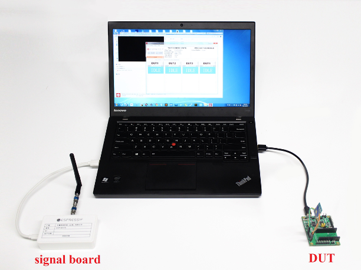

    快速入门测试框架

2. 打开产测工具，根据产品的芯片平台类型进行配置，具体方法见下方“工具配置”小节。

3. 点击 *START* 按钮开始测试。测试过程中，需保证 Log 中的 *fb_rssi* 参数保持在 50（ESP-BAT8 平台）或 -50（ESP-BAT32 平台）左右。

4. 等待测试完成，并根据测试结果排除现场问题。

.. _production-testing-tool:

产测工具
----------

工具介绍
^^^^^^^^^^

`下载链接 <download.espressif.com/fac_tool_release/Qrelease/the_latest_release/ESP_PRODUCTION_TEST_TOOL_NORMAL.zip>`__

工具目录
~~~~~~~~

- factory_test_tool：主目录

   - factory_test_ui_tool.exe：应用程序
   - config：工具运行的配置文件

      - .sys_config/.bin 文件夹：存放各种芯片的测试 bin 文件
      - .sys_config/.spec_file 文件夹：存放各种芯片的阈值文件
      - .sys_settings.conf：配置当前的测试 bin 和阈值文件

   - logs：存放每个待测设备的测试 log

工具界面
~~~~~~~~

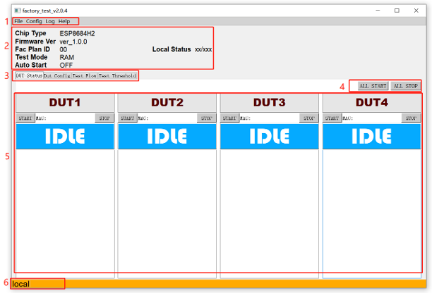

    工具主界面

如上图所示，产测工具的初始界面可大致分为 6 个部分：

#. 菜单栏：*Config* 下进行本地/云端切换（云端模式暂未支持），*Log* 下可打开对应的 log 文件，*Help* 下显示帮助文档。
#. 测试 *配置信息*：左边显示产品类型等测试配置信息；右边显示截止目前为止，本地所有的测试结果数据统计（pass 数量/fail 数量）。
#. 选项卡：可切换显示界面，进行测试或配置。
#. *ALL START/ALL STOP*：全部开始/停止按键。
#. 测试操作界面：默认显示配置完成后进行实际测试的界面，本工具目前采用“一拖四”的形式，所以有 4 个 DUT 界面，各待测设备可独立进行测试，具体的测试项是统一配置的。
#. *Position*：显示当前是本地模式，还是云端模式。

测试方式
~~~~~~~~

目前，本产测工具仅支持 1 种测试方式：

- **RAM 运行测试** (ESP32-C/ESP32/ESP32-S/ESP8266)

   - 测试前，DUT 处于下载模式。测试时，上位机将测试固件下载到 DUT 的 RAM 中并运行。

工具配置
^^^^^^^^^^

配置界面
~~~~~~~~

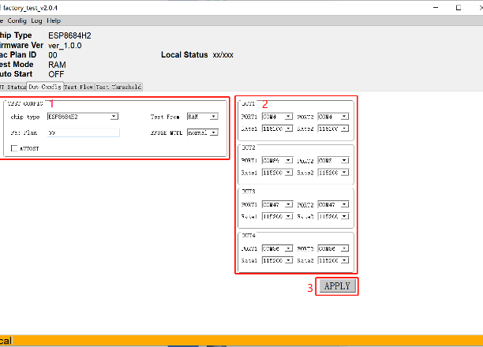

    DUT Config 配置界面

如上图所示，选项卡界面的第二栏是 *DUT Config* 的配置界面，界面主要分成三大部分：

#. *TEST CONFIG：* 配置测试信息
#. *DUT：* 配置 DUT 信息
#. *APPLY：* 应用配置

TEST CONFIG
~~~~~~~~~~~~~

.. list-table:: 配置测试信息
    :header-rows: 1
    :widths: 1 2 4
    :align: center

    * - 选项
      - 功能
      - 说明
    * - Chip Type
      - DUT 类型
      -
         - ESP8266EX
         - ESP32
         - ESP32-S
         - ESP32-C
    * - Test From
      - 程序启动位置
      - RAM：必须选择要下载的测试 bin 文件
    * - Fac-Plan
      - 测试记录代号
      - 以“代号+测试结果”的形式存储 MAC 地址列表。
    * - AUTOST
      - 自动测试开关
      - 勾选后每次测试结束就会自动开始下一次测试。
    * - EFUSE MODE
      - 检测 eFuse 的方式
      - 如果烧录了定制 MAC 地址就选择 custom，否则就选择 normal。

DUT CONFIG
~~~~~~~~~~~~~~~

.. list-table:: 配置 DUT 信息
    :header-rows: 1
    :widths: 1 2 4
    :align: center

    * - 选项
      - 功能
      - 说明
    * - Port
      - 串口号
      - 工位的串口配置，包括正常测试串口和固件测试串口两个（可相同或不同，根据具体的情况选择）。
    * - Rate
      - 波特率
      - 串口命令波特率。
    * - APPLY
      - 修改确认按钮
      - 界面进行修改后，必须要点击 APPLY，并验证通过后才会生效。用户需要填入验证码进行验证，通过后方可完成修改。验证规则为“年+月+日+时”的数字之和，比如 2018-03-01 日 15 时的验证码计算方式为：2018+03+01+15 = 2037。

测试流程
^^^^^^^^^^

除了单纯测试产品的射频性能，产测方案也可同时测试产品的整体功能，具体可完成的测试项目包括但不限于（可自定义命令）RF测试、GPIO 导通测试、应用固件版本测试、Flash RW 测试。

射频测试
~~~~~~~~

- **测试目的：** 射频测试是产测过程中的必选项，其目的是确保产品的射频性能达标，并可进行正常的收发包。
- **测试方式：** 通过辐射的方式，在信号板和待测产品间进行收发包。待测产品通过串口，将测试信息反馈给上位机，而后由上位机对信息解析并得出测试结论。
- **测试过程：** 待测产品运行测试固件，上位机发送串口指令后测试开始。首先，产品会读取寄存器信息，获得射频部分的性能情况，包括供电电压波动等；然后，与信号板进行一定数量的收发包；最后，上位机通过对比串口信息与阈值，判定待测产品是否通过测试。
- **配置界面：** 可在 *Test Flow* 下的 *RF_TEST* 模块中使能。

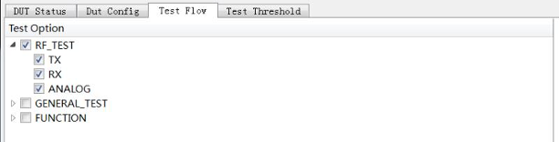

    RF 测试配置界面

GPIO 导通测试
~~~~~~~~~~~~~

- **测试目的：** 可用于检测 GPIO 的导通情况，防止产品的焊接过程中出现的虚焊或连焊现象。
- **测试方式：** 将待测模组治具的对应管脚短接后，通过串口命令来设置和获取管脚电平状态，判断是否存在虚焊或连焊的问题。
- **测试过程：** 在射频性能测试结束后，发送一系列串口命令来进行导通测试。此命令已经在上位机内集成，客户只需要开启此功能即可，若无 GPIO 导通测试需求，则不需要开启。
- **配置界面：** 可在 *Test Flow* 下的 *GENERAL_TEST* 模块中使能（见下图），详细说明请参考 :ref:`appendix-b`。

.. figure:: ../../../_static/production_testing_guide/GPIO_conductivity_test.png
    :align: center
    :scale: 70%

    GPIO 导通测试

固件版本校验测试
~~~~~~~~~~~~~~~~

- **测试目的：** 可用于确定待测产品 flash 中烧录的固件是否为目标版本，防止出现版本错误的问题。
- **测试方式：** 通过比对目标版本固件串口日志中的“特定字符串”或“版本号”进行校验。因此，该字符串应具备区分效果。
- **测试过程：** 在射频性能测试结束后，上位机通过控制串口板的流控，让待测产品从 flash 启动，匹配目标字符串。客户如需要进行版本校验，只需要开启此功能即可。
- **配置界面：** 可在 Test Flow 下的 *GENERAL_TEST* 模块中使能。

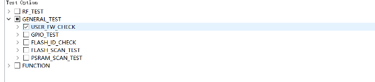

    固件版本校验

Flash 功能测试
~~~~~~~~~~~~~~

- **测试目的：** Flash 功能测试包括 Flash ID 验证及 Flash 读写测试，其目的为确认使用的 flash 型号为期望型号，并保证此 flash 可正常读写。
- **测试方式：** 通过串口命令来运行测试固件中的 flash 测试流程，并通过串口将测试结果返回给上位机。
- **测试过程：** 射频测试结束后，通过串口命令及返回结果进行判断。
- **配置界面：** 可在 *Test Flow* 下的 *GENERAL_TEST* 模块中使能。其中 *FLASH_SCAN_ADDR* 为该测试项的起始地址（只需要 0x1000 扇区大小），*FLASH_SCAN_TARGET* 为目标测试值，不同芯片目标值不一样。

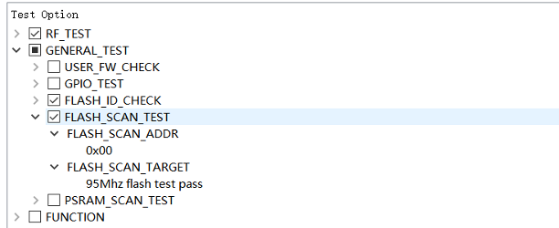

    Flash 功能测试

工具操作
^^^^^^^^^^

测试方式有两种（单工位和全工位），配置对两种测试方式均生效，具体操作流程如下：

1. 环境搭建完成后，点击开始按钮（*START* 或 *ALL START*），开始同步及下载。

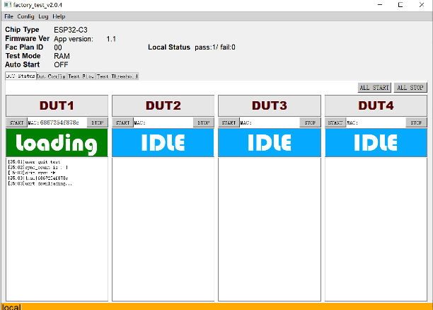

    同步过程

2. 下载完成后，进入测试状态，界面显示 *RUN*，等待测试结果。

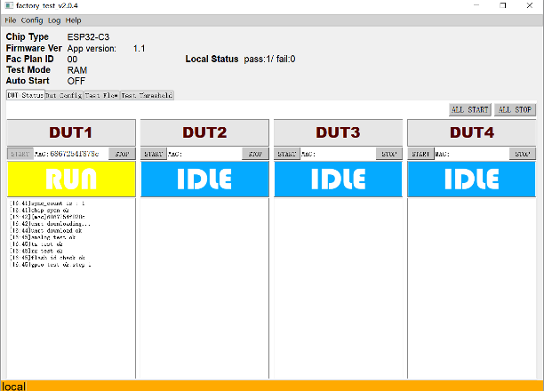

    正在运行中

3. 显示测试结果。

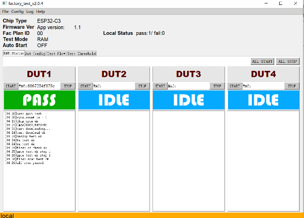

    测试完成

测试过程中有任何测试项目失败，“状态显示框”就会显示 *FAIL*，状态显示框下方的文本框内会逐条显示每个测试项目的结果。用户可据此定位测试失败的具体原因。

4. 查看详细测试记录

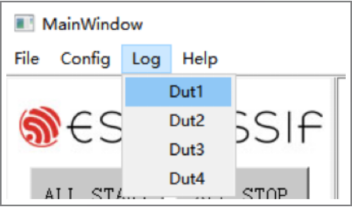

    查看测试结果

每次产测的记录都会单独保存一个 log 文件，文件名以“模组 MAC +日期”的形式保存。点击 *Log* 按钮会弹出对应工位最后一次测试的 log 文件。如果该工位没有进行过测试，则打开 *Logs* 文件夹，方便查看 log。

.. _appendix-b:

附录 B：GPIO 导通测试配置
-------------------------------

在进行 GPIO 导通测试，需要测试的管脚 (GPIOx, GPIOy) 两两短接。一端输出高或低电平 (n = 1 或 0)，另一端作为输入并读取当前电平。

关于 <GPIOx, GPIOy, n> 的说明：

#. GPIOx 表示输入 pin 脚，GPIOy 表示输出 pin 脚；
#. n 可以配置为 0 或 1，0 代表低电平、1 代表高电平。

为了保证高低电平都能测试到，每次配置后，CPIO 导通测试均自动进行两次：

#. 第一次测试采用配置的 n；
#. 第二次测试采用 n 取反。

举例，如果 n 配置为 1，则将首先按照 n = 1 进行测试，然后再按照 n = 0 进行测试。

测试配置
^^^^^^^^^^^^^

.. only:: esp32c2 or esp32c3 or esp32c6

    乐鑫 ESP32-C3-WROOM-02 模组的 GPIO 导通测试，具体配置如下。

    **接线方式：**

    - IO3 --> IO1
    - IO7 --> IO5
    - IO19 --> IO10
    - IO2 --> IO0
    - IO4 --> IO0
    - IO18 --> IO6

    **上位机端的命令配置：**

    <GPIO1,GPIO3,0>;<GPIO5,GPIO7,0>;<GPIO10,GPIO19,0>;<GPIO0,GPIO2,1>;<GPIO0,GPIO4,1>;<GPIO6,GPIO18,1>

    .. figure:: ../../../_static/production_testing_guide/test_option_esp32c_series.png
        :align: center
        :scale: 70%

        ESP32-C 系列测试配置

.. only:: esp32

    乐鑫 ESP32-WROOM-32D 模组的 GPIO 导通测试，具体配置如下。

    **接线方式：**

    - IO23 --> IO34
    - IO22 --> IO35
    - IO15 --> IO32
    - IO02 --> IO33
    - IO19 --> IO25
    - IO18 --> IO26
    - IO05 --> IO12
    - IO13 --> IO27
    - IO21 --> IO14

    **上位机端的命令配置：**

    <GPIO34,GPIO23,0>;<GPIO35,GPIO22,1>;<GPIO32,GPIO15,0>;<GPIO33,GPIO2,1>;<GPIO25,GPIO19,0>;<GPIO26,GPIO18,1>;<GPIO12,GPIO5,0>;<GPIO27,GPIO13,0>;<GPIO14,GPIO21,1>

    .. figure:: ../../../_static/production_testing_guide/test_option_esp32_series.png
        :align: center
        :scale: 70%

        ESP32 系列测试配置

.. only:: esp8266

    乐鑫 ESP-WROOM-02D 模组的 GPIO 导通测试，具体配置如下。

    **接线方式：**

    - IO2 --> IO14
    - IO4 --> IO13
    - IO5 --> IO12

    **上位机端的命令配置：**

    <GPIO14,GPIO2,0>;<GPIO13,GPIO4,0>;<GPIO12,GPIO5,1>

    .. figure:: ../../../_static/production_testing_guide/test_option_esp8266_series.png
        :align: center
        :scale: 70%

        ESP8266 系列测试配置

.. only:: esp32 or esp32c2 or esp32c3 or esp32c6

    串口命令说明
    ^^^^^^^^^^^^^^^^^

    - **串口命令：ESP_TEST_GPIO** <参数1> <参数2> <参数3>

    .. flat-table::
        :header-rows: 0
        :widths: 1 2

        * - 输入
          - ESP_TEST_GPIO 0xD9000C20 0x0054ECE0 0x00000055
        * - 预期输出
          - 0x33000000 0x00AC0000 0x000000BB

    - **命令说明：** 用 2 个 bit 表示一个 GPIO 状态，每个 GPIO 共四种状态：

      - 00 为 default 模式
      - 01 为 INPUT
      - 10 为 OUTPUT 输出低
      - 11 为 OUTPUT 输出高

    - **参数说明：**

      - <参数1>：为 32 bit 数，<参数1>代表 GPIO0~GPIO15。其中的 [1:0] 代表 GPIO0、[3:2] 代表 GPIO1，以此类推，[30:31] 代表 GPIO15。
      - <参数2>：为 32 bit 数，<参数2>代表 GPIO16~GPIO31。其中的 [1:0] 代表 GPIO16、[3:2] 代表 GPIO17，以此类推，[30:31] 代表 GPIO31。
      - <参数3>：为 32 bit数，<参数3>代表 GPIO32~GPIO47。其中的 [1:0] 代表 GPIO32、[3:2] 代表 GPIO33，以此类推，[30:31] 代表 GPIO47。

    - **返回值说明：**

      - **输入结果：** <参数1> <参数2> <参数3>
      - **说明：** 用 2 bit 表示一个 GPIO 作为输入的结果，其中高 bit 位为输入有效标志位，低 bit 位为输入电平高低。每个 GPIO 作为 INPUT 共四种结果：

        - 00 表示不作为输入
        - 10 为输入低电平
        - 11 为输入为高电平
        - 01 不存在

      - **参数说明：**

        - <参数1>：为 32 bit数，<参数1>代表 GPIO0~GPIO15 的输入结果。其中的 [1:0] 代表 GPIO0、[3:2] 代表 GPIO1，以此类推，[30:31] 代表 GPIO15。
        - <参数2>：为 32 bit 数，<参数2>代表 GPIO16~GPIO31 的输入结果。其中的 [1:0] 代表 GPIO16、[3:2] 代表 GPIO17，以此类推，[30:31] 代表 GPIO31。
        - <参数3>：为 32 bit 数，<参数3>代表 GPIO32~GPIO47 的输入结果。其中的 [1:0] 代表 GPIO32、[3:2] 代表 GPIO33，以此类推，[30:31] 代表 GPIO47。

    .. only:: esp32

        .. note::

            ESP32 所用的 GPIO 共 34 个，其中：

            - GPIO20、GPIO24、GPIO28~GPIO31 不可用，状态配置无效；
            - GPIO1/U0RXD，GPIO3/U0TXD 作为串口收发指令，在此不用作 IO 测试，测试结果视为无效；
            - GPIO34~GPIO39 只作为输入，不能作为输出。

.. only:: esp8266

    串口命令说明
    ^^^^^^^^^^^^^^^^^

    - **串口命令**： gpio_test <参数1> <参数2> <参数3>

    .. flat-table::
        :header-rows: 0
        :widths: 1 2

        * - 输入
          - gpio_test 0x3030 0x01010 0x1010

    - **参数说明：**

      - <参数1>：GPIO 管脚测试使能，包括输入管脚和输出管脚，共有 16 位，最低位表示 IO0，最高位表示 IO15。用 bit 表示相应的 GPIO 使能位。1 表示使能，此管脚可以进行 GPIO 测试。0 表示不使能，此管脚不进行 GPIO 测试。
      - <参数2>：GPIO 输出 value 值，用 bit 位表示相应的 GPIO 输出值，1 代表高电平，0 代表低电平，例如 0x1000 代表 GPIO12 输出高电平。
      - <参数3>：GPIO 输出使能开关，用 bit 位表示相应的 GPIO 位输出使能。若此管脚在<参数1>中开启了测试使能，并且在<参数3>中置 1，则此管脚表示输出，置 0 表示输入。

    - **串口命令：** *gpio_read*

    - **命令说明：** 读取所有使能 GPIO 测试的管脚值。

附录 C：固件版本校验测试配置
-------------------------------

固件版本校验测试的详细配置如下图所示：

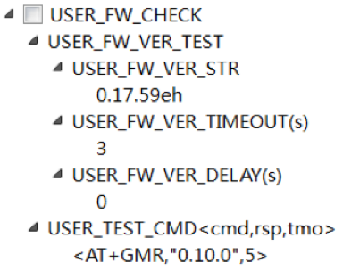

    详细配置

勾选 USER_FW_CHECK 表示使能了固件版本测试项目。该项目有两种测试方式：

- *USER_FW_VER_TEST*：USER_FW_VER_STR 设置为 *Espcmd_en* 表示使能了 *USER_TEST_CMD* 方式。否则，使用匹配串口字符的方式，如上图中的 "0.17.59eh"。
- *USER_TEST_CMD*：若 *USER_FW_VER_STR* 设置为 *Espcmd_en* 表示使能了该方式。客户可根据自己的命令配置，如上图中 <*AT+GMR,"0.10.0",5*> 表示发送命令 *AT+GMR* 后，串口应该返回的字符包含 "0.10.0"。

证书下载
-----------

用户可通过乐鑫官网证书 `下载页面 <https://www.espressif.com/zh-hans/certificates>`_ 下载产品证书。
