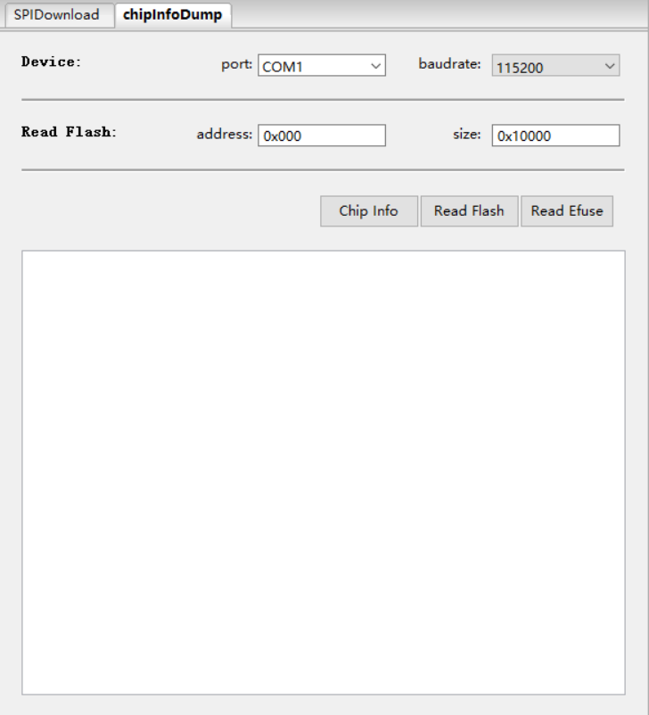

Flash 下载工具用户指南
===================================

:link_to_translation:`en:[English]`

准备工作
--------------

乐鑫模组在进行 flash 下载时所需的软、硬件资源如下所示。

- 硬件设备：

  * 1 x 待下载设备
  * 1 x PC（操作系统支持 Windows 7 [64 位]、Windows 10）

- 软件：

  * `Flash 下载工具 <https://dl.espressif.com/public/flash_download_tool.zip>`__

工具介绍
------------

界面入口
^^^^^^^^^^^^^^

打开 `Flash 下载工具 <https://dl.espressif.com/public/flash_download_tool.zip>`__，双击 ``.exe`` 文件后进入工具主界面，如下图所示：

.. figure:: ../../../_static/flash_download_tool/main_interface.jpg
    :align: center
    :scale: 90%

    Flash Download Tool 主界面

- ``ChipType``：芯片类型，根据所用产品类型选择

- ``WorkMode``：软件模式，当前有 ``Develop`` 模式与 ``Factory`` 模式，区别如下：

  * ``Develop`` 模式使用固件绝对路径，只支持单片产品烧录。
  * ``Factory`` 模式使用相对路径，建议将待烧录固件放在与 ``.exe`` 文件同级的 bin 文件夹中，配置后关闭时会自动保存在本地。
  * ``Factory`` 模式打开时，界面锁定，需点击 ``LockSettings`` 按钮使能编辑。防止鼠标误操作。

.. only:: esp8266 or esp32 or esp32c2

    - ``LoadMode``：下载接口仅支持 ``UART``。

.. only:: not esp8266 and not esp32 and not esp32c2

    - ``LoadMode``：下载接口支持 ``UART`` 和 ``USB`` 两种方式。

SPIDownload 界面
^^^^^^^^^^^^^^^^^^^^^^^^^

以下是配置说明：

- ``Download Path Config`` 包含固件加载路径，固件下载地址，以 16 进制格式填写，比如 0x1000。

- ``SPI Flash Config``

  * ``SPI SPEED``：SPI 启动速率
  * ``SPI MODE``：SPI 启动模式
  * ``DETECTED INFO``：自动检测到的 flash 及晶振信息
  * ``DoNotChgBin``：若使能，则按照 bin 文件原始内容烧录。若不使能，按照界面的 ``SPI SPEED``、``SPI MODE`` 配置更新并烧录。
  * ``CombineBin`` 按钮：可将 ``Download Path Config`` 中选中的多个固件打包成一个固件。若使能 ``DoNotChgBin``，则按原始固件打包。若不使能 ``DoNotChgBin``，则按界面 ``SPI SPEED``、``SPI MODE`` 配置打包固件。固件之间非数据区，会以 0xff 进行填充。打包的固件将保存为 ./combine/target.bin，每次点击覆盖前次。
  * ``Default`` 按钮：将界面 SPI 配置均还原成默认值。

- ``Download Panel``

  * ``START``：开始按键
  * ``STOP``：停止按键
  * ``ERASE``：整个 flash 擦除
  * ``COM``：下载串口
  * ``BAUD``：下载波特率

.. figure:: ../../../_static/flash_download_tool/spidownload_interface.jpg
    :align: center
    :scale: 80%

    SPIDownload 界面

.. only:: esp8266

    HSPIDownload 界面
    ^^^^^^^^^^^^^^^^^^^^^^^^^^^

    HSPIDownload 界面与 SPIDownload 界面一致，ESP8266 HSPI 外接 flash 时会用到，界面说明可参考 `SPIDownload 界面`_。

FactoryMultiDownload 界面
^^^^^^^^^^^^^^^^^^^^^^^^^^^^^^^^^

- ``Factory`` 模式使用相对路径，默认从工具目录的 bin 路径下加载待烧录固件。而 ``Develop`` 模式使用绝对路径。``Factory`` 模式的优点：只要将待烧录固件拷入工具目录的 bin 路径下，即可在工厂电脑间拷贝，不会出现路径问题。

- ``Factory`` 模式打开时，工具启动默认使能界面上 ``LockSettings``。``LockSettings`` 在使能的情况下，固件路径及 ``SPI flash config`` 均无法配置，防止产线人员误触导致配置错误。（工厂管理人员需要配置时，可点击 ``LockSettings`` 进行解锁）

.. figure:: ../../../_static/flash_download_tool/factorymultidownload_interface.png
    :align: center
    :scale: 55%

    FactoryMultiDownload 界面

FactoryMultiDownload 界面的 ``download path config`` 及 ``SPI flash config`` 配置与 SPIDownload 界面基本相同，请参考 `SPIDownload 界面`_，并注意单独配置每一路的串口号和波特率。

chipInfoDump 界面
^^^^^^^^^^^^^^^^^^^^^^^^^^^^^^^^^

- ``Device`` 选择对应设备的串口号和通信波特率 

- ``Read Flash`` 选择从flash里读取内容的首地址及要读取内容的大小，此项仅读取flash时需要设置

    chipInfoDump 界面

- ``功能说明``

  * ``Chip Info``：读取芯片型号、Flash ID及Flash状态寄存器值，读取内容直接显示在软件界面上。
  * ``Read Flash``：读取 Flash 存储的数据。读出的内容会存储在生成的bin文件中，bin文件名称以 芯片MAC+读取起始地址+读取数据长度+读取时间 的格式命名。
  * ``Read Efuse``：读取芯片 Efuse 内容，功能和esptool summary相同，读出内容存储在生成的文本文件中，文件以 芯片MAC+读取时间 的格式命名

.. note::

    以上读取功能需要产品启动后进入下载模式

下载示例
---------------

.. only:: esp32

    本章节主以 ESP32 系列为例，演示如何进行常规烧录和加密烧录。目前，{IDF_TARGET_NAME} 支持常规烧录与加密烧录。

.. only:: not esp32

    本章节主以 ESP32 系列为例，演示如何进行常规烧录和加密烧录。目前，{IDF_TARGET_NAME} 仅支持常规烧录，加密烧录待后续更新。

常规烧录
^^^^^^^^^^^^^^

.. only:: esp8266 or esp32 or esp32s2 or esp32s3

    1. 将 GPIO0 管脚下拉，使设备进入下载模式

.. only:: esp32c2 or esp32c3 or esp32c6 or esp32h2

    1. 将 GPIO9 管脚下拉，GPIO8 管脚上拉，使设备进入下载模式。

2.	打开下载工具，``ChipType`` 选择 ``ESP32``，``WorkMode`` 选择 ``Develop``，``LoadMode`` 选择 ``UART``，点击 ``OK``，如下图所示。

.. figure:: ../../../_static/flash_download_tool/device_selection.jpg
    :align: center
    :scale: 90%

    设备选择 — ESP32 Download Tool

3. 进入下载页面，填入需要烧录的 bin 文件，和对应的烧录地址，勾选 bin 文件前面的复选框，并根据自己实际需求填入 ``SPI SPEED``、``SPI MODE``、``COM`` 及 ``BAUD``。

4. 点击 ``START`` 开始下载。下载过程中，下载工具会读取 flash 的信息和芯片的 MAC 地址。

5. 下载完成后，下载工具的界面如下图所示。

.. figure:: ../../../_static/flash_download_tool/download_finish_interface.jpg
    :align: center
    :scale: 90%

    下载完成界面

加密烧录
^^^^^^^^^^^^^^^^

加密烧录流程为：

- `Flash 下载工具 <https://dl.espressif.com/public/flash_download_tool.zip>`__ 将明文固件烧录进芯片

- 芯片使用 eFuse 中的密钥对该明文固件进行加密，然后将加密后的固件写入 flash。

- 若 eFuse 中无 flash 加密密钥，下载工具会自动在 PC 端随机生成密钥并烧录进 eFuse，客户也可以自行准备加密密钥；若 eFuse 中已有 flash 加密密钥，则跳过密钥的生成及密钥烧录过程。

以下为配置加密功能的步骤：

- 打开配置文件 ./configure/[chip_name]/security.conf，若首次打开时无此文件，可关闭软件后再次打开即可

- 修改相关配置项

以下为配置项的说明，其中等号后面的内容为配置项的默认值，``True`` 表示使能，``False`` 表示不使能。

- **[SECURE BOOT]** 此配置项为开启 secure boot 时需要配置

  * **secure_boot_en = False** （配置是否使能 secure boot）

  .. only:: esp32

     * **secure_boot_version = 1** （用于选择安全启动版本）

  * **public_key_digest_path = .\secure\public_key_digest.bin**  （公钥摘要文件路径，生成方式: ``espsecure digest_sbv2_public_key -k pem.pem -o public_key_digest.bin``; ``.pem`` 文件是编译时指定的私钥文件）

  * **public_key_digest_block_index = 0** （eFuse 中存储公钥摘要文件的 block 索引，默认 0）

- **[FLASH ENCRYPTION]** 此配置项为开启 flash 加密时需要配置

  * **flash_encryption_en = False** （配置是否开启 flash 加密功能）

  * **reserved_burn_times = 3** （配置预留烧录次数）

  .. only:: esp32s2 or esp32s3 or esp32c3 or esp32c6

      * **flash_encrypt_key_block_index = 0** （配置加密密钥在 block_key 中的索引值，默认为 0，可选范围 0~4。）更多信息请参考 `技术参考手册 (PDF) <{IDF_TARGET_TRM_CN_URL}>`__ > 章节 eFuse 控制器

  .. only:: esp32c2

      * **flash_encrypt_key_block_index = 0** （配置加密密钥在 block_key 中的索引值，默认为 0，不可更改。）更多信息请参考 `技术参考手册 (PDF) <{IDF_TARGET_TRM_CN_URL}>`__ > 章节 eFuse 控制器

- **[SECURE OTHER CONFIG]** 其他安全配置项：

  * **flash_encryption_use_customer_key_enable = False** （配置是否使能客户指定的加密密钥）

  * **flash_encryption_use_customer_key_path = .\secure\flash_encrypt_key.bin** （若使用客户指定的密钥，这里需要指定密钥路径）

  * **flash_force_write_enable = False** （配置烧录时是否跳过加密和安全启动检查。此时若对已经开启 flash 加密或安全启动的产品烧录时会弹窗报错）

- **[FLASH ENCRYPTION KEYS LOCAL SAVE]** 此配置为是否将加密用的密钥文件保存在本地，默认为 False

  * **keys_save_enable = False** （配置是否保存密钥）

  * **encrypt_keys_enable = False** （配置是否对保存在本地的密钥加密）

  * **encrypt_keys_aeskey_path =** （若对本地保存的密钥加密，请在此处填入密钥文件，比如 **./my_aeskey.bin**）

- **[ESP32* EFUSE BIT CONFIG]** 此配置为开启 flash 加密时，是否配置加密项，默认为 False。

.. only:: esp32

    .. list-table:: [ESP32 DISABLE FUNC] 配置项
        :header-rows: 1

        * - [ESP32 DISABLE FUNC] 配置项
          - 描述

        * - dl_encrypt_disable = False
          - 配置是否禁用加密

        * - dl_decrypt_disable = False
          - 配置是否禁用解密

        * - dl_cache_disable = False
          - 配置是否关闭 cache

        * - jtag_disable = False
          - 配置是否关闭 JTAG

.. only:: esp32c2 or esp32c3 or esp32c6

    .. list-table:: [ESP32-C* DISABLE FUNC] 配置项
        :header-rows: 1

        * - [ESP32-C* DISABLE FUNC] 配置项
          - 描述

        * - dis_usb_jtag = False
          - 配置是否禁用 USB JTAG

        * - dis_pad_jtag = False
          - 配置是否禁用 JTAG PAD

        * - soft_dis_jtag = 7
          - 配置是否软禁用 JTAG

        * - dis_direct_boot = False
          - 配置是否禁用 direct boot

        * - dis_download_icache = False
          - 配置是否在 Download 模式下关闭指令 cache

.. only:: esp32s2 or esp32s3

    .. list-table:: [ESP32-S* DISABLE FUNC] 配置项
        :header-rows: 1

        * - [ESP32-S* DISABLE FUNC] 配置项
          - 描述

        * - dis_usb_jtag = False
          - 配置是否禁用 USB JTAG

        * - hard_dis_jtag = False
          - 配置是否硬禁用 JTAG

        * - soft_dis_jtag = 7
          - 配置是否软禁用 JTAG

        * - dis_usb_otg_download_mode = False
          - 配置是否禁用 USB OTG 下载

        * - dis_direct_boot = False
          - 配置是否禁用 direct boot

        * - dis_download_icache = False
          - 配置是否在 Download 模式下关闭指令 cache

        * - dis_download_dcache = False
          - 配置是否在 Download 模式下关闭数据 cache

.. only:: esp32h2

    .. list-table:: [ESP32-H* DISABLE FUNC] 配置项
        :header-rows: 1

        * - [ESP32-H* DISABLE FUNC] 配置项
          - 描述

        * - dis_direct_boot = False
          - 配置是否禁用 direct boot

        * - soft_dis_jtag = False
          - 配置是否软禁用 JTAG

        * - dis_pad_jtag = False
          - 配置是否硬禁用 JTAG

        * - dis_usb_jtag = False
          - 配置是否禁用 USB JTAG

运行工具时会提示如下内容，需核对是否正确。下图为同时开启 flash 加密和安全启动的提示信息：

.. figure:: ../../../_static/flash_download_tool/flash_encryption_secure_boot.jpg
    :align: center
    :scale: 90%

    以 ESP32 示例开启 flash 加密和安全启动提示信息

固件烧录过程中，会向芯片的 eFuse 中烧录密钥等信息。待固件及 eFuse 烧录完成后，显示 ``FINISH/完成``。

.. note::

    为防止已加密的模组重烧，工具烧录前会默认校验 eFuse flash 加密及安全启动信息，防止报废。
