WFA 认证与测试指南
==========================================

:link_to_translation:`en:[English]`

概述
----------

本文档讲述 ESP 系列芯片如何通过 WFA 认证，以及快速认证（QuickTrack）方式的指导，方便乐鑫客户在自己的产品上完成 WFA 认证。

EPS 系列固件和测试工具可从 `乐鑫官网 <https://www.espressif.com/zh-hans/support/download/other-tools>`__ 下载。

WFA 认证介绍
-------------------------

认证方式
^^^^^^^^^^^^^^^^^^

WFA 标准流程：

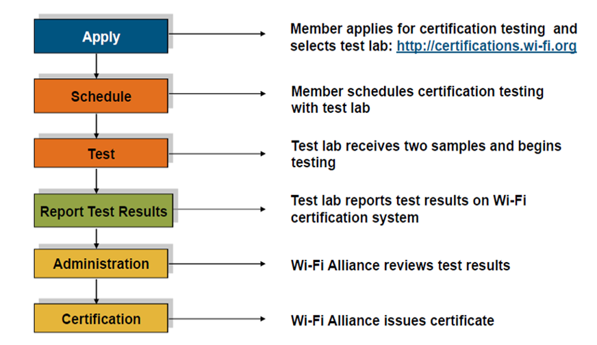

    WFA 标准流程

1. 向 Wi-Fi 联盟提交认证申请，并选择对应的 ATL，实验室接收 CID
2. 联系 ATL 寄送待测设备
3. 实验室开始测试
4. ATL 提供相应测试结果
5. Wi-Fi 联盟颁发认证证书

Wi-Fi 联盟认证规则
^^^^^^^^^^^^^^^^^^^^^^^^^^^^^^^^^^^^^^

1. **全新认证 (New Certification)**

   如果产品之前没有做过任何 Wi-Fi 的认证，可以选择此项。

2. **追加认证 (Additional Certification)**

   如果此产品已经过认证，并且您将测试新的或更新的产品功能，请选择此选项。

3. **重认证 (Re-Certification)**

   贡献者、发起人、附属成员、实施者 **不允许** 会员仅可申请其 Wi-Fi 认证产品的再认证。

   如果此产品具有现有认证，但是固件/软件版本发生变化，应重新进行认证。

   固件/软件版本发生变化的情形包含以下三种：

   - 硬件（应该非常小）和/或设备软件（操作系统或设备驱动程序）已更改并影响 Wi-Fi 操作
   - 固件已更改或发生了轻微的软件修改，更改会影响 Wi-Fi 操作（包括小更新/错误修复，不包括操作系统或设备驱动程序更新）
   - 包含不会影响 Wi-Fi 操作的更改，实验室将审查并确定是否需要测试

4. **派生认证 (Derivative Certification)**

   - 会员资格

     所有会员都可以申请衍生产品认证。

   - 需求

     * 仅基于来源认证，而非其他衍生产品认证
     * 衍生产品的功能应与源产品相同
     * 成员应为衍生产品或者来源认证产品提供必要的技术信息，以验证衍生产品认证的合格性

   - 模块需求

     * 一个 Wi-Fi 模块被测试和 Wi-Fi 认证后应能代表其在第一和后续衍生产品中的模块化使用
     * Wi-Fi 模块的源认证仅适用于模块本身，不适用于一阶衍生产品
     * 用于测试 Wi-Fi 模块的产品可被视为衍生产品，并被认证为一级衍生产品。后续衍生产品符合衍生产品认证要求的，可作为衍生产品认证

哪些产品需要做 Wi-Fi 联盟认证？
^^^^^^^^^^^^^^^^^^^^^^^^^^^^^^^^^^^^^^^^^^^^^^^^^^^^^^^^^^

需要做 Wi-Fi 联盟认证的产品主要针对 Wi-Fi 802.11a/b/g/n 几种工作模式，通常使用 2.4 GHz UHF 或 5 GHz SHF ISM 射频频段，包括无线路由器、智能手机、家电、计算机、网络基础设施和消费电子产品等。

ESP 系列产品认证方式
------------------------------------------

认证方式
^^^^^^^^^^^^^^^^^^^

- ESP 系列模组目前使用的认证方式为全新认证 (New Certification)
- 对于使用 ESP 系列芯片的下游客户建议和使用快速认证 (QuickTrack)

二者之间的关系如下：

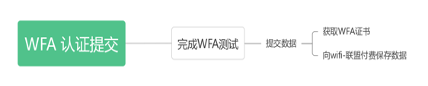

   全新认证与快速认证

当一款全新 ESP 系列模组完成全新认证 (New Certification) 测试后，会向 Wi-Fi 联盟付费保存测试数据并生成对应的合格解决方案 (Qualified Solutions)，方便 ESP 系列芯片的下游客户可以选择此解决方案，从而申请 QuickTrack 的快速认证方式。

ESP 系列模组全新认证 (New Certification) 介绍
^^^^^^^^^^^^^^^^^^^^^^^^^^^^^^^^^^^^^^^^^^^^^^^^^^^^^^^^^^^^^^^^^^^^^^^^^^^^^^

ESP 系列模组测试项如图 3-2 所示。

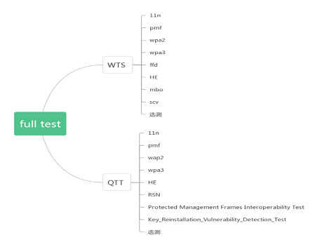

    full-test 测试项

WFA测试项包括两部分，WTS 与 QTT，其中 WTS 为 sigma 工具测试项，QTT 为 QuickTrack 工具测试项。它们包含部分相同的测试项，但是具体的测试用例不同。

QuickTrack 认证方式介绍
^^^^^^^^^^^^^^^^^^^^^^^^^^^^^^^^^^^^^^^^^^^^

QuickTrack 是一种全新的 Wi-Fi 认证方式。

作为 Wi-Fi 联盟推出的三种全新认证方式之一，QuickTrack 主要面向基于 **合格解决方案 (Qualified Solutions)** 来构建的产品。换句话说，对于那些使用已通过先决测试的模块、芯片组或其他方案来设计产品的企业，Wi-Fi 联盟将会用更简便的方式来进行认证，进而达到降低测试和认证成本，减少测试时间的效果。

具体而言，企业首先需要在多种备选的 **合格解决方案** 中选择符合自身需求和设计的组件或方案来构建产品，之后完成一个产品与所选方案的一致性测试来确保产品所使用的组件或方案确为 **合格解决方案**。而后，企业可自行或通过认证实验室来进行测试，并向认证系统提交测试结果。在测试过程中，企业完全可通过 Wi-Fi 联盟提供的软硬件测试工具自行搭建测试环境。待测试结果经过 Wi-Fi 联盟的确认之后，企业的产品便可快速获得 Wi-Fi CERTIFIED 的认证。

.. figure:: ../../_static/wfa_certification_test_guide/quicktrack_process_cn.png
    :align: center
    :scale: 90%

    QuickTrack 认证过程

QuickTrack 认证方式的优点
^^^^^^^^^^^^^^^^^^^^^^^^^^^^^^^^^^^^^^^^^^

降低测试和认证成本，减少测试时间，可以更快的获取 WFA 证书。

下面将以 ESP32-C2 举例说明：

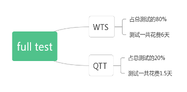

    full-test 测试时间

ESP32-C2 模组完成 full-test 测试初步估算需要 7.5 天。

而对于 ESP32-C2 下游客户选择 QuickTrack 认证方式，确认下面产品信息：

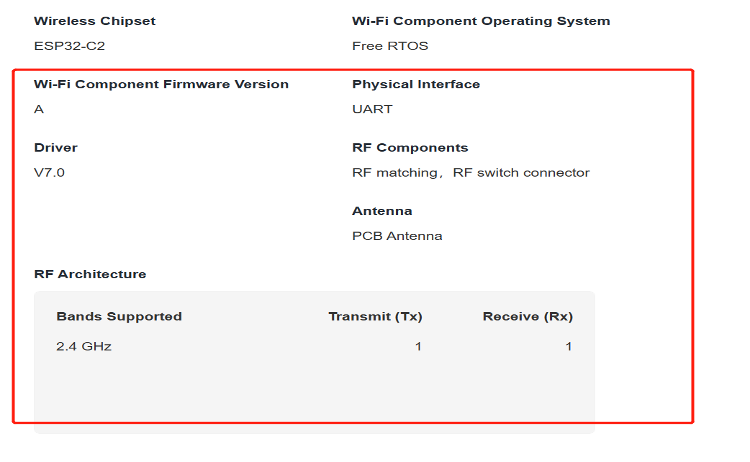

    产品信息

- 如产品信息与 ESP32-C2 保持一致，没有任何改动，则该产品无需做任何测试，直接付费获取证书。
- 如产品信息与 ESP32-C2 有差异，则仅需要测试 QTT 部分，WTS 部分无需测试，产品完成认证时间只需要 1.5 天。

QuickTrack 认证方式与普通认证方式对比图：

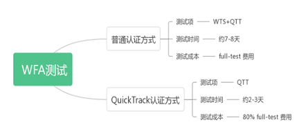

    普通认证与 QuickTrack 对比

.. note::

    这里的测试时间并非 WFA 完成时间，WFA 完整时间为 2.1 小节中提到的 WFA 整个认证过程的完成时间，这里的测试时间只是测试花费的时间，具体由实验室来安排测试。依然以 ESP32-C2 为例，WFA 完成时间 40 天（普通认证方式），如果选择 QuickTrack 认证方式大概时间为 10 天左右，约节约 70% 时间。

ESP 芯片 QuickTrack 认证方式现状
^^^^^^^^^^^^^^^^^^^^^^^^^^^^^^^^^^^^^^^^^^^^^^^^^^^^

目前已取得 ESP 系列芯片 QuickTrack 合格解决方案的芯片包括ESP32-C2，ESP32-C6。

WFA 测试
---------------

填写 CID 信息
^^^^^^^^^^^^^^^^^^^^^^^^^^^^

可根据自身要求填写测试内容，可参考 Wi-Fi 联盟 CID `填写指导 <https://www.wi-fi.org/file-member/flextrack-new-product-application-training>`__，也可参考 ESP 系列模组 `填写方式 <https://www.cert.wi-fi.org/#/application/lisrshok/new?step=1>`__。

固件烧录
^^^^^^^^^^^^^^^^^^

在 Windows 上烧录
""""""""""""""""""""""""""""""""

ESP32 系列芯片

- 打开 ``flash_download_tool_3.9.2.exe`` 应用程序
- ``chipType`` 选择 ``ESP32``，``workMode`` 选择 ``develop``，点击 ``OK``
- 选择固件和填写烧入位置，选择端口号，``baud`` 选择 ``115200``，点击 ``START``，开始烧录

  固件对应位置：

  - bootloader.bin  0x1000
  - espsigma.bin    0x10000
  - partition.bin   0x8000

ESP32-C3, ESP32-C2, ESP32-C6

- 打开 ``flash_download_tool_3.9.2.exe`` 应用程序
- ``chipType`` 选择 ``ESPXX``（对应芯片）， ``workMode`` 选择 ``develop``，点击 ``OK``
- 选择固件和填写烧录位置，选择端口号，``baud`` 选择 ``115200``，点击 ``START``，开始烧录

  固件对应位置：

  - bootloader.bin  0x0
  - espsigma.bin    0x10000
  - partition.bin   0x8000

烧录完成页面会显示 ``finish``

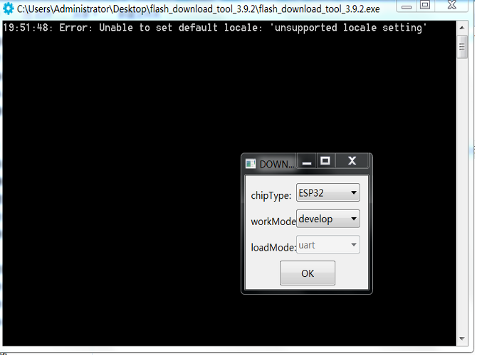

    烧录配置

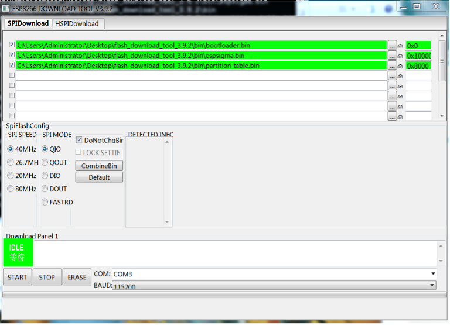

    烧录固件

在 Ubuntu 上烧录
""""""""""""""""""""""""""""""

- 安装 python3.7

  .. code-block:: bash

     cd espsigma_qt/espsigma
     ./tools/setup/setup_pyenv_python.sh
     source ~/.pyenv/activate

- 安装烧录工具

  .. code-block:: bash

     pip install esptool

- 进行烧录

  .. code-block:: bash

     esptool.py -p /dev/ttyUSB0 --chip=auto write_flash 0x0 bootloader.bin 0x8000 partition-table.bin 0x10000 espsigma.bin

.. note::

   ``0x0 bootloader.bin``， ``0x8000 partition-table.bin``， ``0x10000 espsigma.bin`` 这部分根据具体芯片型号以及固件摆放位置填写。

测试电脑环境安装
^^^^^^^^^^^^^^^^^^^^^^^^^^^^^^^^^^

1. 使用 Ubuntu 16.04 以上版本操作

2. 安装 python3.7

   .. code-block:: bash

      cd espsigma_qt/espsigma
      ./tools/setup/setup_pyenv_python.sh
      source ~/.pyenv/activate

安装成功后可以再次输入 ``python -v`` 查看 python 版本。

开始测试
^^^^^^^^^^^^^^^^^^^^^^

测试 WTS 部分
""""""""""""""""""""""""""

- 打开命令行一个窗口

  .. code:: bash

     cd /espsigma_qt/espsigma/esp_sigma_ca

- 输入命令：

  .. code:: bash

     python espsigma.py --dut /dev/ttyUSB*

.. note::

   ``*`` 指的是串口号。

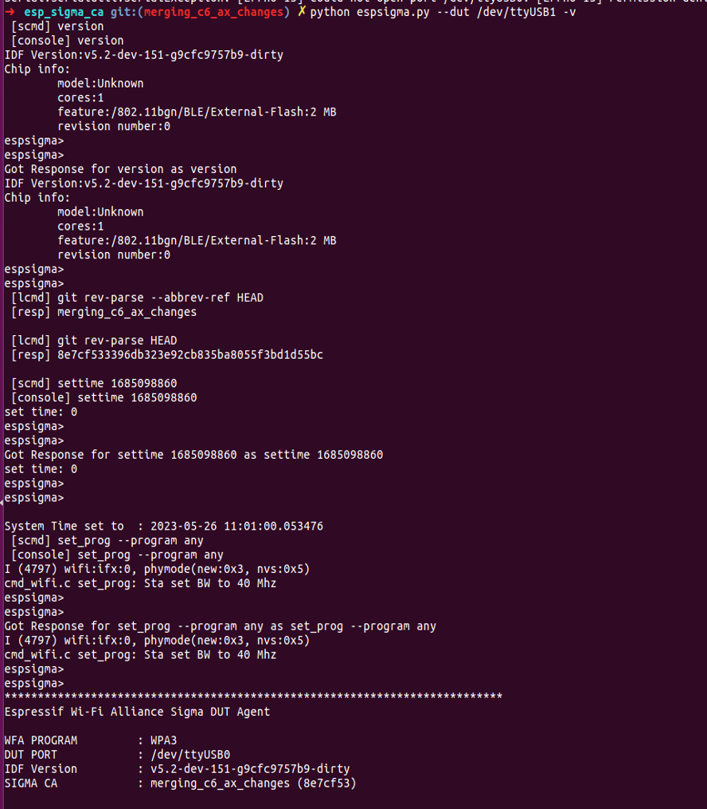

    WTS 测试

测试 quicktrack 部分
""""""""""""""""""""""""""""""""

- 打开命令行一个窗口

  .. code:: bash

     cd /espsigma_qt/espsigma/esp_sigma_ca

- 输入命令：

  .. code:: bash

     python espsigma.py --quicktrack --dut/dev/ttyUSB *

  .. note::

     ``*`` 指的是串口号。

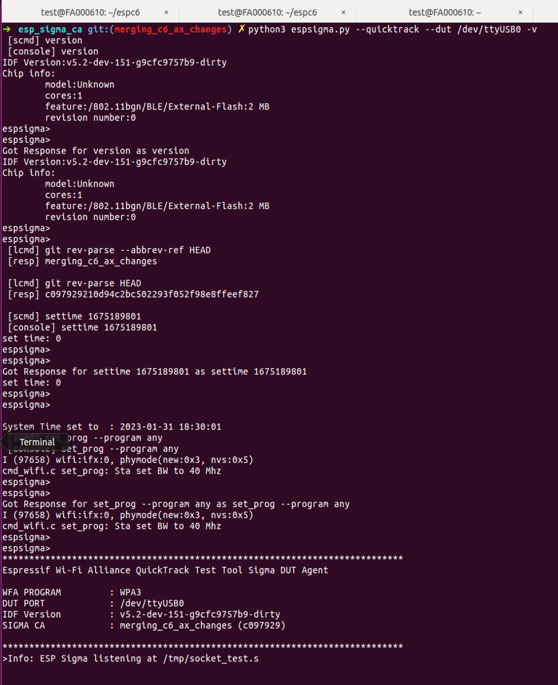

    QuickTrack 测试-1

- 打开另一个命令行窗口

  .. code:: bash

     cd /espsigma_qt/controlappc-2.0.0.9

- 输入命令

  .. code:: bash

     ./app -p *

  .. note::

     ``*`` 指的是 QTT 端口，例如 9005。

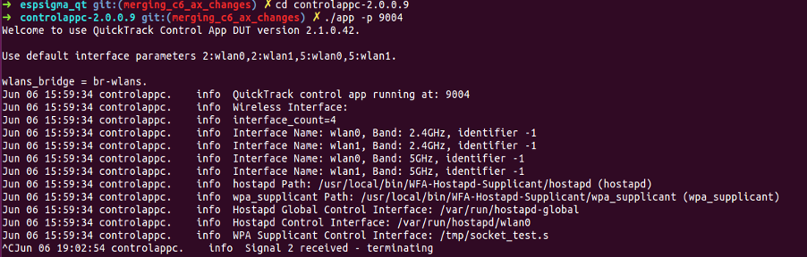

    QuickTrack 测试-2

Quicktrack 页面设置勾选请参考图片

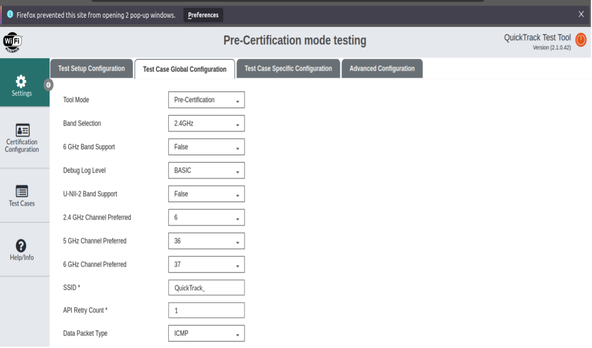

    QuickTrack 设置-1

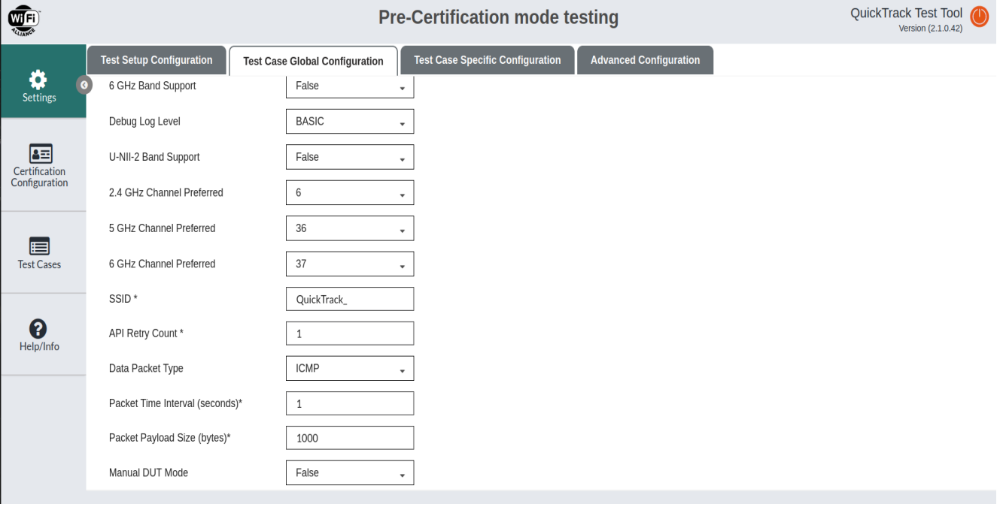

    QuickTrack 设置-2

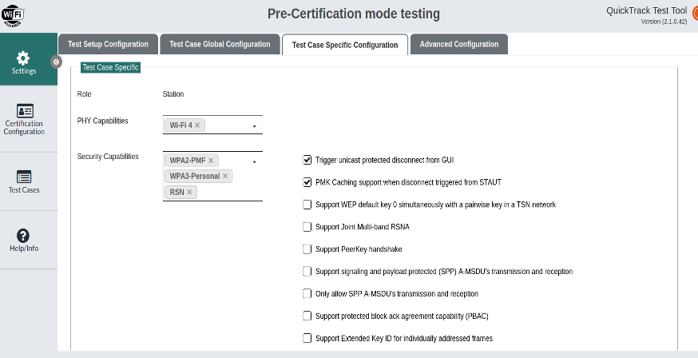

    QuickTrack 设置-3

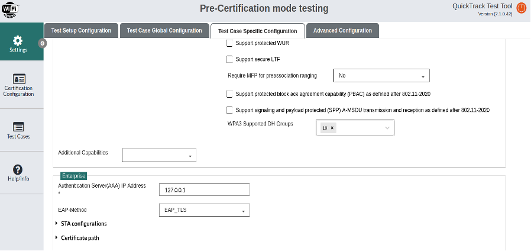

    QuickTrack 设置-4

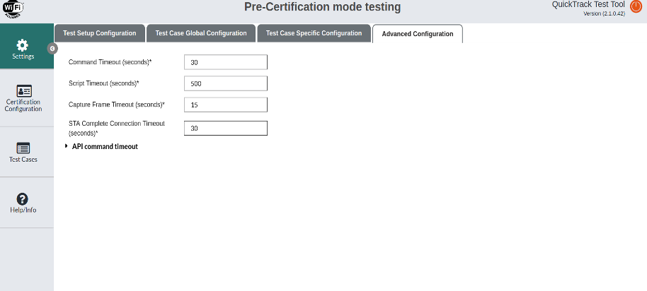

    QuickTrack 设置-5

.. note::

    python 版本必须为 3.7 以上，如果窗口 python 版本不对请执行步骤 2。
