ESP 系列产品 CE 认证说明
****************************************

:link_to_translation:`en:[English]`

测试准备
====================

硬件准备
-----------------

CE 认证需准备的硬件有三种，分别是待测样机、串口板和 USB 线，硬件说明如表 1 所示。

.. list-table:: 硬件说明
  :widths: 20 40 10 30

  * - 名称
    - 图片
    - 数量
    - 描述
  * - 待测样机
    - N/A
    - 6
    - 基于 ESP 芯片或模组设计的产品
  * - 串口板
    - .. figure:: ../../_static/rf_test_tool/serial_board.jpg
    - 1
    - 连接 PC 的 USB 线和待测样机接出来的杜邦线，用于 USB-UART 转换，使 PC 端和待测样机通信
  * - USB 线
    - .. figure:: ../../_static/rf_test_tool/usb_cable.jpg
    - 1
    - 连接 PC 和串口板

.. note::

    1. 仅蓝牙 Blocking 测试会用到 2 个串口板和 2 根 USB 线，如果待测样机没有蓝牙功能，只需 1 个串口板和 1 根 USB 线。
    2. 为排除干扰和便于使用，可以在乐鑫淘宝官方店铺购买乐鑫串口板。

软件准备
----------------

下载 CE 认证所需的软件，软件说明如表 2 所示。

.. list-table:: 软件说明
    :header-rows: 1
    :widths: 40 60
    :align: left

    * - 名称
      - 描述
    * - ft232r-usb-uart.zip
      - 乐鑫串口板的驱动程序
    * - ESP_RF_test_tool.zip
      - 该压缩包包含了测试 bin，用于下载和运行测试 bin 的工具
    * - BQB
      - 用于蓝牙 Blocking 测试

下载测试固件
---------------------

在进行测试之前，请按照本节内容先搭建下载环境，然后下载测试固件。

下载环境搭建
^^^^^^^^^^^^^^^^^^^^^^^

.. list-table:: 下载环境搭建
  :widths: 30 70

  * - 芯片型号
    - 连接说明
  * - | ESP8266
      | ESP8285
    - | • 3V3/CH_EN 管脚连接到 3.3 V 电源
      | • RXD/TXD/GND 管脚连接到串口模块的对应引脚上，使 PC 与设备通信
      | • MTDO (GPIO15) 管脚下拉
      | • GPIO0 (Boot) 管脚下拉时，设备进入下载模式
  * - | ESP32
      | ESP32-S2
      | ESP32-S3
    - | • 3V3/CH_EN 管脚连接到 3.3 V 电源
      | • RXD/TXD/GND 管脚连接到串口模块的对应引脚上，使 PC 与设备通信
      | • GPIO0 (Boot) 管脚下拉时，设备进入下载模式
  * - | ESP32-C3
      | ESP32-C6
      | ESP32-H2
    - | • 3V3/CH_EN 管脚连接到 3.3 V 电源
      | • RXD/TXD/GND 管脚连接到串口模块的对应引脚上，使 PC 与设备通信
      | • GPIO9 (Boot) 管脚下拉，GPIO8 管脚上拉时，设备进入下载模式

下载操作
^^^^^^^^^^^^^^^^^^^

硬件环境搭建完成后，按照下列操作下载测试固件：

1. 打开串口板电源开关，显示灯变亮，如 `connection_serial_port_board` 所示

.. _connection_serial_port_board:
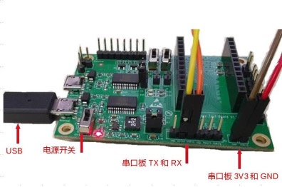

    串口板连接示意图

1. 解压并打开 EspRFTestTool

   - 选择对应的芯片类型、COM 口、波特率 115200，点击 open 按钮打开串口
   - 选择下载至 Flash
   - 选择芯片对应的测试固件

     * 非信令 RF 测试固件见表 4
     * Adaptivity 和 Blocking 测试固见表 5
     * BQB 测试固件见表 6
     * 信令测试固件见表 7

   - 点击 Load bin 按钮，下载完成会显示 SUCC。图 2 为 ESP32 下载固件的界面。

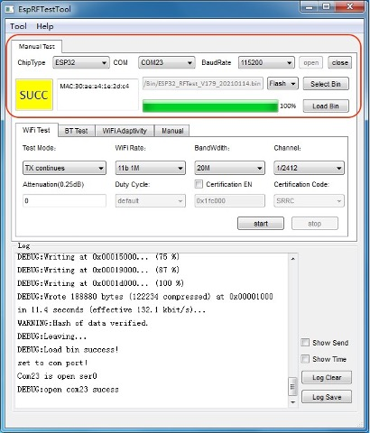

    ESP32 固件下载界面

EspRFTestTool 的默认下载地址为 0x1000，若需要将固件下载到其它地址，或需要同时下载多个固件时，请使用 DownloadTool 工具。例如，ESP32 Blocking 测试需要下载 bootloader、partitions、SSC 三个固件。PC 端解压并打开 EspRFTestTool，点击左上角的 Tool 打开 DownloadTool，在 DownloadTool 中设置下载，下载界面设置如图 3，下载成功后显示 SUCC。有关如何使用 DownloadTool 的详细说明请见 help 文件夹下的《DownloadTool 使用说明》。

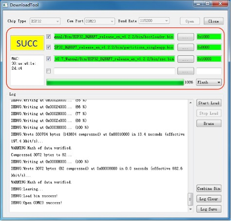

    DownloadTool 蓝牙 bin 下载界面表

.. flat-table:: 非信令 RF 测试固件和地址
   :header-rows: 2
   :stub-columns: 1
   :widths: 1 3 1 2 2

   * - :rspan:`1` 芯片
     - :cspan:`1` 非信令 RF 测试
     - :cspan:`1` 芯片特性

   * - bin 文件
     - 下载地址
     - Wi-Fi
     - 蓝牙

   *  - ESP32
      - ESP32_RFTest_Bin
      - 0x1000
      - 11b, 11g, 11n-HT20, 11n-HT40
      - Bluetooth & Bluetooth LE 4.2

   *  - ESP32-S2
      - ESP32-S2_RFTest_Bin
      - 0x1000
      - 11b, 11g, 11n-HT20, 11n-HT40
      - --

   *  - ESP32-S3
      - ESP32-S3_RFTest_Bin
      - 0x0
      - 11b, 11g, 11n-HT20, 11n-HT40
      - Bluetooth LE 5.0

   *  - ESP32-C3
      - ESP32-C3_RFTest_Bin
      - 0x0
      - 11b, 11g, 11n-HT20, 11n-HT40
      - Bluetooth LE 5.0

   *  - ESP32-C6
      - ESP32-C6_RFTest_Bin
      - 0x0
      - 11b, 11g, 11n-HT20, 11n-HT40
      - Bluetooth LE 5.0

   *  - ESP32-H2
      - ESP32-H2_RFTest_Bin
      - 0x0
      - --
      - Bluetooth LE 5.2 & Zigbee & Thread

   *  - ESP8266, ESP8285
      - ESP8266_RFTest_Bin
      - 0x0
      - 11b, 11g, 11n-HT20
      - --

.. list-table:: Adaptivity & Blocking 测试固件和地址
    :header-rows: 1
    :widths: 20 60 20
    :align: left

    * - 芯片
      - bin 文件
      - 下载地址

    * - ESP32
      - ESP32_Adaptivity&Blocking_Bin
      - 0x1000

    * - ESP32-S2
      - ESP32-S2_Adaptivity&Blocking_Bin
      - 0x1000

    * - ESP32-S3
      - ESP32-S3_Adaptivity&Blocking_Bin
      - 0x0

    * - ESP32-C3
      - ESP32-C3_Adaptivity&Blocking_Bin
      - 0x0

    * - ESP32-C6
      - ESP32-C6_Adaptivity&Blocking_Bin
      - 0x0

    * - | ESP8266
        | ESP8285
      - ESP8266&ESP8285_Adaptivity&Blocking_Bin
      - 0x0

.. flat-table:: BQB 测试固件和地址
    :header-rows: 1
    :stub-columns: 2
    :widths: 1 3 1 2

    * - 芯片
      - bin 文件
      - 下载地址
      - 蓝牙

    * - :rspan:`2` ESP32
      - bootloader.bin
      - 0x1000
      - :rspan:`2` Classic Bluetooth & Bluetooth LE 4.2

    * - partitions_singleapp.bin
      - 0x8000

    * - ssc.bin
      - 0x10000

    * - :rspan:`2` ESP32-C3
      - bootloader.bin
      - 0x0
      - :rspan:`2` Bluetooth LE 5.0

    * - partitions_singleapp.bin
      - 0x8000

    * - ssc.bin
      - 0x10000

    * - :rspan:`2` ESP32-C6
      - bootloader.bin
      - 0x0
      - :rspan:`2` Bluetooth LE 5.0

    * - partitions_singleapp.bin
      - 0x8000

    * - ssc.bin
      - 0x10000

    * - :rspan:`2` ESP32-S3
      - bootloader.bin
      - 0x0
      - :rspan:`2` Bluetooth LE 5.0

    * - partitions_singleapp.bin
      - 0x8000

    * - ssc.bin
      - 0x10000

    * - :rspan:`2` ESP32-H2
      - bootloader.bin
      - 0x0
      - :rspan:`2` Bluetooth LE 5.2

    * - partitions_singleapp.bin
      - 0x8000

    * - ssc.bin
      - 0x10000

    * - ESP32-S2
      - :cspan:`1` --
      - 不支持

    * - ESP328266， ESP8285
      - :cspan:`1` --
      - 不支持

.. flat-table:: Wi-Fi 信令测试固件和地址
    :header-rows: 1
    :stub-columns: 3
    :widths: 1 3 2

    * - 芯片
      - bin 文件
      - 下载地址

    * - :rspan:`3` ESP32
      - (phy int bin)
      - 0xF000

    * - bootloader.bin
      - 0x1000

    * - partitions_singleapp.bin
      - 0x8000

    * - ssc.bin
      - 0x10000

    * - :rspan:`3` ESP32-S2
      - (phy int bin)
      - 0xF000

    * - bootloader.bin
      - 0x1000

    * - partitions_singleapp.bin
      - 0x8000

    * - ssc.bin
      - 0x10000

    * - :rspan:`3` ESP32-S3
      - (phy int bin)
      - 0xF000

    * - bootloader.bin
      - 0x0

    * - partitions_singleapp.bin
      - 0x8000

    * - ssc.bin
      - 0x10000

    * - :rspan:`3` ESP32-C3
      - (phy int bin)
      - 0xF000

    * - bootloader.bin
      - 0x0

    * - partitions_singleapp.bin
      - 0x8000

    * - ssc.bin
      - 0x10000

    * - :rspan:`3` ESP32-C6
      - (phy int bin)
      - 0xF000

    * - bootloader.bin
      - 0x0

    * - partitions_singleapp.bin
      - 0x8000

    * - ssc.bin
      - 0x10000

    * - :rspan:`2` ESP8266, ESP8285
      - bootloader.bin
      - 0x0

    * - partitions_singleapp.bin
      - 0x8000

    * - ssc.bin
      - 0x10000

定频测试
==============

本章介绍如何在基于 ESP 芯片或模组的产品中运行定频测试固件。

.. _environment_setup:

搭建环境
-----------------

在硬件上，ESP 芯片的 EN 脚通常在设计时通过 RC 延时电路连接到电源线 3V3 上。将芯片 TXD0、RXD0、Boot 键、3V3 和 GND 通过杜邦线焊接出来，用于连接串口板对应的 pin 脚。串口板通过 USB 线连接到 PC，PC 通过串口板与待测样机通信并供电串口板。待测样机的环境搭建框图见图 4。

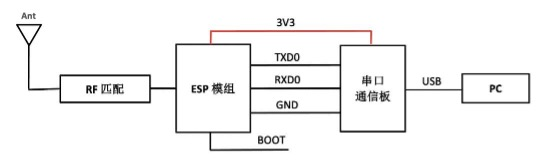

    环境搭建框图

当测试传导时，RF cable 接到 ESP RF 匹配后面，若 Π 型匹配后面同时有连接天线，则需要将天线断开。当 RF 匹配包含在模组屏蔽罩内，RF cable 应焊接到屏蔽罩外，见图 5。
当测试辐射时，RF 匹配后面直接接天线，并保证样机的天线附近无遮挡。

.. figure:: ../../_static/rf_test_tool/rf_cable_connection.jpg
    :align: center
    :scale: 90%

    模组传导测试 RF cable 接线图

表 8 所示为运行各芯片测试固件的硬件环境，与下载固件的硬件环境有细微差异（粗体标出）。

.. list-table:: 运行测试固件硬件连接
  :widths: 30 70

  * - 芯片型号
    - 连接说明
  * - | ESP8266
      | ESP8285
    - | • 3V3/CH_EN 管脚连接到 3.3 V 电源
      | • RXD/TXD/GND 管脚连接到串口模块的对应引脚上，使 PC 与设备通信
      | • MTDO (GPIO15) 管脚下拉
      | • **GPIO0 管脚悬空**
  * - | ESP32
      | ESP32-S2
      | ESP32-S3
    - | • 3V3/CH_EN 管脚连接到 3.3 V 电源
      | • RXD/TXD/GND 管脚连接到串口模块的对应引脚上，使 PC 与设备通信
      | • **GPIO0 管脚悬空**
  * - | ESP32-C3
      | ESP32-C6
      | ESP32-H2
    - | • 3V3/CH_EN 管脚连接到 3.3 V 电源
      | • RXD/TXD/GND 管脚连接到串口模块的对应引脚上，使 PC 与设备通信
      | • **GPIO9 管脚悬空**，GPIO8 管脚上拉时

运行固件
----------------

运行 Wi-Fi 定频测试固件
^^^^^^^^^^^^^^^^^^^^^^^^^^^^^^^^^^^^^

- 断开样机的 IO0，然后再拨动串口板电源开关重新上电。
- 在下载时打开的 EspRFTestTool 中点击 WiFi Test，Test Mode 选择 TX continues。
- 认证如果需要降功率，在 Attenuation(0.25dB) 里填写数值来实现，单位为 0.25 dB，如填写 20，则表示从默认最大功率降低 20x0.25=5dB，Attenuation 的默认数值是 0，表示不衰减。
- 其它选项根据实验室测试需要进行选择，选择完参数点击 start 即可定频测试，工具里会有相应的 log 显示，图 6 所示为 ESP32 的定频测试界面。

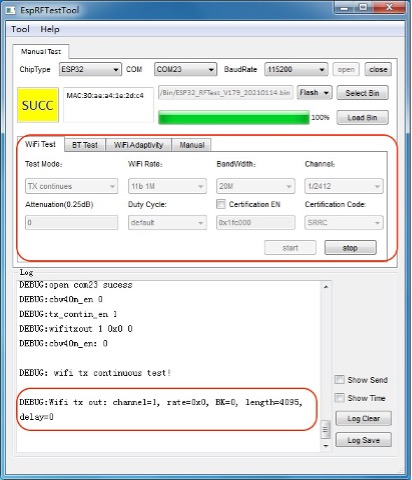

    ESP32 Wi-Fi 定频测试界面

- 如果测试接收，Test Mode 选择 RX packet，其它根据测试需要进行相应选择。ESP32 Wi-Fi 接收测试界面如图 7 所示。

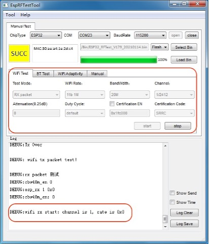

    ESP32 Wi-Fi 接收测试界面

运行蓝牙定频测试固件
^^^^^^^^^^^^^^^^^^^^^^^^^^^^^^^^^^^^^

蓝牙定频测试固件与 Wi-Fi 定频测试固件相同。

- 打开 EspRFTestTool 测试工具，选择待测试的芯片类型。ESP8266、ESP32-S2 系列芯片没有蓝牙功能，所以无需测试。ESP32-C3 系列芯片的蓝牙只支持 BLUETOOTH LE。
- 打开 BT Test 页面，配置相关参数：Power Level 一般选择 4，其它设置根据实测需要来选择，图 8 显示的为 ESP32 蓝牙定频测试界面。

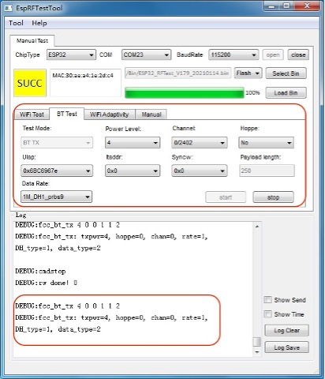

    蓝牙测试界面

Adaptivity 测试
==========================

本章介绍基于 ESP 芯片或模组的产品在 CE 认证中的 Adaptivity 测试（自适应测试）。

搭建环境
----------------

本测试的硬件环境与定频测试的相同，请参考 :ref:`环境搭建 <environment_setup>`。

运行固件
-----------------

- 下载完 bin 以后，待测样机 RF cable 线先连接到测试设备的同轴线。
- EspRFTestTool 的波特率选择 115200。
- 断开样机的 IO0，然后再拨动串口板电源开关重新上电。
- 对于工作在 Wi-Fi Station Mode 的样机，在下载时打开的 EspRFTestTool 中点击 WiFi Adaptivity，进去后点击左边的 STA，输入实验室 AP 的名称和密码，名称和密码尽量简单，点击 Connect AP，EspRFTestTool 状态栏会显示连接 log。连接成功后，将 packet num 改成 900000 以便长时间跑流，将 packet delay 改成 1，选择芯片对应的 socket ID，然后点击 Send Data 即可认证测试，图 9 为 ESP32 的自适应测试界面，图 10 为 ESP32-C3 自适应测试界面。

  * ESP32、ESP32-S2、ESP32-C3 的 socket ID：54
  * ESP8266 的 socket ID：0

- 对于工作在 Wi-Fi AP Mode 的样机，在下载时打开的 EspRFTestTool 中点击 WiFi Adaptivity，然后点击左边的 AP，输入待测样机 AP 的名称和密码、信道和模式后点击 create，然后认证实验室的 STA 会连接到刚创建的 AP。接成功后跑流设置和上述 Wi-Fi Station Mode 相同。

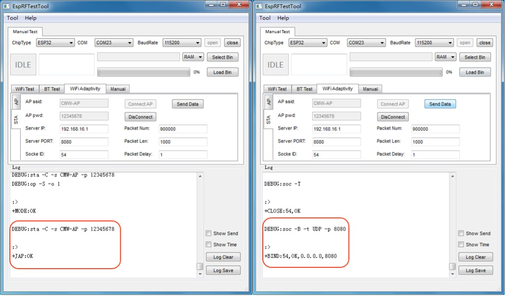

    ESP32 自适应测试界面

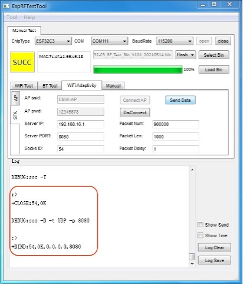

    ESP32-C3 自适应测试界面

Blocking 测试
====================

本章介绍基于 ESP 芯片或模组的产品，在 CE 认证中的 Blocking 测试（接收阻塞测试）。Blocking 测试分为两部分：Wi-Fi Blocking 测试和蓝牙 Blocking 测试，蓝牙 Blocking 测试使用 BQB 来测试。由于 ESP32-S2 和 ESP8266 系列没有蓝牙功能，所以无需蓝牙 Blocking 测试。

Wi-Fi Blocking 测试
------------------------------

搭建环境
^^^^^^^^^^^^^^^^^

本测试的硬件环境与定频测试的相同，请参考 :ref:`环境搭建 <environment_setup>`。

Blocking 通常是传导信令测试，待测样机的 RF cable 线需要连接到认证实验室的测试设备，例如 CMW500。

运行固件
^^^^^^^^^^^^^^^^

- 下载完 bin 以后，待测样机 RF cable 线先连接到测试设备的同轴线。
- 打开 EspRFTestTool 工具，选择波特率：

  * ESP32、ESP32-S2、ESP32-C3：115200
  * ESP8266：74880

- 断开样机的 IO0，然后再拨动串口板电源开关重新上电。
- 对于工作在 Wi-Fi Station Mode 的样机，在下载时打开的 EspRFTestTool 中点击 WiFi Adaptivity，进去后点击左边的 STA，输入实验室测试设备 AP 的名称和密码，名称和密码尽量简单，点击 Connect AP，EspRFTestTool 状态栏会显示连接成功 log。连接成功后测试设备即可控制 DUT 进行接收测试。
- 对于工作在 Wi-Fi AP Mode 的样机，在下载时打开的 EspRFTestTool 中点击 WiFi Adaptivity，然后点击左边的 AP，输入待测样机 AP 的名称和密码，信道和模式后点击 create，然后认证实验室的 STA 会连接到此 AP 即可测试。

蓝牙 Blocking 测试
-----------------------------

本节介绍使用 BQB 测试蓝牙 Blocking。

搭建环境
^^^^^^^^^^^^^^

蓝牙 Blocking 测试需要用到两个串口板，DUT 部分的硬件环境连接见图 11。TXD0 和 RXD0 连接 ESP 模组的 TXD0 和 RXD0 引脚，TXD1 和 RXD1 连接 ESP 模组的 IO5 和 IO18 引脚。RF cable 线接到 ESP 模组 RF 匹配后面，如果 RF 后面同时连接 PCB 天线，则需要断开 PCB 天线。

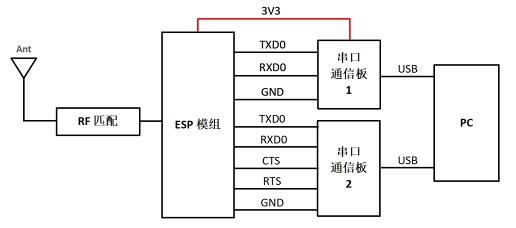

    蓝牙 Blocking 测试环境搭建

.. note::

    UART 配置说明：用户可以通过 UART0 输入命令配置 UART1 所使用的引脚，而不使用默认引脚（即 IO5、IO18、IO19、IO23）。
    例如，将 IO21、IO22、IO19 和 IO5 用于 UART1 的 TXD、RXD、RTS、CTS 引脚，则需要进行如下设置：

    - 将 IO21 连接到 USB 串口 RXD
    - 将 IO22 连接到 USB 串口 TXD
    - 将 IO19 连接到 USB 串口 CTS
    - 将 IO5 连接到 USB 串口 RTS

    上电后，通过 UART0 输入以下命令： ``bqb -z set_uart_pin -t 21 -r 22 -q 19 -c 5``

    详情可参考 BQB 文件夹下 BQB_test_tool_user_guide.pdf。

运行固件
^^^^^^^^^^^^^^

运行经典蓝牙 Blocking 测试固件
""""""""""""""""""""""""""""""""""""""""""""""

- 下载完 bin 以后，待测样机 RF cable 线先连接到测试设备的同轴线。
- ESP 的 IO0 断开。
- PC 端打开串口工具，COM 号选择 ESP 的串口板 1 对应的 COM，波特率 115200，以友善串口工具为例，如图 12 所示。
- 重新上电 ESP 模组。
- 在串口工具输入以下命令：

  .. code:: bash

    bqb -z set_ble_tx_power -i 4         //设置 Bluetooth LE TX power, i 的范围：[0~7]。

    bqb -z set_power_class -i 3 -a 4     //设置 Classic Power Class, i[Min_powe_level_index], range[0~7], a[Max_power_level_index], range[0~7]

    bqb -z set_pll_track -e 0            //关掉 PLL track 功能

    bqb -z init                          //初始化 Bluetooth controller dual mode

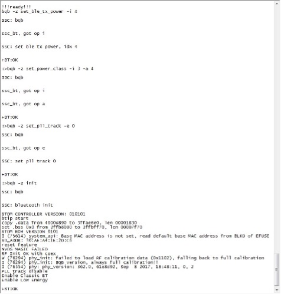

    UART0 串口设置

- 设置 UART1，在 /tools/HCI_host/config/dev0.conf 中将 UART_PORT 改为串口板 2 对应的 com 值。
- 在 /tools/HCI_host/ 打开 tinyBH.exe，在 tinyBH.exe 输入下述指令，正常 log 见图 13。

  .. code:: bash

    hci reset                 //初始化所有的蓝牙 controller
    hci set_evt_mask          //设置 legacy event mask
    hci set_name ESPRESSIF    //设置待测物的名称
    hci dut                   //使蓝牙进入 Under test mode
    hci ipscan                //使蓝牙进入 scan 状态

- 这时可以搜到蓝牙 ESPRESSIF，连上信令测试仪器进行经典蓝牙 Blocking 测试。

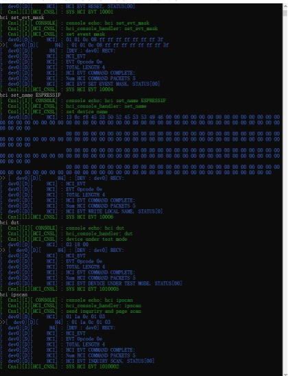

    UART1 运行 log

运行 Bluetooth LE Blocking 测试固件
""""""""""""""""""""""""""""""""""""""""""""""""

LE Blocking 测试可以参考经典蓝牙部分，测试中只需要经典蓝牙测试步骤的前 5 步，然后将串口板 2 的 USB 线连接到测试设备，例如 CMW500，将测试设备 CMW500 设置成 LE 模式，连接成功即可信令测试。

常见问题
==============

如何将认证测试的功率参数更新到应用固件？
----------------------------------------------------------------------

  请参考 ESP32-Series_PowerLimitTool 使用说明。

定频测试辐射二次、三次、四次谐波超标。
----------------------------------------------------------------------

  - 对于基于 ESP 芯片的设计，则排查 RF layout，匹配和 PA 供电部分，通过调整 RF 匹配，PA 电源线滤波网络来抑制谐波。
  - 对于基于 ESP 模组的产品，则模组下面放置底板，底板通常是产品的 PCB 板。
  - 在定频测试工具的 attenuation 里输入数值来降低功率。

PSD 和功率超标。
---------------------------

  - 确认 RF 匹配是否调试正确。
  - 在定频测试工具的 attenuation 里输入数值来降低功率。

自适应测试不过。
------------------------------------

  - 确认测试方法是否正确，按照前面第三章 Adaptivity 进行设置，此时频谱仪应看到正常的流量。
  - 重复测试，排查实验室环境稳定性。

1 GHz 以下辐射杂散超标。
------------------------------------------

  - 排查外设通信，UART、SPI、IIC 等。
  - 排查串口板和 UART 线，USB 线。

蓝牙 Blocking 测试 UART1 log 异常。
-----------------------------------------------------------

  - 检查硬件连接是否异常。
  - 交换 UART1 的 TX 和 RX。
