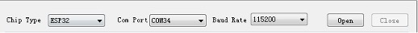
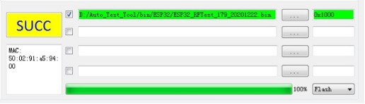
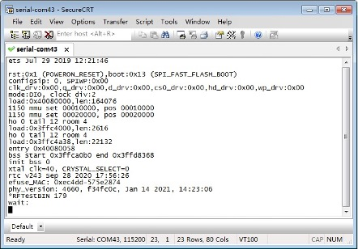

DownloadTool 使用说明
**********************************

:link_to_translation:`en:[English]`

DownloadTool 简介
==============================

界面介绍
----------------

乐鑫 DownloadTool 的主界面如图 1 所示，用户可在本界面进行下载操作。具体操作方法请见第 3 章。

.. figure:: ../../_static/rf_test_tool/downloadtool_interface.png
    :align: center
    :scale: 100%
    :alt: DownloadTool Interface

    DownloadTool 界面

功能介绍
------------------

DownloadTool 界面分为六个部分，分别是串口配置 (Serial Port Configuration)、下载路径配置 (Download Path Configuration)、下载状态 (Download Status)、下载控制 (Download Control)、Log 打印 (Log Information) 以及 Log 管理 (Log Management)。

.. list-table:: DownloadTool 功能介绍
    :header-rows: 1
    :widths: 40 60
    :align: left

    * - 工具组成
      - 功能介绍
    * - 串口配置
      - 选项包括芯片类型、串口号、波特率、串口开关。
    * - 下载路径配置
      - 选择需要下载的固件，以及下载地址（16 进制格式填写）。
    * - 下载状态
      - 下载状态共包括 “SYNC”、“LOAD”、“SUCC”、“FAIL” 四种状态。
    * - 下载控制
      - 下载控制分为 “Start Load”、“Stop Load” 和 “Erase”
    * - Log 打印
      - 所有的操作信息都会在此处打印。
    * - Log 管理
      - 用户可以对 Log 进行保存和清除。

下载模式
=================

硬件连接
---------------

将待测设备与串口模块连接，使设备进入下载模式，请参考表 2 进行硬件连接与配置。

.. list-table:: 硬件连接与配置
  :widths: 30 70

  * - 芯片型号
    - 连接说明
  * - | ESP8266
      | ESP8285
    - | • 3V3/CH_EN 管脚连接到 3.3 V 电源
      | • RXD/TXD/GND 管脚连接到串口模块的对应引脚上，使 PC 与设备通信
      | • MTDO (GPIO15) 管脚下拉
      | • GPIO0 管脚下拉时，设备进入下载模式
  * - | ESP32
      | ESP32-S2
      | ESP32-S3
    - | • 3V3/CH_EN 管脚连接到 3.3 V 电源
      | • RXD/TXD/GND 管脚连接到串口模块的对应引脚上，使 PC 与设备通信
      | • GPIO0 管脚下拉时，设备进入下载模式
  * - ESP32-C3
    - | • 3V3/CH_EN 管脚连接到 3.3 V 电源
      | • RXD/TXD/GND 管脚连接到串口模块的对应引脚上，使 PC 与设备通信
      | • GPIO9 管脚下拉，GPIO8 管脚上拉时，设备进入下载模式

串口打印
---------------

用户可以通过串口打印来检查设备是否进入正确的下载模式。打开串口工具和对应的串口，按照表 2 中将设备与串口模块进行连接，重新上电后串口工具会显示一串打印日志，请参考表 3，若打印一致，即表示设备已处于下载模式。

.. list-table:: 下载模式的串口打印
    :header-rows: 1
    :widths: 20 20 60
    :align: left

    * - 芯片型号
      - 波特率
      - 串口打印
    * - ESP8266
      - 74880
      - ets Jan  8 2013,rst cause:1, boot mode1,0)
    * - ESP8285
      - 74880
      - ets Jan  8 2013,rst cause:1, boot mode1,2)
    * - ESP32
      - 115200
      - rst:0x1(POWERON_RESET),boot:0x3(DOWNLOAD_BOOT(UART0/U ART1/SDIO_REI_REO_V2)) waiting for download
    * - ESP32-S2
      - 115200
      - rst:0x1 (POWERON),boot:0x0 (DOWNLOAD(USB/UART0/1/SPI)) waiting for download
    * - ESP32-C3
      - 115200
      - rst:0x1 (POWERON),boot:0x4 (DOWNLOAD(USB/UART0/1)) waiting for download
    * - ESP32-S3
      - 115200
      - rst:0x1 (POWERON),boot:0x0 (DOWNLOAD(USB/UART0/1/SPI)) waiting for download

下载说明
===============

串口配置
---------------

    串口配置

- Chip Type：ESP32（以实际使用的芯片型号为准）
- Com Port：选择对应的串口
- Baud Rate：波特率，默认选择 115200
- Open：打开串口
- Close：关闭串口

下载路径配置
---------------------

    下载路径配置

- 下载到 “RAM” 或 “Flash”：
  点击``RAM``，选择下载固件到 “RAM” 或 “Flash”。两者的区别是，若下载到 Flash，一般只需下载一次，下载完成后将 GPIO0 悬空，并将设备重新上电，即可进入正常工作模式。若下载到 RAM，下载完成后可以直接运行，但是设备掉电后 RAM 中的程序会消失，需要重新下载。

- 选取待下载固件：
  点击``...``，在本地选取需要下载的固件，并在左侧方框中进行勾选，勾选表示下载。该行不勾选表示不下载。

- 固件下载地址：
  在右侧白色框中输入下载地址（16 进制格式），需要注意的是，下载到 RAM 不需要填写地址，界面中也无法输入。表 4 列出了各芯片射频固件的下载地址。

.. list-table:: ESP 芯片对应下载地址
    :header-rows: 1
    :widths: 40 60
    :align: left

    * - 芯片型号
      - 射频固件下载地址
    * - ESP32/ESP32-S2
      - 0x1000
    * - ESP8266/ESP8285/ESP32-C3/ESP32-S3
      - 0x0

下载状态
--------------

- SYNC：同步中
- Load：下载中
- SUCC：下载成功
- Fail：下载失败

固件下载
---------------

- Start Load：点击 Start load，开始下载。当绿色进度条到 100%，并且状态栏显示 “SUCC” 字样即表示下载成功。
- Stop Load：停止下载。
- Erase：擦除 Flash 中的固件。

串口打印
----------------
下载完成后，将 GPIO0 管脚悬空并重新上电，使设备进入正常工作模式，此时便可开始测试。用户也可以通过串口工具来检查固件是否烧录成功，以 ESP32 为例，图 3-1 是 ESP32 下载射频测试固件后的串口打印。

    ESP32 射频测试固件串口打印

常见问题
=================

串口问题
--------------

1. **打开工具后，在 “Com Port” 下拉菜单中找不到对应串口？**

   - 首先查看设备管理器，确认串口已经安装成功。若没有成功，检查驱动是否有问题。

2. **串口无法打开？**

   - 检查是否被 “EspRFTestTool” 占用，请先将 “DownloadTool” 界面关闭，回到 “EspRFTestTool” 界面关闭串口后再次尝试。也可能是被其他线程占用。

下载问题
--------------

1. **设备不能进入下载模式？**

   - 参考 2.1 章节检查硬件连接是否正确。若待下载设备为整机，需确保 TXD/RXD 未被产品上的其他主机占用。

2. **界面显示已经下载成功，还是无法正常测试。**

   - 请检查“Chip Type”与待下载设备的芯片是否一致。另外，ESP8266 和 ESP8285 的射频测试固件有两个，一个是 26 M 晶振对应的固件，另一个是 40 M 晶振对应的固件，下载时请注意区分。
