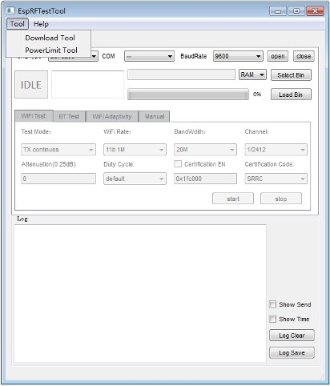
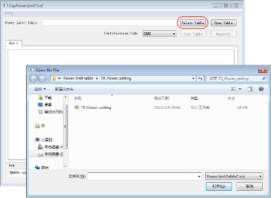
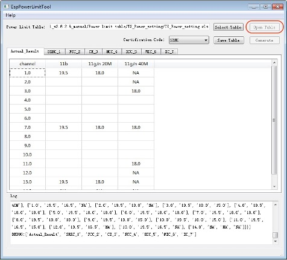
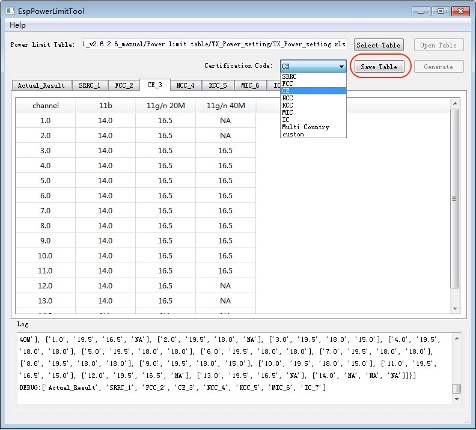
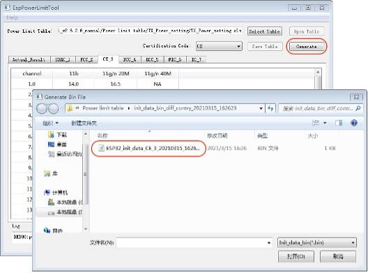
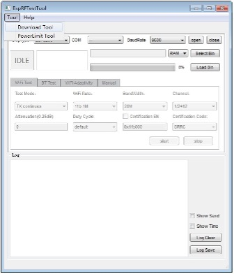
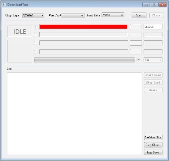
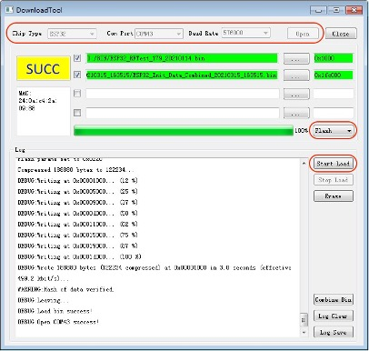
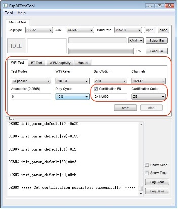

ESP32 系列芯片 PowerLimitTool 使用说明
***********************************************************

:link_to_translation:`en:[English]`

PowerLimitTool 简介
========================

工具界面
----------------

从 EspRFTestTool 主界面菜单栏 Tool 中选择 PowerLimitTool，进入 PowerLimitTool 工具，如图 1-1 所示。

    EspRFTestTool 主界面

PowerLimitTool 工具可配置生成包括 SRRC、CE、FCC 等单个或多国认证所需的 Phy Init Bin 文件，如图 1-2 所示。

.. figure:: ../../_static/rf_test_tool/powerlimittool_main_interface.jpg
    :align: center
    :scale: 120%

    PowerLimitTool 主界面

功率表配置
---------------

点击 Select Table，双击选择文件夹下的 TX_Power_setting.xlsx 文件，导入功率表，如图 1-3。

    导入 TX_Power_Setting

点击 Open Table，主界面显示 Actual_Result 及七国或地区认证的信道功率列表，如图 1-4。

    TX_Power_Setting 列表

功率表说明
^^^^^^^^^^^^^^^^^^^^^^^

- Actual_Result： 产品的实测功率，代表产品本身性能，参考附录 A。
- SRRC_1：中国大陆认证，主要关注 PSD 等功率限制。
- FCC_2：美国认证，主要关注谐波、带外发射杂散限制。
- CE_3：欧盟认证，主要关注 PSD、RE 及接收杂散限制。
- NCC_4：台湾认证，主要关注 RE 及接收杂散限制。
- KCC_5：韩国认证，主要关注接收杂散限制。
- MIC_6：日本认证，主要关注特定频段杂散、PSD 限制。
- IC_7：加拿大认证，主要关注谐波、带外发射杂散限制。

写入功率值
^^^^^^^^^^^^^^^^^^

Actual_Result：建议测试 11b、g、n20、n40 最低速率全信道平均功率，并填入表中。如果信道间功率接近，可以仅测试对应速率的高中低 3 个信道，其他信道功率值会使用三个信道的平均值用于后续计算。

各认证功率表：

认证会测试各模式下高中低三个信道满足认证所需的最大功率值，记录此时对应的衰减值。最终认证填写的实际功率值是由 Actual_Result 减去对应信道的衰减值。

.. note::

   - 认证仅测试高中低三个信道，但认证功率表需填写所有规定信道。 在认证功率表中计算信道所需功率时，高低信道分别按认证报告中高低信道的衰减值计算，而其它信道均按认证报告中的中间信道衰减值计算。
   - 认证一般采用 Tx Continue 模式测试，但测试模组的实际功率 (Actual_Result) 时需使用 Tx Packet 测试。
   - 认证记录的衰减值以 1/4 dB 为单位，计算时需转换为 dB 单位，如认证衰减 4，代表衰减 1dB，以此类推。

生成 Phy Init Bin 文件
-----------------------------------

填写认证功率值后点击 Save Table 保存功率配置，在 Certification Code 下拉项中选择需要的认证，如图 1-5 所示，然后点击 Generate 即在指定文件夹中生成对应的 Phy Init Bin 文件，如图 1-6 所示。

Phy Init bin 文件包含了满足当前认证所有信道的功率值，可用于 RF 测试和实际应用，详见下文。

.. note::

   下拉选项 Certification Code 中包含单个认证和 Multiple Country 及 Custom。 选择单认证会生成对应认证的单独 Phy Init Bin 文件，文件包含除校验控制信息外共 128 字节; 选择 Multiple Country 会生成包含 Default 和 SRRC、FCC、CE、NCC、KCC、MIC、IC 七国认证的 Combined Phy Init Bin 文件，包含了 8*128 字节；选择 Custom，根据自定义选择生成单个或多国认证 Phy Init Bin 文件。

    选择需要的认证

    生成所需认证的 Phy Init Bin 文件

实例演示
-------------

单国认证：以 CE 为例
^^^^^^^^^^^^^^^^^^^^^^^^^^^^^^

填写 Actual_Result
""""""""""""""""""""""""""""

使用 Tx Packet 实测模组的平均输出功率，有关如何进行 RF 非信令测试请参考章节 2.2。

本例因信道间功率接近，只测试了低、中、高 3 个信道：

- 11b 测试 1 Mbps 速率，低、中、高信道分别为 19.5 dBm、19.2 dBm、19 dBm；
- 11g/11n-20M 分别测试 6 Mbps 和 MCS0 速率，填写其中功率最高的三个信道，分别为 17.5 dBm、17.3 dBm、17dBm；
- 11n-40M 测试 MCS0 速率，三个信道功率分别为 17.2 dBm、17 dBm、16.8 dBm，如图 1-7 所示。

.. figure:: ../../_static/rf_test_tool/fill_in_test_power.jpg
    :align: center
    :scale: 120%

    填写实测功率值

计算衰减值
""""""""""""""""""""""

通过认证测试报告或实验室验证后，确认模组能满足 CE 认证所需的最大功率，并记录对应衰减值，如下表中 Attenuation 一栏，并将其转换成实际功率后记录在对应速率和信道中。 由于认证一般只选择测试低中高 3 个信道，因此除首末信道使用实测衰减值外，其余信道均使用中间信道衰减值。本例中满足认证的信道功率衰减值设置如下：

11b 中功率最高的为 1 Mbps 速率，11g 中功率最高的为 6 Mbps 速率，11n-20M 中功率最高的为 MCS0 速率，11n-40M 中功率最高的为 MCS0 速率。 其中 11g 和 11n-20M 取高者作为信道功率值，如表 1-1。

.. flat-table:: 实测功率与 CE 认证功率计算
    :header-rows: 1
    :stub-columns: 5

    * - Mode
      - Data Rate
      - Channel
      - Attenuation
      - Attenuation * 0.25 (dB)
      - Actual_Result (dBm)
      - Power Table (dBm)

    * - :rspan:`2` 802.11b
      - :rspan:`2` 1 Mbps
      - 2412
      - 12
      - 3
      - 19.5
      - 16.5

    * - 2437
      - 12
      - 3
      - 19.2
      - 16.2

    * - 2472
      - 10
      - 2.5
      - 19
      - 16.5

    * - :rspan:`2` 802.11b
      - :rspan:`2` 11 Mbps
      - 2412
      - 10
      - 2.5
      - --
      - --

    * - 2437
      - 10
      - 2.5
      - --
      - --

    * - 2472
      - 10
      - 2.5
      - --
      - --

    * - :rspan:`2` 802.11g
      - :rspan:`2` 6 Mbps
      - 2412
      - 8
      - 2
      - 17.5
      - 15.5

    * - 2437
      - 8
      - 2
      - 17.3
      - 15.3

    * - 2472
      - 6
      - 1.5
      - --
      - --

    * - :rspan:`2` 802.11g
      - :rspan:`2` 54 Mbps
      - 2412
      - 0
      - 0
      - --
      - --

    * - 2437
      - 0
      - 0
      - --
      - --

    * - 2472
      - 0
      - 0
      - --
      - --

    * - :rspan:`2` 802.11n-HT20
      - :rspan:`2` MCS0
      - 2412
      - 8
      - 2
      - --
      - --

    * - 2437
      - 6
      - 1.5
      - --
      - --

    * - 2472
      - 8
      - 2
      - 17
      - 15

    * - :rspan:`2` 802.11n-HT20
      - :rspan:`2` MCS7
      - 2412
      - 0
      - 0
      - --
      - --

    * - 2437
      - 0
      - 0
      - --
      - --

    * - 2472
      - 0
      - 0
      - --
      - --

    * - :rspan:`2` 802.11n-HT40
      - :rspan:`2` MCS0
      - 2422
      - 16
      - 4
      - 17.2
      - 13.2

    * - 2437
      - 16
      - 4
      - 17
      - 13

    * - 2462
      - 16
      - 4
      - 16.8
      - 12.8

    * - :rspan:`2` 802.11b
      - :rspan:`2` 1 Mbps
      - 2412
      - 12
      - 3
      - 19.5
      - 16.5

    * - 2437
      - 12
      - 3
      - 19.2
      - 16.2

    * - 2472
      - 10
      - 2.5
      - 19
      - 16.5

    * - :rspan:`2` 802.11n-HT40
      - :rspan:`2` MCS7
      - 2422
      - 0
      - 0
      - --
      - --

    * - 2437
      - 0
      - 0
      - --
      - --

    * - 2462
      - 0
      - 0
      - --
      - --

填写 CE 功率表
""""""""""""""""""""""""

Power Table 中要填写的功率值=实测功率-衰减值

- 计算 11b CE 功率值，低、中、高信道分别为 16.5 dBm、16.2 dBm、16.5 dBm；
- 计算 11g/n20 信道功率，选择 6 Mbps 和 MCS0 两者中衰减值高者用于计算，三个信道分别为 15.5 dBm、 15.3 dBm、15 dBm；
- 计算 11n40M 三个信道分别为 13.2 dBm、13 dBm、12.8 dBm。

将功率值填入 CE 栏中，非首末信道均填写中间信道的功率值，如图 1-8。

.. figure:: ../../_static/rf_test_tool/fill_in_ce_power.jpg
    :align: center
    :scale: 120%

    填写 CE 认证功率值

生成 CE Phy Init Bin
""""""""""""""""""""""""""""""""

在 Certification 下拉选项中选择 CE，点击 Save Table 保存所有修改，如图 1-9。

.. figure:: ../../_static/rf_test_tool/select_ce_save_config.jpg
    :align: center
    :scale: 120%

    选择 CE 并保存设置

点击 Generate 即可生成带有 CRC 校验的 CE phy init bin 文件，如图 1-10。

.. figure:: ../../_static/rf_test_tool/generate_ce_phy_init_bin.jpg
    :align: center
    :scale: 120%

    生成 CE Phy Init Bin 文件

多国认证：Multiple Country
^^^^^^^^^^^^^^^^^^^^^^^^^^^^^^^^^^^^^^^

Actual_Result 和各认证所需功率测试过程与前述单认证 CE 相似，经计算后写入功率表。 在 Certification Code 下拉选项中选择 Multi Country，点击 Save Table 保存所有修改，如图 1-11。

.. figure:: ../../_static/rf_test_tool/select_multi_country_save_config.jpg
    :align: center
    :scale: 120%

    选择 Multiple Country 并保存设置

点击 Generate 生成 Combined 文件，如图 1-12。

.. figure:: ../../_static/rf_test_tool/generate_combined_phy_init_bin.jpg
    :align: center
    :scale: 120%

    生成 Combined Phy Init Bin 文件

Download and RF Test
===========================

下载 Phy Init Bin 文件
--------------------------------

从 Tool 选项栏中选择 DownloadTool，进入 DownloadTool 界面，如图 2-1 和图 2-2。

    ESPRFTestTool 主界面

    DownloadTool 主界面

下载步骤，如图 2-3 所示：

- 选择对应的 ChipType、Com、BaudRate、点击 Open 打开串口；
- Boot 接低电平使模组进入下载模式；
- 选择烧录至 Flash；
- 选择 Phy Init 固件并填写对应地址：0x1fc000；
- 选择 RF 测试固件并配置对应地址：0x1000；
- 点击 Start Load 开始下载，烧录完成后显示 SUCC 字样；
- 点击 Close 关闭串口，关闭 DownloadTool 工具界面。

    烧录 Phy Init Bin 文件

.. note::

   - ESP32/S2 Boot 键为 GPIO0，ESP32-C3 Boot 键为 GPIO9。
   - DownloadTool 工具默认烧录到 RAM，如需填写烧录地址，需先选择至 Flash。
   - Phy Init Bin 烧录地址可改动，后续用于 RF 测试时需做相应调整即可。
   - 对于 Multiple Country Phy Init Bin 与单认证烧录地址一样，建议均选择 0x1fc000 地址。

RF Test with Phy Init Bin
-------------------------------

使用 Wi-Fi 仪器测试输出功率，RF Test 可以用于确认 Phy Init 是否生效。
测试步骤（如图 2-4 所示）：

- 选择 Manual Test 界面，选择对应的 ChipType、Com、BaudRate、点击 Open 打开串口；
- 选择 WiFi Test 界面，选择 Test Mode、Rate、BandWidth、Channel；
- 设置 Attenuation 默认值 0，选择 Duty Cycle 为 10%；
- 不勾选 Certification EN 代表不使能 Phy init，此时 start 发包测试代表模组的初始性能。
- 勾选 Certification EN 代表使能 Phy init，此时 start 发包测试代表模组的认证功率性能。
- 输入地址为 Phy Init Bin 的烧录地址，如烧录地址变动，此处需做相应改变。
- 对于 Multiple Country，在 Certification Code 中可选择其所包含的认证。

    RF Test 设置界面

.. note::

    Phy Init Bin 文件同样适用于产品应用固件。

附录 A. ESP32 系列平均输出功率典型值
================================================================

ESP32-Series 平均输出功率典型值见下表。

.. list-table::
    :header-rows: 1
    :widths: 20 20 20 40
    :align: center

    * - Rates
      - ESP32 (dBm)
      - ESP32-S2 (dBm)
      - ESP32-C3 (dBm)
    * - 11b 1 Mbps
      - 19.5
      - 19.5
      - 20.5
    * - 11b 11 Mbps
      - 19.5
      - 19.5
      - 20.5
    * - 11g 6 Mbps
      - 18
      - 18
      - 20
    * - 11g 54 Mbps
      - 14
      - 15
      - 18
    * - 11n-20 MCS0
      - 18
      - 18
      - 19
    * - 11n-20 MCS7
      - 13
      - 13.5
      - 17.5
    * - 11n-40 MCS0
      - 18
      - 18
      - 18.5
    * - 11n-40 MCS7
      - 13
      - 13.5
      - 17
