ESP 射频测试指南
******************************

:link_to_translation:`en:[English]`

测试环境示意图
========================

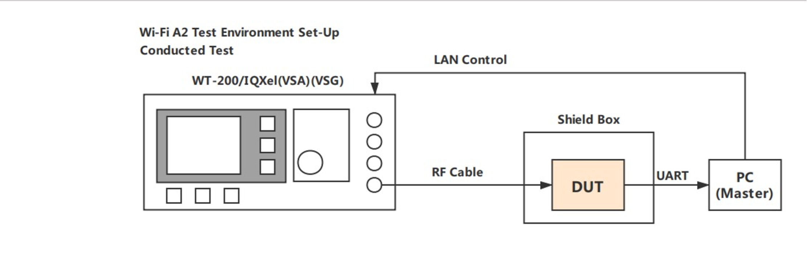

    搭建环境示意图

- 待测设备为基于 ESP32/ESP8266/ESP32-C3 等相关硬件设计产品。
- 测试时，PC 端运行 EspRFTestTool 测试工具，PC 与待测设备通过 UART 进行通讯交互，并实现各种测试模式的配置。
- 测试仪器为 WT-200/IQXel 等综测仪，用于测试待测设备在不同模式下的射频性能。

测试准备
=============

硬件连接说明
---------------------

.. list-table:: 硬件连接说明
  :widths: 30 70

  * - 芯片型号
    - 连接说明
  * - | ESP8266
      | ESP8285
    - | • 3V3/CH_EN 管脚连接到 3.3 V 电源
      | • RXD/TXD/GND 管脚连接到串口模块的对应引脚上，使 PC 与设备通信
      | • MTDO (GPIO15) 管脚下拉
      | • GPIO0 管脚下拉时，设备进入下载模式
  * - | ESP32
      | ESP32-S2
      | ESP32-S3
    - | • 3V3/CH_EN 管脚连接到 3.3 V 电源
      | • RXD/TXD/GND 管脚连接到串口模块的对应引脚上，使 PC 与设备通信
      | • GPIO0 管脚下拉时，设备进入下载模式
  * - | ESP32-C3
      | ESP32-C6
      | ESP32-H2
    - | • 3V3/CH_EN 管脚连接到 3.3 V 电源
      | • RXD/TXD/GND 管脚连接到串口模块的对应引脚上，使 PC 与设备通信
      | • GPIO9 管脚下拉，GPIO8 管脚上拉时，设备进入下载模式
  * - ESP-DevKitC 系列
    - • 开发板具备自动下载功能，测试时只需将 USB 串口连接至 PC 端即可

传导测试硬件连接说明
----------------------------------------

对于带 I-PEX 端子的模组，做传导测试时，可以将射频 Cable 线连接到 I-PEX 端子上（0 欧姆选切电阻切入 I-PEX 端即可）。

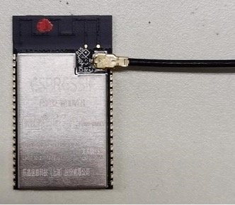

    PCB 板载天线选切传导测试示意图

对于单 PCB 板载天线模组，做传导测试时，需要割断后端的 PCB 天线，再焊接射频 Cable，以确保测试数据的准确性。

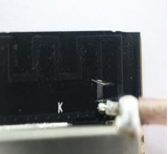

    PCB 板载天线改传导测试示意图

其他硬件准备
---------------------

.. list-table:: 其他硬件准备
  :widths: 20 40 10 30

  * - 名称
    - 图片
    - 数量
    - 简介
  * - ESP32/ESP8266 系列模组
    - 客户/ESP 自研产品
    - 按测试要求
    - 客户基于 ESP32/ESP8266 系列开发的相关产品
  * - 串口测试底板
    - .. figure:: ../../_static/rf_test_tool/serial_test_base_board.jpg
    - 1
    - 功能是 USB 转串口，PC 工具最终通过测试底板上的串口与待测设备进行通讯
  * - Micro USB 数据线
    - .. figure:: ../../_static/rf_test_tool/usb_cable.jpg
    - 1
    - 用于连接串口测试底板和 PC
  * - PC
    - --
    - 1
    - 用于运行相关的软件
  * - Wi-Fi 综测仪
    - --
    - 1
    - 用于测试 Wi-Fi 性能参数，如：WT200/IQXel 等

软件准备
---------------

.. list-table::
    :header-rows: 1
    :widths: 40 60
    :align: left

    * - 名称
      - 简介
    * - CP210x_Windows_Drivers
      - USB 转 UART 串口驱动
    * - EspRFTestTool 测试工具
      - 该工具集成了烧录测试固件和运行测试项的相关测试命令配置

测试工具使用简介
============================

EspRFTestTool 界面
----------------------------

EspRFTestTool 界面主要分为五部分，分别是功能区栏 (Menu)、串口配置栏 (Serial Port Configuration)、下载栏 (Download Configuration)、测试配置栏 (Test Configuration) 以及日志打印栏 (Log Information)，如图 3-1 所示。

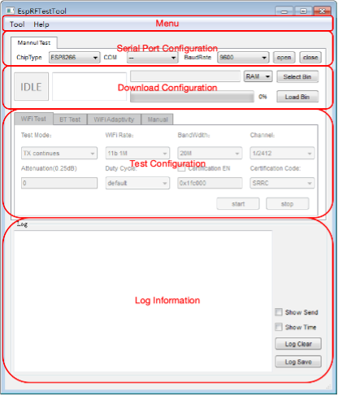

    EspRFTestTool 主界面

EspRFTestTool 功能介绍
--------------------------------

功能区栏 (Menu)
^^^^^^^^^^^^^^^^^^^^^^^^^

功能区栏包括 Tool 和 Help，其中 Tool 包含 DownloadTool 和 PowerLimitTool。

- DownloadTool：主要用于待测设备测试固件的下载，详情请参考《DownloadTool 使用说明》。
- PowerLimitTool：可配置生成包括 SRRC 等单个或多国主流认证所需的 Phy Init Bin 文件，详情请参考《ESP32-Series PowerLimitTool 使用说明》。

Help 包含 Tool Help、RF Test Help、RF Certification Help。

- Tool Help：各工具的使用说明文档。
- RF Test Help：射频测试说明文档。
- RF Certification Help：认证测试相关说明文档。

串口配置栏 (Serial Port Configuration)
^^^^^^^^^^^^^^^^^^^^^^^^^^^^^^^^^^^^^^^^^^^^^^^^^^^^^^^^^^^^

包括芯片类型、串口号、波特率、打开和关闭串口。测试时，默认波特率配置为 115200。

下载栏 (Download Configuration)
^^^^^^^^^^^^^^^^^^^^^^^^^^^^^^^^^^^^^^^^^

主要用于测试固件的下载，详细说明请参考章节 4.1。

测试配置栏 (Test Configuration)
^^^^^^^^^^^^^^^^^^^^^^^^^^^^^^^^^^^^^^^^^^^^^

包括 Wi-Fi Test 、BT Test、Wi-Fi Adaptivity 以及手动输入测试命令 (Manual) 四个界面。

- Wi-Fi Test：主要用于 Wi-Fi 收发包测试，详细说明请参考章节 4.2。
- BT Test：主要用于 BT 收发包测试，详细说明请参考章节 4.3。
- Wi-Fi Adaptivity：主要用于自适应认证测试，详细说明请参考《CE 认证说明》中的章节 3.2。
- Manual：手动命令测试。

日志打印栏 (Log Information)
^^^^^^^^^^^^^^^^^^^^^^^^^^^^^^^^^^^^^^^^^^

所有的操作信息都会在此处打印。 用户可以具体查看模组信息及对日志进行保存和清除操作。

射频测试
================

下载说明
-----------------

EspRFTestTool 的下载界面如图 4-1 所示。

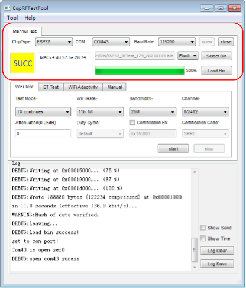

    下载配置设置

打开 EspRFTestTool
^^^^^^^^^^^^^^^^^^^^^^^^^^^

- ChipType：选择对应的 ESP 芯片名称，如：ESP32/ESP8266 等。
- COM：选择使用的串口。
- BaudRate：选择使用的波特率，下载固件时，用户可自行配置波特率。
- 串口开关：点击 open、close 按钮，可进行切换。

固件下载设置
^^^^^^^^^^^^^^^^^^^^^^^

- 下载到 “RAM” 或 “Flash”
   点击 ``RAM`` 按钮，选择下载固件到 “RAM” 或 “Flash”。两者的区别是，若下载到 Flash，一般只需下载一次，下载完成后将 GPIO0 悬空，并将设备重新上电，即可进入正常工作模式。 若下载到 RAM，下载完成后可以直接运行，但是设备掉电后 RAM 中的程序会消失，需要重新下载。

- 选取待下载固件
   点击 ``Select Bin`` 按钮，在本地选取需要下载的固件，选择后会在固件显示栏显示当前选择的固件路径及名称。需要注意的是不同的芯片所对应的测试固件也不同。

下载状态
^^^^^^^^^^^^^^^^^

- SYNC：同步中
- Load：下载中
- SUCC：下载成功
- Fail：下载失败

固件下载
^^^^^^^^^^^^^^^^^

Load Bin：点击 Load Bin 按钮，开始下载固件。 当绿色进程条显示 100%，并且状态栏显示 “SUCC” 字样即表示下载成功。

串口打印
^^^^^^^^^^^^^^

下载完成后，将 GPIO0 管脚悬空并重新上电，使设备进入正常工作模式，此时便可开始测试。用户也可以通过串口工具来检查固件是否烧录成功，以 ESP32 为例，图 4-2 是 ESP32 下载射频测试固件后的串口打印。

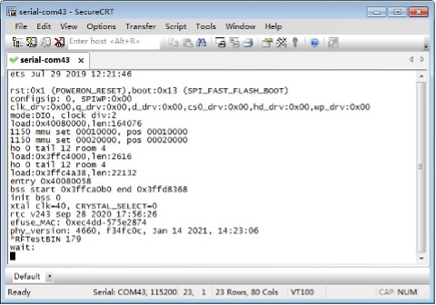

    ESP32 射频测试固件串口打印

Wi-Fi 性能测试
------------------------

EspRFTestTool 的 Wi-Fi Test 测试界面，如图 4-3 所示。

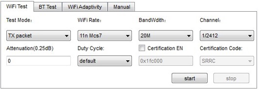

    Wi-Fi Test Mode 界面

Wi-Fi Test
^^^^^^^^^^^^^^^^^^^^

Test Mode 包括：

- TX continues：连续发包，主要用于认证测试。
- TX packet：非连续发包，主要用于发射性能测试。
- RX packet：收包，主要用于接收性能测试。
- TX tone：单载波信号。

Wi-Fi Rate 包括：射频测试 b/g/n 收发包速率。

BandWidth 包括：

- 11n HT20，20 M 信号带宽。
- 11n HT40，40 M 信号带宽（仅 ESP32 系列支持）。

Channel：为收发信道。

Attenuation (0.25dB)：

- 表示发射功率衰减值。
- 认证中如果需要降功率，可在 Attenuation(0.25dB) 里填写数值来实现。 默认数值是 0，表示不衰减。填 4 表示衰减 1 dB, 6 表示衰减 1.5 dB, 10 表示衰减 2.5 dB, 以此类推。

Duty Cycle：表示发包占空比，支持 10%、50%、90% 以及 default 四种配置。

Certification EN 和 Certification Code：用于验证 power limit table 是否生效，详细说明请参考《ESP32-Series PowerLimitTool 使用说明》。

根据测试要求选择测试条件，点击 start 开始发包/收包；点击 stop 停止发包/收包。 Wi-Fi 收发包打印日志如图 4-4 所示；左为 Wi-Fi TX（发包）的打印日志界面，右为 Wi-Fi RX（收包）的打印界面。

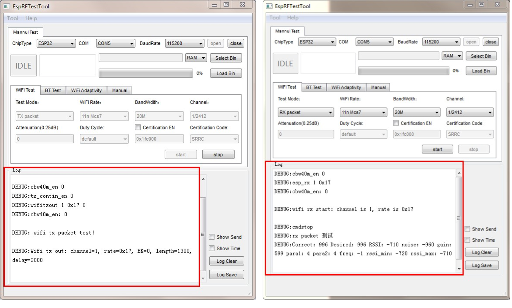

    Wi-Fi 收发包打印日志界面

Wi-Fi 发包 Log 解读：

- cbw40m_en 0：“0”表示信道带宽为 20 M，“1”表示信道带宽为 40 M。
- wifitxout 1 0x17 0：“1”表示信道为 1，“0x17”表示测试速率为 Mcs7。
- Wifi tx out：channel=1, rate=0x17, BK=0, length=1300, delay=2000：表示 Wi-Fi 发包成功。

Wi-Fi 收包 Log 解读：仪器收包结束，点击“stop”按钮，返回收包“Log”信息为

- Correct：996 表示收到的包总数。
- Desired：996 表示收到配置项中指定速率的包总数。
- RSSI：-710 表示接收信号强度，代表接收信号强度为 -71 dBm。
- 其他打印信息为研发 Debug 参数。

每次收发包如需调整测试需求都要点击 stop 停止收发指令，调整完成点击 start 开始收发包测试。

BT 性能测试
-------------------

BT Test 测试界面如图 4-5 所示。蓝牙的测试固件和 Wi-Fi 相同，只需要在测试工具里点击 BT Test 即可。

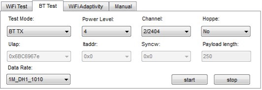

    BT Test Mode 界面

BT Test
^^^^^^^^^^^

Test Mode 包括：

- BT TX：用于经典蓝牙发射测试。
- BT RX：用于经典蓝牙接收测试。
- Bluetooth LE TX：用于低功耗蓝牙发射测试。
- Bluetooth LE RX：用于低功耗蓝牙接收测试。
- TX tone：单载波信号。

Power Level：为发包功率等级。

Channel：为收发信道。

Data Rate：

- 为收发包速率。
- 其他配置可保留默认配置，根据实际测试要求选择测试条件，点击 start 开始发包；点击 stop 停止发包。 如图 4-6 所示，左为 BT TX（发包）的打印日志界面，右为 BT RX（收包）的打印日志界面。如图 4-7 所示，左为 Bluetooth LE TX（发包）的打印界面，右为 Bluetooth LE RX（收包）的打印界面。如图 4-8 所示，TX tone 发包的打印日志。

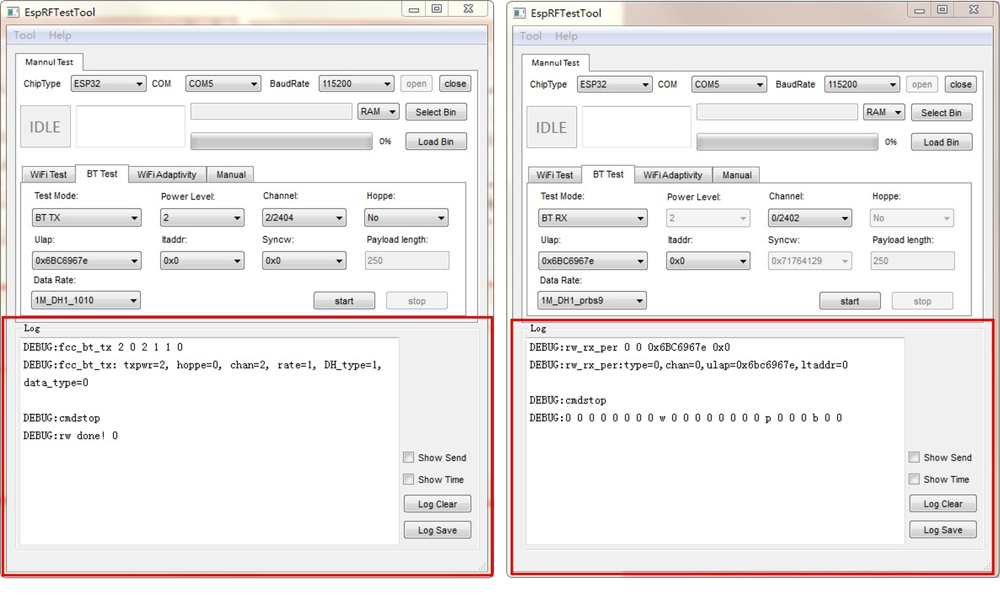

    BT 收发包打印日志界面

BT 发包 Log 解读：

- fcc_bt_tx 2 0 2 1 1 0：BT 发包测试开始。
- txpwr=2：测试发包功率等级。
- hoppe=0：不支持跳频。
- chan=2：收发包信道为 2。
- rate=1：测试速率为 1 M。
- DH_type=1，data_type=0：表示包类型为 DH1，1010。

BT 收包 Log 解读：rw_rx_per 0 0 0x6BC6967e 0x0：BT 收包测试开始。仪器收包结束，点击“stop”按钮，返回收包“Log”信息为：

0 0 0 0 0 0 0 0 0 0 w 0 0 0 0 0 0 0 0 p 0 0 0 b 0 0。

- 返回打印的第一个参数（16 进制）表示本次总收到的包个数。
- 返回打印的第二个参数（16 进制）表示本次收到对应速率的包个数。
- 返回打印的最后一个参数（16 进制）表示本次共收到的误码个数。
- 返回打印的倒数第二个参数（16 进制）表示本次共收到对应速率的总码数。

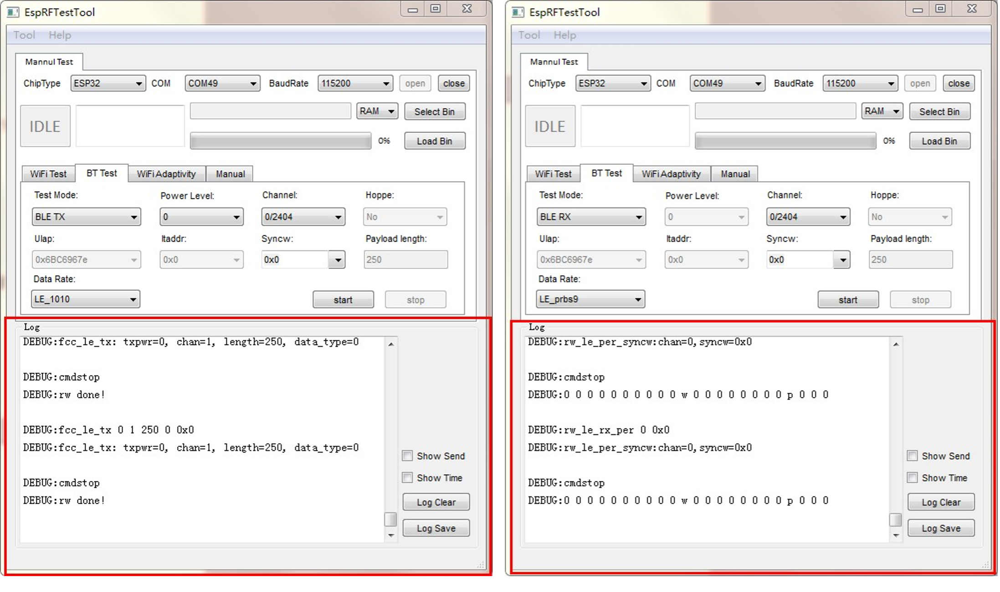

    Bluetooth LE 收发包打印日志界面

Bluetooth LE 发包 Log 解读：

- fcc_le_tx 0 1 250 0 0x0：Bluetooth LE 发包测试开始。
- txpwr=0：测试发包功率等级。
- chan=1：发包信道为 1。
- length=250：payload 长度选择。
- data_type=0：类型选择。0: 1010，1: 00001111，2: prbs9。

Bluetooth LE 收包 Log 解读：rw_le_rx_per 0 0x0：Bluetooth LE 收包测试开始。仪器收包结束，运行“stop”，返回收包“Log”信息为：

0 0 0 0 0 0 0 0 0 0 w 0 0 0 0 0 0 0 0 p 0 0 0

- 返回打印的第一个参数（16 进制）表示本次总共收到的包个数。
- 返回打印的第二个参数（16 进制）表示本次收到对应速率的包个数。
- 返回打印的最后一个参数（16 进制）表示本次共收到的误码个数。
- 返回打印的倒数第二个参数（16 进制）表示本次共收到对应速率的总码数。

TX tone：单载波信号

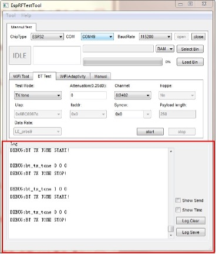

    TX tone 发包打印日志界面

TX tone 发包 Log 解读：

- bt_tx_tone 1 0 0：TX tone 发包测试开始。
- 第一位单载波发送使能信号，1 表示发送，0 表示停止发送。
- 第二位单载波发送信道选择。
- 第三位单载波功率衰减参数，单位是 0.25 dB，4 表示功率衰减 1 dB，以此类推。
