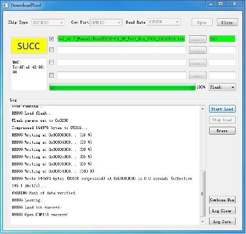
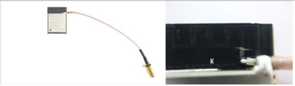

ESP 系列产品 FCC 认证说明
*****************************************

:link_to_translation:`en:[English]`

测试准备
================

硬件准备
-------------------

FCC 认证需准备的硬件有三种，分别是待测样机、串口板和 USB 线，硬件说明如表 1 所示。

.. list-table:: 硬件说明
  :widths: 20 40 10 30

  * - 名称
    - 图片
    - 数量
    - 描述
  * - 待测样机
    - N/A
    - 6
    - 基于 ESP 芯片或模组设计的产品
  * - 串口板
    - .. figure:: ../../_static/rf_test_tool/serial_board.jpg
    - 1
    - 连接 PC 的 USB 线和待测样机接出来的杜邦线，用于 USB-UART 转换，使 PC 端和待测样机通信
  * - USB 线
    - .. figure:: ../../_static/rf_test_tool/usb_cable.jpg
    - 1
    - 连接 PC 和串口板

.. note::

    为排除干扰和便于使用，可以点击此链接购买乐鑫串口板。

软件准备
--------------

下载 FCC 认证所需的软件，软件说明如表 2 所示。

.. list-table:: 软件说明
    :header-rows: 1
    :widths: 40 60
    :align: left

    * - 名称
      - 描述
    * - ft232r-usb-uart.zip
      - 乐鑫串口板的驱动程序
    * - ESP_RF_test_tool.zip
      - 该压缩包包含了测试 bin，用于下载和运行测试 bin 的工具

下载测试固件
-------------------

在进行测试之前，请按照本节内容先搭建下载环境，然后下载测试固件。

下载环境搭建
^^^^^^^^^^^^^^^^^^^^^

.. list-table:: 下载环境搭建
  :widths: 30 70

  * - 芯片型号
    - 连接说明
  * - | ESP8266
      | ESP8285
    - | • 3V3/CH_EN 管脚连接到 3.3 V 电源
      | • RXD/TXD/GND 管脚连接到串口模块的对应引脚上，使 PC 与设备通信
      | • MTDO (GPIO15) 管脚下拉
      | • GPIO0 (Boot) 管脚下拉时，设备进入下载模式
  * - | ESP32
      | ESP32-S2
      | ESP32-S3
    - | • 3V3/CH_EN 管脚连接到 3.3 V 电源
      | • RXD/TXD/GND 管脚连接到串口模块的对应引脚上，使 PC 与设备通信
      | • GPIO0 (Boot) 管脚下拉时，设备进入下载模式
  * - | ESP32-C3
      | ESP32-C6
    - | • 3V3/CH_EN 管脚连接到 3.3 V 电源
      | • RXD/TXD/GND 管脚连接到串口模块的对应引脚上，使 PC 与设备通信
      | • GPIO9 (Boot) 管脚下拉，GPIO8 管脚上拉时，设备进入下载模式

下载操作
^^^^^^^^^^^^^^^^^

硬件环境搭建完成后，按照下列操作下载测试固件：

1. 打开串口板电源开关，显示灯变亮，如图 1 所示

.. figure:: ../../_static/rf_test_tool/connection_serial_port_board_cn.jpg
    :align: center
    :scale: 120%

    串口板连接示意图

2. 解压并打开 EspRFTestTool

   - 选择对应的芯片类型、COM 口、波特率 115200，点击 open 按钮打开串口
   - 选择下载至 Flash
   - 选择芯片对应的测试固件，不同芯片的测试固件见表 4：

.. flat-table:: 非信令 RF 测试固件和地址
   :header-rows: 2
   :stub-columns: 1
   :widths: 1 3 1 2 2

   * - :rspan:`1` 芯片
     - :cspan:`1` 非信令 RF 测试
     - :cspan:`1` 芯片特性

   * - bin 文件
     - 下载地址
     - Wi-Fi
     - 蓝牙

   *  - ESP32
      - ESP32_RFTest_Bin
      - 0x1000
      - 11b, 11g, 11n-HT20, 11n-HT40
      - Bluetooth & Bluetooth LE 4.2

   *  - ESP32-S2
      - ESP32-S2_RFTest_Bin
      - 0x1000
      - 11b, 11g, 11n-HT20, 11n-HT40
      - --

   *  - ESP32-S3
      - ESP32-S3_RFTest_Bin
      - 0x0
      - 11b, 11g, 11n-HT20, 11n-HT40
      - Bluetooth LE 5.0

   *  - ESP32-C3
      - ESP32-C3_RFTest_Bin
      - 0x0
      - 11b, 11g, 11n-HT20, 11n-HT40
      - Bluetooth LE 5.0

   *  - ESP32-C6
      - ESP32-C6_RFTest_Bin
      - 0x0
      - 11b, 11g, 11n-HT20, 11n-HT40
      - Bluetooth LE 5.0

   *  - ESP32-H2
      - ESP32-H2_RFTest_Bin
      - 0x0
      - --
      - Bluetooth LE 5.2 & Zigbee & Thread

   *  - ESP8266, ESP8285
      - ESP8266_RFTest_Bin
      - 0x0
      - 11b, 11g, 11n-HT20
      - --

- 点击 Load bin 按钮，下载完成会显示 SUCC。图 2 为 ESP32 下载固件的界面

.. figure:: ../../_static/rf_test_tool/download_test_bin_esp32.jpg
    :align: center
    :scale: 120%

    ESP32 固件下载界面

EspRFTestTool 的默认下载地址为 0x1000，仅适用于 ESP32 和 ESP32-S2，对于下载地址为 0x0 的芯片，需使用 DownloadTool 工具下载固件，图 3 为使用该工具下载 ESP32-C3 测试固件的界面图。有关如何使用 DownloadTool 的详细说明请见 help 文件夹下的《DownloadTool 使用说明》。

    ESP32-C3 固件下载界面

定频测试
======================

本章介绍如何在基于 ESP 芯片或模组的产品中运行定频测试固件。

搭建环境
----------------

在硬件上，ESP 芯片的 EN 脚通常在设计时通过 RC 延时电路连接到电源线 3V3 上。将芯片 TXD0、RXD0、Boot 键、3V3 和 GND 通过杜邦线焊接出来，用于连接串口板对应的 pin 脚。串口板通过 USB 线连接到 PC，PC 通过串口板与待测样机通信并供电串口板。待测样机的环境搭建框图见图 4。

.. figure:: ../../_static/rf_test_tool/environment_setup_cn.jpg
    :align: center
    :scale: 120%

    环境搭建框图

当测试传导时，RF cable 接到 ESP RF 匹配后面，若 Π 型匹配后面同时有连接天线，则需要将天线断开。当 RF 匹配包含在模组屏蔽罩内，RF cable 应焊接到屏蔽罩外，见图 5。

    模组传导测试 RF cable 接线图

当测试辐射时，RF 匹配后面直接接天线，并保证样机的天线附近无遮挡。

表 5 所示为运行各芯片测试固件的硬件环境，与下载固件的硬件环境有细微差异（粗体标出）。

.. list-table:: 运行测试固件硬件连接
  :widths: 30 70

  * - 芯片型号
    - 连接说明
  * - | ESP8266
      | ESP8285
    - | • 3V3/CH_EN 管脚连接到 3.3 V 电源
      | • RXD/TXD/GND 管脚连接到串口模块的对应引脚上，使 PC 与设备通信
      | • MTDO (GPIO15) 管脚下拉
      | • **GPIO0 管脚悬空**
  * - | ESP32
      | ESP32-S2
      | ESP32-S3
    - | • 3V3/CH_EN 管脚连接到 3.3 V 电源
      | • RXD/TXD/GND 管脚连接到串口模块的对应引脚上，使 PC 与设备通信
      | • **GPIO0 管脚悬空**
  * - | ESP32-C3
      | ESP32-C6
      | ESP32-H2
    - | • 3V3/CH_EN 管脚连接到 3.3 V 电源
      | • RXD/TXD/GND 管脚连接到串口模块的对应引脚上，使 PC 与设备通信
      | • **GPIO9 管脚悬空**，GPIO8 管脚上拉时

运行固件
---------------

运行 Wi-Fi 定频测试固件
^^^^^^^^^^^^^^^^^^^^^^^^^^^^^^^^^^^^^

- 断开样机的 IO0，然后再拨动串口板电源开关重新上电。
- 在下载时打开的 EspRFTestTool 中点击 WiFi Test，Test Mode 选择 TX continues。
- 认证如果需要降功率，在 Attenuation(0.25dB) 里填写数值来实现，单位为 0.25 dB，如填写 20，则表示从默认最大功率降低 20x0.25=5dB，Attenuation 的默认数值是 0，表示不衰减。
- 其它选项根据实验室测试需要进行选择，选择完参数点击 start 即可定频测试，工具里会有相应的 log 显示，图 6 所示为 ESP32 的定频测试界面。

.. figure:: ../../_static/rf_test_tool/wifi_fixed_frequency_test.jpg
    :align: center
    :scale: 120%

    ESP32 Wi-Fi 定频测试界面

运行蓝牙定频测试固件
^^^^^^^^^^^^^^^^^^^^^^^^^^^^^^^^^^^^^^

蓝牙定频测试固件与 Wi-Fi 定频测试固件相同。

- 打开 EspRFTestTool 测试工具，选择待测试的芯片类型。ESP8266、ESP32-S2 系列芯片没有蓝牙功能，所以无需测试。ESP32-C3 系列芯片的蓝牙只支持 Bluetooth LE。
- 打开 BT Test 页面，配置相关参数：Power Level 一般选择 4，其它设置根据实测需要来选择，图 7 显示的为 ESP32 蓝牙定频测试界面。

.. figure:: ../../_static/rf_test_tool/bt_test.jpg
    :align: center
    :scale: 120%

    蓝牙测试界面

常见问题
================

1. **如何将认证测试的功率参数更新到应用固件？**

   请参考 ESP32-Series_PowerLimitTool 使用说明。

2. **定频测试辐射二次、三次、四次谐波超标。**

   - 对于基于 ESP 芯片的设计，则排查 RF layout，匹配和 PA 供电部分，通过调整 RF 匹配，PA 电源线滤波网络来抑制谐波。
   - 对于基于 ESP 模组的产品，则模组下面放置底板，底板通常是产品的 PCB 板。
   - 在定频测试工具的 attenuation 里输入数值来降低功率。

3. **Band Edge 和 RE in Restricted Band 超标。**

   - 确认 RF 匹配是否调试正确
   - 在定频测试工具的 attenuation 里输入数值来降低功率。
  