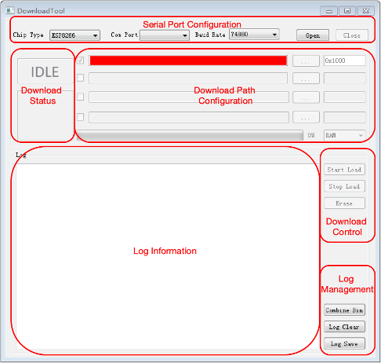
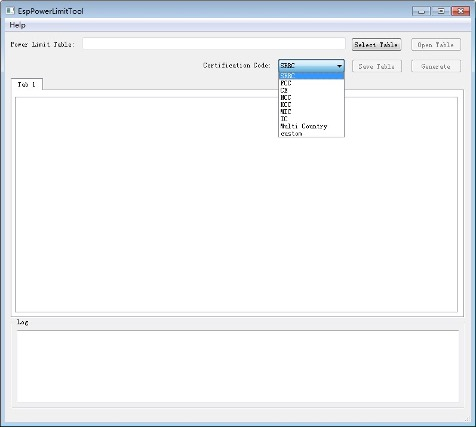
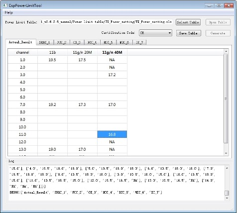
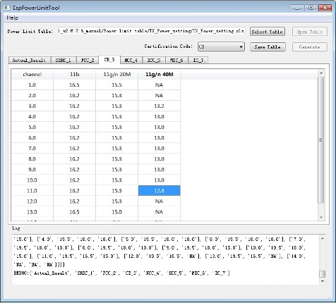
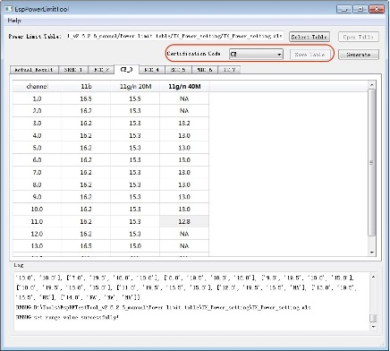
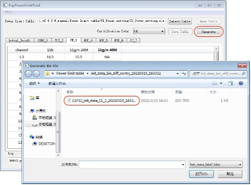
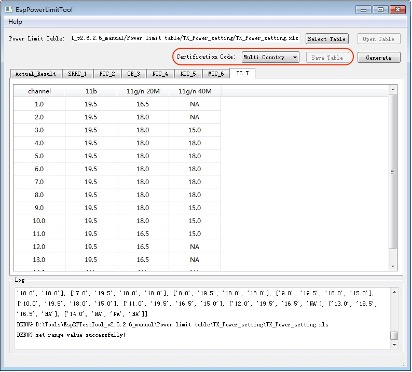

EspRFTestTool 工具包
=============================

EspRFTestTool 工具包是乐鑫提供的射频测试工具，主要用于

- Wi-Fi 定频测试
- Wi-Fi 自适应测试
- Wi-Fi 阻塞测试
- 蓝牙定频测试
- 蓝牙自适应测试
- 蓝牙阻塞测试
- 蓝牙信令测试

本文档主要介绍 EspRFTestTool 工具包的使用方法。

EspRFTestTool 工具包主要包括三个工具，分别是 EspRFTestTool、DownloadTool 和 PowerLimitTool。

- EspRFTestTool：可用于向默认地址下载固件，并进行上述射频测试；
- DownloadTool：可用于向指定地址下载固件；
- PowerLimitTool：可用于生成定制化固件。

.. note::
  EspRFTestTool 工具包是三个工具 EspRFTestTool、DownloadTool 和 PowerLimitTool 的统称；EspRFTestTool 单独出现时，指的是 EspRFTestTool 工具包中的 EspRFTestTool 工具。

EspRFTestTool 工具包界面
---------------------------------

EspRFTestTool 工具包界面主要分为五部分，分别是功能区栏 (Menu)、串口配置栏 (Serial Port Configuration)、下载栏 (Download Configuration)、测试配置栏 (Test Configuration) 以及日志打印栏 (Log Information)。

.. figure:: ../../_static/rf_test_tool/esprftesttool_interface.png
    :align: center
    :scale: 120%
    :alt: RF Test Setup

    EspRFTestTool 主界面

- **功能区栏 (Menu)**

  功能区栏包括 Tool 和 Help，其中 Tool 默认为 EspRFTestTool，可切换为 DownloadTool 和 PowerLimitTool。

  Help 包含 Tool Help、RF Test Help、RF Certification Help。

  * Tool Help：各工具的使用说明文档。
  * RF Test Help：射频测试说明文档。
  * RF Certification Help：认证测试相关说明文档。

- **串口配置栏 (Serial Port Configuration)**

  包括芯片类型、串口号、波特率、打开和关闭串口。测试时，默认波特率配置为 115200。

- **下载栏 (Download Configuration)**

  主要用于测试固件的下载，详细说明请参考章节 4.1。

- **测试配置栏 (Test Configuration)**

  包括 Wi-Fi Test、BT Test、Wi-Fi Adaptivity 以及手动输入测试命令 (Manual) 四个界面。

  * Wi-Fi Test：主要用于 Wi-Fi 收发包测试；
  * BT Test：主要用于 BT 收发包测试；
  * Wi-Fi Adaptivity：主要用于自适应认证测试；
  * Manual：手动命令测试。

- **日志打印栏 (Log Information)**

  所有的操作信息都会在此处打印。用户可以具体查看模组信息及对日志进行保存和清除操作。

EspRFTestTool 工具包功能
-------------------------------------

EspRFTestTool 工具包可用于下载固件，进行相关射频性能测试，以及生成定制化固件。

下载功能
^^^^^^^^^^^^^^

EspRFTestTool 与 DownloadTool 都可用于下载固件。EspRFTestTool 可将单个固件下载至默认地址，而 DownloadTool 可将多个固件下载到指定地址。

EspRFTestTool 中的下载功能
""""""""""""""""""""""""""""""""""""""""

EspRFTestTool 的下载界面如图 4-1 所示。

.. figure:: ../../_static/rf_test_tool/esprftesttool_download_config.png
    :align: center
    :scale: 120%

    下载配置设置

1. 串口配置

  - ChipType：选择对应的 ESP 芯片名称，如：ESP32/ESP8266 等。
  - COM：选择使用的串口。
  - BaudRate：选择使用的波特率，下载固件时，用户可自行配置波特率。
  - 串口开关：点击 open、close 按钮，可进行切换。

2. 固件下载设置

  - 下载到 RAM 或 flash
    点击 ``RAM`` 按钮，选择下载固件到 RAM 或 flash。两者的区别是，若下载到 flash，一般只需下载一次，下载完成后将 GPIO0 悬空，并将设备重新上电，即可进入正常工作模式。 若下载到 RAM，下载完成后可以直接运行，但是设备掉电后 RAM 中的程序会消失，需要重新下载。

  - 选取待下载固件
    点击 ``Select Bin`` 按钮，在本地选取需要下载的固件，选择后会在固件显示栏显示当前选择的固件路径及名称。需要注意的是不同的芯片所对应的测试固件也不同。

3. 下载状态

  下载状态包括：

  - SYNC：同步中
  - Load：下载中
  - SUCC：下载成功
  - Fail：下载失败

4. 固件下载

  Load Bin：点击 Load Bin 按钮，开始下载固件。当绿色进程条显示 100%，并且状态栏显示 “SUCC” 字样即表示下载成功。

5. 串口打印

  下载完成后，将 GPIO0 管脚悬空并重新上电，使设备进入正常工作模式，此时便可开始测试。用户也可以通过串口工具来检查固件是否烧录成功，以 ESP32 为例，图 4-2 是 ESP32 下载射频测试固件后的串口打印。

  .. figure:: ../../_static/rf_test_tool/firmware_serial_port_log.jpg
      :align: center
      :scale: 120%

      ESP32 射频测试固件串口打印

DownloadTool
""""""""""""""""

DownloadTool 的主界面如图所示。DownloadTool 界面分为六个部分，分别是串口配置 (Serial Port Configuration)、下载路径配置 (Download Path Configuration)、下载状态 (Download Status)、下载控制 (Download Control)、Log 打印 (Log Information) 以及 Log 管理 (Log Management)。

    DownloadTool 界面

.. list-table:: DownloadTool 功能介绍
    :header-rows: 1
    :widths: 40 60
    :align: left

    * - 工具组成
      - 功能介绍
    * - 串口配置
      - 选项包括芯片类型、串口号、波特率、串口开关。
    * - 下载路径配置
      - 选择需要下载的固件，以及下载地址（16 进制格式填写）。
    * - 下载状态
      - 下载状态共包括 “SYNC”、“LOAD”、“SUCC”、“FAIL” 四种状态。
    * - 下载控制
      - 下载控制分为 “Start Load”、“Stop Load” 和 “Erase”
    * - Log 打印
      - 所有的操作信息都会在此处打印。
    * - Log 管理
      - 用户可以对 Log 进行保存和清除。

使用 DownloadTool 下载固件，首先需要将 EspRFTestTool 的工具包中的 Tool 切换至 DownloadTool。下载步骤中的第 1 步与使用 EspRFTestTool 下载固件的步骤相同，此处不再赘述，以下从第 2 步开始介绍。

2. 固件下载设置

  - 下载到 RAM 或 flash：
    点击 ``RAM``，选择下载固件到 RAM 或 flash。两者的区别是，若下载到 flash，一般只需下载一次，下载完成后将 GPIO0 悬空，并将设备重新上电，即可进入正常工作模式。若下载到 RAM，下载完成后可以直接运行，但是设备掉电后 RAM 中的程序会消失，需要重新下载。

  - 选取待下载固件：
    点击``...``，在本地选取需要下载的固件，并在左侧方框中进行勾选，勾选表示下载。该行不勾选表示不下载。

  - 固件下载地址：
    在右侧白色框中输入下载地址（16 进制格式），需要注意的是，下载到 RAM 不需要填写地址，界面中也无法输入。下表列出了各芯片射频固件的下载地址。

.. list-table:: ESP 芯片对应下载地址
    :header-rows: 1
    :widths: 40 60
    :align: left

    * - 芯片型号
      - 射频固件下载地址
    * - ESP32/ESP32-S2
      - 0x1000
    * - ESP8266/ESP8285/ESP32-C3/ESP32-S3
      - 0x0

3. 下载状态

  下载状态包括：

  - SYNC：同步中
  - Load：下载中
  - SUCC：下载成功
  - Fail：下载失败

4. 固件下载

  - Start Load：点击 Start load，开始下载。当绿色进度条到 100%，并且状态栏显示 “SUCC” 字样即表示下载成功。
  - Stop Load：停止下载。
  - Erase：擦除 Flash 中的固件。

5. 串口打印

  下载完成后，将 GPIO0 管脚悬空并重新上电，使设备进入正常工作模式，此时便可开始测试。用户也可以通过串口工具来检查固件是否烧录成功，以 ESP32 为例，下图是 ESP32 下载射频测试固件后的串口打印。

  .. figure:: ../../_static/rf_test_tool/serial_port_log.jpg
      :align: center
      :scale: 100%
      :alt: Serial Port Configuration

      ESP32 射频测试固件串口打印

射频性能测试功能
^^^^^^^^^^^^^^^^^^^^^^^^^^^

Wi-Fi 性能测试
""""""""""""""""""""""""

EspRFTestTool 的 Wi-Fi Test 测试界面，如下图所示。

.. figure:: ../../_static/rf_test_tool/wifi_test_mode.jpg
    :align: center
    :scale: 120%

    Wi-Fi Test Mode 界面

Test Mode 包括：

- TX continues：连续发包，主要用于认证测试。
- TX packet：非连续发包，主要用于发射性能测试。
- RX packet：收包，主要用于接收性能测试。
- TX tone：单载波信号。

Wi-Fi Rate 包括：射频测试 b/g/n 收发包速率。

BandWidth 包括：

- 11n HT20，20 M 信号带宽。
- 11n HT40，40 M 信号带宽（仅 ESP32 系列支持）。

Channel：为收发信道。

Attenuation (0.25dB)：

- 表示发射功率衰减值。
- 认证中如果需要降功率，可在 Attenuation(0.25dB) 里填写数值来实现。默认数值是 0，表示不衰减。填 4 表示衰减 1 dB, 6 表示衰减 1.5 dB, 10 表示衰减 2.5 dB, 以此类推。

Duty Cycle：表示发包占空比，支持 10%、50%、90% 以及 default 四种配置。

Certification EN 和 Certification Code：用于验证 power limit table 是否生效，详细说明请参考《ESP32-Series PowerLimitTool 使用说明》。

根据测试要求选择测试条件，点击 start 开始发包/收包；点击 stop 停止发包/收包。 Wi-Fi 收发包打印日志如图 4-4 所示；左为 Wi-Fi TX（发包）的打印日志界面，右为 Wi-Fi RX（收包）的打印界面。

.. figure:: ../../_static/rf_test_tool/wifi_rx_tx_package_log.png
    :align: center

    Wi-Fi 收发包打印日志界面

Wi-Fi 发包 Log 解读：

- cbw40m_en 0：“0”表示信道带宽为 20 M，“1”表示信道带宽为 40 M。
- wifitxout 1 0x17 0：“1”表示信道为 1，“0x17”表示测试速率为 Mcs7。
- Wifi tx out：channel=1, rate=0x17, BK=0, length=1300, delay=2000：表示 Wi-Fi 发包成功。

Wi-Fi 收包 Log 解读：仪器收包结束，点击“stop”按钮，返回收包“Log”信息为

- Correct：996 表示收到的包总数。
- Desired：996 表示收到配置项中指定速率的包总数。
- RSSI：-710 表示接收信号强度，代表接收信号强度为 -71 dBm。
- 其他打印信息为研发 Debug 参数。

每次收发包如需调整测试需求都要点击 stop 停止收发指令，调整完成点击 start 开始收发包测试。

BT 性能测试
"""""""""""""""""""""""

BT Test 测试界面如图 4-5 所示。蓝牙的测试固件和 Wi-Fi 相同，只需要在测试工具里点击 BT Test 即可。

.. figure:: ../../_static/rf_test_tool/bt_test_mode.jpg
    :align: center
    :scale: 120%

    BT Test Mode 界面

BT Test

Test Mode 包括：

- BT TX：用于经典蓝牙发射测试。
- BT RX：用于经典蓝牙接收测试。
- Bluetooth LE TX：用于低功耗蓝牙发射测试。
- Bluetooth LE RX：用于低功耗蓝牙接收测试。
- TX tone：单载波信号。

Power Level：为发包功率等级。

Channel：为收发信道。

Data Rate：

- 为收发包速率。
- 其他配置可保留默认配置，根据实际测试要求选择测试条件，点击 start 开始发包；点击 stop 停止发包。 如图 4-6 所示，左为 BT TX（发包）的打印日志界面，右为 BT RX（收包）的打印日志界面。如图 4-7 所示，左为 Bluetooth LE TX（发包）的打印界面，右为 Bluetooth LE RX（收包）的打印界面。如图 4-8 所示，TX tone 发包的打印日志。

.. figure:: ../../_static/rf_test_tool/bt_tx_rx_package_log.png
    :align: center

    BT 收发包打印日志界面

BT 发包 Log 解读：

- fcc_bt_tx 2 0 2 1 1 0：BT 发包测试开始。
- txpwr=2：测试发包功率等级。
- hoppe=0：不支持跳频。
- chan=2：收发包信道为 2。
- rate=1：测试速率为 1 M。
- DH_type=1，data_type=0：表示包类型为 DH1，1010。

BT 收包 Log 解读：rw_rx_per 0 0 0x6BC6967e 0x0：BT 收包测试开始。仪器收包结束，点击“stop”按钮，返回收包“Log”信息为：

0 0 0 0 0 0 0 0 0 0 w 0 0 0 0 0 0 0 0 p 0 0 0 b 0 0。

- 返回打印的第一个参数（16 进制）表示本次总收到的包个数。
- 返回打印的第二个参数（16 进制）表示本次收到对应速率的包个数。
- 返回打印的最后一个参数（16 进制）表示本次共收到的误码个数。
- 返回打印的倒数第二个参数（16 进制）表示本次共收到对应速率的总码数。

.. figure:: ../../_static/rf_test_tool/ble_tx_rx_package_log.png
    :align: center

    Bluetooth LE 收发包打印日志界面

Bluetooth LE 发包 Log 解读：

- fcc_le_tx 0 1 250 0 0x0：Bluetooth LE 发包测试开始。
- txpwr=0：测试发包功率等级。
- chan=1：发包信道为 1。
- length=250：payload 长度选择。
- data_type=0：类型选择。0: 1010，1: 00001111，2: prbs9。

Bluetooth LE 收包 Log 解读：rw_le_rx_per 0 0x0：Bluetooth LE 收包测试开始。仪器收包结束，运行“stop”，返回收包“Log”信息为：

0 0 0 0 0 0 0 0 0 0 w 0 0 0 0 0 0 0 0 p 0 0 0

- 返回打印的第一个参数（16 进制）表示本次总共收到的包个数。
- 返回打印的第二个参数（16 进制）表示本次收到对应速率的包个数。
- 返回打印的最后一个参数（16 进制）表示本次共收到的误码个数。
- 返回打印的倒数第二个参数（16 进制）表示本次共收到对应速率的总码数。

TX tone：单载波信号

.. figure:: ../../_static/rf_test_tool/tx_tone_log.jpg
    :align: center
    :scale: 120%

    TX tone 发包打印日志界面

TX tone 发包 Log 解读：

- bt_tx_tone 1 0 0：TX tone 发包测试开始。
- 第一位单载波发送使能信号，1 表示发送，0 表示停止发送。
- 第二位单载波发送信道选择。
- 第三位单载波功率衰减参数，单位是 0.25 dB，4 表示功率衰减 1 dB，以此类推。

生成定制化固件
^^^^^^^^^^^^^^^^^^^^^^^^^^^^^

PowerLimitTool 可用于生成定制化固件，主要用于生成包括 SRRC、CE、FCC 等单个或多国认证所需的 Phy Init Bin 文件。

    PowerLimitTool

可按以下步骤生成定制化固件。

1. 进入 PowerLimitTool 工具

  从 EspRFTestTool 主界面菜单栏 Tool 中选择 PowerLimitTool，进入 PowerLimitTool 工具。

  .. figure:: ../../_static/rf_test_tool/esprftesttool_main_interface.jpg
      :align: center
      :scale: 120%

      EspRFTestTool 主界面

2. 配置功率表

  点击 Select Table，双击选择文件夹下的 TX_Power_setting.xlsx 文件，导入功率表。

  .. figure:: ../../_static/rf_test_tool/import_tx_power_setting.jpg
      :align: center
      :scale: 120%

      导入 TX_Power_Setting

  点击 Open Table，主界面显示 Actual_Result 及七国或地区认证的信道功率列表。

  .. figure:: ../../_static/rf_test_tool/tx_power_setting_list.jpg
      :align: center
      :scale: 120%

      TX_Power_Setting 列表

  .. note::

      - Actual_Result： 产品的实测功率，代表产品本身性能，参考附录 A。
      - SRRC_1：中国大陆认证，主要关注 PSD 等功率限制。
      - FCC_2：美国认证，主要关注谐波、带外发射杂散限制。
      - CE_3：欧盟认证，主要关注 PSD、RE 及接收杂散限制。
      - NCC_4：台湾认证，主要关注 RE 及接收杂散限制。
      - KCC_5：韩国认证，主要关注接收杂散限制。
      - MIC_6：日本认证，主要关注特定频段杂散、PSD 限制。
      - IC_7：加拿大认证，主要关注谐波、带外发射杂散限制。

3. 写入功率值

  Actual_Result：建议测试 11b、g、n20、n40 最低速率全信道平均功率，并填入表中。如果信道间功率接近，可以仅测试对应速率的高中低 3 个信道，其他信道功率值会使用三个信道的平均值用于后续计算。

  对于各认证功率表，认证会测试各模式下高中低三个信道满足认证所需的最大功率值，记录此时对应的衰减值。最终认证填写的实际功率值是由 Actual_Result 减去对应信道的衰减值。

  .. note::

     - 认证仅测试高中低三个信道，但认证功率表需填写所有规定信道。 在认证功率表中计算信道所需功率时，高低信道分别按认证报告中高低信道的衰减值计算，而其它信道均按认证报告中的中间信道衰减值计算。
     - 认证一般采用 Tx Continue 模式测试，但测试模组的实际功率 (Actual_Result) 时需使用 Tx Packet 测试。
     - 认证记录的衰减值以 1/4 dB 为单位，计算时需转换为 dB 单位，如认证衰减 4，代表衰减 1dB，以此类推。

4. 生成 Phy Init Bin 文件

  填写认证功率值后点击 Save Table 保存功率配置，在 Certification Code 下拉项中选择需要的认证，如图 1-5 所示，然后点击 Generate 即在指定文件夹中生成对应的 Phy Init Bin 文件，如图 1-6 所示。

  Phy Init bin 文件包含了满足当前认证所有信道的功率值，可用于 RF 测试和实际应用，详见下文。

  .. note::

      下拉选项 Certification Code 中包含单个认证和 Multiple Country 及 Custom。 选择单认证会生成对应认证的单独 Phy Init Bin 文件，文件包含除校验控制信息外共 128 字节; 选择 Multiple Country 会生成包含 Default 和 SRRC、FCC、CE、NCC、KCC、MIC、IC 七国认证的 Combined Phy Init Bin 文件，包含了 8*128 字节；选择 Custom，根据自定义选择生成单个或多国认证 Phy Init Bin 文件。

  .. figure:: ../../_static/rf_test_tool/select_required_certification.jpg
      :align: center
      :scale: 120%

      选择需要的认证

  .. figure:: ../../_static/rf_test_tool/generate_phy_init_bin.jpg
      :align: center
      :scale: 120%

      生成所需认证的 Phy Init Bin 文件

5. 下载 Phy Init Bin 文件

  按照上述步骤下载生成的 Phy Init Bin 文件

  从 Tool 选项栏中选择 DownloadTool，进入 DownloadTool 界面，如图 2-1 和图 2-2。

  .. note::

    - 选择 Phy Init 固件并填写对应地址：0x1fc000；
    - 选择 RF 测试固件并配置对应地址：0x1000；
    - ESP32/S2 Boot 键为 GPIO0，ESP32-C3 Boot 键为 GPIO9。
    - Phy Init Bin 烧录地址可改动，后续用于 RF 测试时需做相应调整即可。
    - 对于 Multiple Country Phy Init Bin 与单认证烧录地址一样，建议均选择 0x1fc000 地址。

6. 利用 Phy Init Bin 进行射频测试

  按照上述步骤利用 Phy Init Bin 进行射频测试

  .. note::

    - 不勾选 Certification EN 代表不使能 Phy init，此时 start 发包测试代表模组的初始性能。
    - 勾选 Certification EN 代表使能 Phy init，此时 start 发包测试代表模组的认证功率性能。
    - 输入地址为 Phy Init Bin 的烧录地址，如烧录地址变动，此处需做相应改变。
    - 对于 Multiple Country，在 Certification Code 中可选择其所包含的认证。

  .. figure:: ../../_static/rf_test_tool/rf_test_setting_interface.jpg
      :align: center
      :scale: 120%

      RF Test 设置界面

.. note::

    Phy Init Bin 文件同样适用于产品应用固件。

实例演示
""""""""""""""""

单国认证：以 CE 为例
^^^^^^^^^^^^^^^^^^^^^^^^^^^^^^

填写 Actual_Result
""""""""""""""""""""""""""""

使用 Tx Packet 实测模组的平均输出功率，有关如何进行 RF 非信令测试请参考章节 2.2。

本例因信道间功率接近，只测试了低、中、高 3 个信道：

- 11b 测试 1 Mbps 速率，低、中、高信道分别为 19.5 dBm、19.2 dBm、19 dBm；
- 11g/11n-20M 分别测试 6 Mbps 和 MCS0 速率，填写其中功率最高的三个信道，分别为 17.5 dBm、17.3 dBm、17dBm；
- 11n-40M 测试 MCS0 速率，三个信道功率分别为 17.2 dBm、17 dBm、16.8 dBm，如图 1-7 所示。

    填写实测功率值

计算衰减值
""""""""""""""""""""""

通过认证测试报告或实验室验证后，确认模组能满足 CE 认证所需的最大功率，并记录对应衰减值，如下表中 Attenuation 一栏，并将其转换成实际功率后记录在对应速率和信道中。 由于认证一般只选择测试低中高 3 个信道，因此除首末信道使用实测衰减值外，其余信道均使用中间信道衰减值。本例中满足认证的信道功率衰减值设置如下：

11b 中功率最高的为 1 Mbps 速率，11g 中功率最高的为 6 Mbps 速率，11n-20M 中功率最高的为 MCS0 速率，11n-40M 中功率最高的为 MCS0 速率。 其中 11g 和 11n-20M 取高者作为信道功率值，如表 1-1。

.. flat-table:: 实测功率与 CE 认证功率计算
    :header-rows: 1
    :stub-columns: 5

    * - Mode
      - Data Rate
      - Channel
      - Attenuation
      - Attenuation * 0.25 (dB)
      - Actual_Result (dBm)
      - Power Table (dBm)

    * - :rspan:`2` 802.11b
      - :rspan:`2` 1 Mbps
      - 2412
      - 12
      - 3
      - 19.5
      - 16.5

    * - 2437
      - 12
      - 3
      - 19.2
      - 16.2

    * - 2472
      - 10
      - 2.5
      - 19
      - 16.5

    * - :rspan:`2` 802.11b
      - :rspan:`2` 11 Mbps
      - 2412
      - 10
      - 2.5
      - --
      - --

    * - 2437
      - 10
      - 2.5
      - --
      - --

    * - 2472
      - 10
      - 2.5
      - --
      - --

    * - :rspan:`2` 802.11g
      - :rspan:`2` 6 Mbps
      - 2412
      - 8
      - 2
      - 17.5
      - 15.5

    * - 2437
      - 8
      - 2
      - 17.3
      - 15.3

    * - 2472
      - 6
      - 1.5
      - --
      - --

    * - :rspan:`2` 802.11g
      - :rspan:`2` 54 Mbps
      - 2412
      - 0
      - 0
      - --
      - --

    * - 2437
      - 0
      - 0
      - --
      - --

    * - 2472
      - 0
      - 0
      - --
      - --

    * - :rspan:`2` 802.11n-HT20
      - :rspan:`2` MCS0
      - 2412
      - 8
      - 2
      - --
      - --

    * - 2437
      - 6
      - 1.5
      - --
      - --

    * - 2472
      - 8
      - 2
      - 17
      - 15

    * - :rspan:`2` 802.11n-HT20
      - :rspan:`2` MCS7
      - 2412
      - 0
      - 0
      - --
      - --

    * - 2437
      - 0
      - 0
      - --
      - --

    * - 2472
      - 0
      - 0
      - --
      - --

    * - :rspan:`2` 802.11n-HT40
      - :rspan:`2` MCS0
      - 2422
      - 16
      - 4
      - 17.2
      - 13.2

    * - 2437
      - 16
      - 4
      - 17
      - 13

    * - 2462
      - 16
      - 4
      - 16.8
      - 12.8

    * - :rspan:`2` 802.11b
      - :rspan:`2` 1 Mbps
      - 2412
      - 12
      - 3
      - 19.5
      - 16.5

    * - 2437
      - 12
      - 3
      - 19.2
      - 16.2

    * - 2472
      - 10
      - 2.5
      - 19
      - 16.5

    * - :rspan:`2` 802.11n-HT40
      - :rspan:`2` MCS7
      - 2422
      - 0
      - 0
      - --
      - --

    * - 2437
      - 0
      - 0
      - --
      - --

    * - 2462
      - 0
      - 0
      - --
      - --

填写 CE 功率表
""""""""""""""""""""""""

Power Table 中要填写的功率值=实测功率-衰减值

- 计算 11b CE 功率值，低、中、高信道分别为 16.5 dBm、16.2 dBm、16.5 dBm；
- 计算 11g/n20 信道功率，选择 6 Mbps 和 MCS0 两者中衰减值高者用于计算，三个信道分别为 15.5 dBm、 15.3 dBm、15 dBm；
- 计算 11n40M 三个信道分别为 13.2 dBm、13 dBm、12.8 dBm。

将功率值填入 CE 栏中，非首末信道均填写中间信道的功率值，如图 1-8。

    填写 CE 认证功率值

生成 CE Phy Init Bin
""""""""""""""""""""""""""""""""

在 Certification 下拉选项中选择 CE，点击 Save Table 保存所有修改，如图 1-9。

    选择 CE 并保存设置

点击 Generate 即可生成带有 CRC 校验的 CE phy init bin 文件，如图 1-10。

    生成 CE Phy Init Bin 文件

多国认证：Multiple Country
^^^^^^^^^^^^^^^^^^^^^^^^^^^^^^^^^^^^^^^

Actual_Result 和各认证所需功率测试过程与前述单认证 CE 相似，经计算后写入功率表。 在 Certification Code 下拉选项中选择 Multi Country，点击 Save Table 保存所有修改，如图 1-11。

    选择 Multiple Country 并保存设置

点击 Generate 生成 Combined 文件，如图 1-12。

.. figure:: ../../_static/rf_test_tool/generate_combined_phy_init_bin.jpg
    :align: center
    :scale: 120%

    生成 Combined Phy Init Bin 文件

附录 A. ESP32 系列平均输出功率典型值
-------------------------------------------------

ESP32-Series 平均输出功率典型值见下表。

.. list-table::
    :header-rows: 1
    :widths: 20 20 20 40
    :align: center

    * - Rates
      - ESP32 (dBm)
      - ESP32-S2 (dBm)
      - ESP32-C3 (dBm)
    * - 11b 1 Mbps
      - 19.5
      - 19.5
      - 20.5
    * - 11b 11 Mbps
      - 19.5
      - 19.5
      - 20.5
    * - 11g 6 Mbps
      - 18
      - 18
      - 20
    * - 11g 54 Mbps
      - 14
      - 15
      - 18
    * - 11n-20 MCS0
      - 18
      - 18
      - 19
    * - 11n-20 MCS7
      - 13
      - 13.5
      - 17.5
    * - 11n-40 MCS0
      - 18
      - 18
      - 18.5
    * - 11n-40 MCS7
      - 13
      - 13.5
      - 17
